# Chem Agent 任务需求

> 本文是 `chem-technical-report.md` 的术语统一重构版。
> 设计基线来自两部分：
> 1. `chem_agent_agent_team_design_report.md` 中的”双层 Agent Team + 动态执行闭环”
> 2. `method.md` 中最有价值的设计：`adapter 驱动`、`搜索与执行解耦`、`图空间搜索`、`workflow 过时检测`、`重搜索 / 重编译`。
>
> 当前论文标题统一为：
> **TuringBrain: Observation-Gated Macro-Action Planning and Workflow Evolution for Autonomous Chemical Experimentation**
>
> 研究引言（原 Section 0）已拆分至 `chem-research_introdcution.md`。

---

## 1. TuringBrain：面向自主化学实验的观测门控宏动作规划与工作流演化系统

本系统适用于这样一类化学任务：

- 用户同时提供一组 **高质量最前沿论文 + 知识图谱 + 学术论文获取 API + 用户规定的试验目标 + 最大运行时间 + 最大运行轮数 + 最高危险等级（默认触发）**
- 系统先生成一个 **初始 workflow**
- workflow 不会一次性盲跑到底，而是在执行过程中根据实验返回结果持续改写后续流程

### 1.1 术语介绍

结合现有 agent、hierarchical planning、temporal abstraction 相关论文，本系统建议统一使用下面这组术语。

1. `workflow`
   指一条完整实验流程的结构化描述。
   它是当前 round 的全局执行蓝图，但不是不可修改的静态真理。
   一旦实验反馈表明后续路径不再合理，`workflow` 可以被局部修订、后缀重规划或整体重生成。

2. `workstation(Primitive-Action)`
   指一个真实实验站点及其一次调用。
   在 agent / planning 语义上，它对应 **primitive execution unit**。
   它是 `workflow` 中最小、不可再拆的执行单位。

3. `result-capable workstation`
   指具备返回可分析实验结果能力的 `workstation`。
   这是站点能力定义，不等于本轮一定会触发结果采集。
   是否属于 `result-capable workstation`，以及能返回哪些结果类型，应由对应的 `workstation` 描述与能力约束定义。

4. `observation request`
   指上层 Agent Team 在某个位置主动要求获取一次实验结果。
   它是 **planning decision**，不是站点固有属性。
   只有当某个 `result-capable workstation` 被显式施加 `observation request` 时，该站点才会在本轮执行中承担结果采集职责。

5. `observation event`
   指一次被请求的实验结果真实返回。
   它是运行时事件，不是预先写死的流程节点。
   系统只有收到 `observation event`，才能把新的实验结果纳入后续分析与续规划。

6. `decision point`
   指一次 `observation event` 完成后的合法决策边界。
   只有在结果真实返回之后，系统才进入新的 `decision point`。
   `decision point` 是下一段在线规划启动的位置。

7. `macro-action`
   指两个相邻 `decision point` 之间的一段连续执行，由一个或多个 `workstation` 构成。
   这一概念的灵感来自强化学习中的 temporally-extended action / options framework（Sutton et al., 1999; Bacon et al., 2017），但本系统并不直接采用 RL 的形式化框架（如 MDP 建模或梯度学习终止条件），而是将其核心思想——在原子动作与完整策略之间建立一个有边界的中间执行单位——适配为 LLM-agent 驱动的实验规划场景。
   与 RL options 的关键区别在于：
   - macro-action 的终止边界由 observation request 显式规划决定，而非由学习到的终止函数自动触发
   - macro-action 的内部执行序列由设备适应层确定性生成，而非由 intra-option policy 采样产生
   - 系统不假设多次 episode 和稠密 reward，而是在极少次实验、稀疏反馈、不可逆操作的约束下工作
   它是本系统的核心在线规划单位，比单个 `workstation` 大，比完整 `workflow` 小。

8. `macro_action_plan`
   指某一段 `macro-action` 的结构化执行计划。
   它回答的是“接下来连续执行哪些 `workstation`、在哪个边界停下、是否请求下一次观测”。
   它是运行时最重要的控制对象，也是 Agent Team 每一轮续规划的直接产物。

9. `chunk-level trajectory memory`
   指按 `macro-action` 粒度记录的 Markdown 轨迹记忆。
   它记录的不是底层原始平台日志，而是“上一轮观测结果、当前执行段、关键动作、异常、下一轮规划依据”。
   它是供 Agent Team 做续规划时直接读取的上层记忆载体。

### 1.2 运行语义

运行语义必须明确：

- `workflow` 的最小执行单位是一个 `workstation`
- 多个连续 `workstation` 组成一个 `macro-action`
- `Agent Team` 不直接一次性规划完整执行过程，而是以 `macro-action` 为在线规划粒度

某个 `workstation` 是否具备结果返回能力，以及可返回何种结果，应由该 `workstation` 的描述文件定义。是否在某个 `result-capable workstation` 上发起一次 `observation request`，属于上层 Agent Team 的规划决策，而不是站点默认必然执行的动作。

系统的真实运行循环，本质上不是“先生成 workflow 再一路执行”的单向流程，而是 **在 runtime 驱动下，agent 与类型化对象持续往返流动的闭环**：

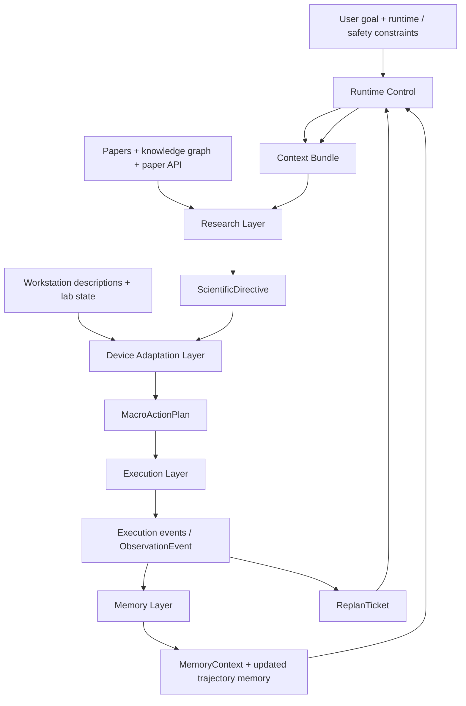

### 1.3 本系统真正输出的是什么

因此，本系统真正输出的，不是一个脱离运行上下文、一次生成后便固定不变的 workflow 文件，而是一场在 **用户目标、预算约束与安全边界** 下由 `runtime` 持续驱动的闭环实验控制过程。  
`workflow` 在这里更像某一时刻的结构化快照；真正的一等产物，是系统围绕 `decision point` 不断形成、修订、解释和沉淀的动态控制轨迹。

更准确地说，TuringBrain 输出的是一个 **可回放、可审计、可继续续跑的研究运行实例**。  
它不是单一 protocol，而是一条带有因果语义的动态实验轨迹：系统不仅要给出“接下来做什么”，还要保留“为什么这样做”“为什么在这里观测”“为什么改线”“为什么停止”的证据链。

从系统视角看，这个运行实例至少由四类外显产物共同构成：

- **`workflow_version` lineage**
  系统不会得到一份生成后永不变化的 workflow，而是维护一条围绕已执行前缀持续演化的版本链。`workflow v0` 只是起点；后续每次新观测、异常、安全阻断或设备适配失败，都可能通过 `ReplanTicket` 触发新的未来版本。每个版本的意义都不是“最终答案”，而是“在当前证据下最好、且仍可执行的未来骨架”。

- **`MacroActionPlan` trajectory**
  系统在每个 `decision point` 后生成下一段可执行的 `MacroActionPlan`。这些 plan 串联起来，才对应系统真实执行过的在线研究路径；它们不是静态 workflow 的附属物，而是运行时真正驱动实验推进的核心控制对象。

- **运行时决策对象链**
  包括 `ObservationEvent`、`SafetyAssessment`、`FeasibilityFeedback`、`ReplanTicket`、`StopDecision` 等。它们共同记录系统何时观测、为何重规划、为何阻断、为何停止。没有这条对象链，系统只能描述“发生了什么”；有了它，系统才能解释“为什么这样推进”。

- **项目级层级记忆**
  包括 `chunk-level trajectory memory` 及其在 `project -> query -> stage -> macro-action` 结构中的摘要、归因和可追溯引用。它使系统在停止后留下的不只是日志，而是一份可被后续研究继续继承、检索和利用的项目级知识资产。

因此，如果必须用一句话概括，本系统真正输出的是：

- 一条持续演化的 `workflow_version` 序列
- 一串以 `decision point` 为边界展开的 `MacroActionPlan` 在线轨迹
- 一组支撑解释、审计与重规划的运行时决策对象
- 一份持续累积并可被后续任务继承的项目级层级记忆

这些产物共同构成一个闭环科学机器人的“外显行为”和“可追溯研究记录”，而不是单个脱离运行语境的静态文件。

系统不会无限循环。Agent Team 的运行必须在以下停止条件之一满足时结束：

- 达到用户设定的目标指标
- 达到用户设定的最长运行时间
- 预测到实验危险等级超过允许阈值
- 达到用户设定的最大 `macro-action` 次数

### 1.4 Macro-Action 粒度的效率-风险-信息价值权衡

macro-action 的核心价值，在于为自主化学实验引入一个介于 **全流程盲执行** 与 **逐动作重规划** 之间的中间执行单位。  
但 macro-action 的粒度不是一个写死在系统中的全局常数，而是 Agent Team 在每个 `decision point` 为下一段执行临时确定的局部边界。  
因此，这里的关键权衡并不只是“长一点还是短一点”，而是同时平衡三件事：

- **时间连贯性**
  如果粒度太小，系统会退化为 ChemCrow 式的 action-by-action 决策。每一步都重新分析、重新规划、重新装配上下文，代价高且缺乏稳定执行期。

- **纠错时延**
  如果粒度太大，系统会退化为 Coscientist / A-Lab 式的 workflow-at-a-time 盲跑。中间步骤已经明显偏离预期，后续步骤仍会继续执行，造成试剂、时间与设备资源浪费。

- **观测成本**
  观测不是免费的。每一次 `observation request` 都意味着暂停连续执行、回收结果、装配上下文、调用研究层和设备适应层重新判断。观测过多会造成分析过载，观测过少则会让错误积累到不可逆。

因此，macro-action 的粒度必须被理解为一个 **效率、风险与信息价值的三方折中**，而不是单纯追求更长或更短。

**粒度的上下界：**

- **下界**：一个 macro-action 至少包含 1 个 workstation 调用。但如果每个 workstation 都触发一次完整的 observation -> research -> device adaptation 闭环，系统就会退化为逐步决策，失去 temporal abstraction 的意义。

- **上界**：一个 macro-action 最多只能盲执行到某个安全上限。MVP 阶段采用 `max_blind_execution_length` 作为硬性约束，连续 N 个 workstation（建议 N=5）无观测时，系统必须在下一个可返回结果的工作站发起强制观测，以防止问题在长链条中无声累积。

**粒度选择应受四类信号共同约束：**

- **科学不确定性**
  当研究层对当前假设置信度低、证据来源薄弱或路线刚切换时，应缩短 macro-action，尽快获取新观测。

- **安全风险**
  当当前段涉及高风险参数、危险前驱体或强依赖前序状态的操作时，应把观测边界前移，降低长链盲执行风险。

- **路线成熟度**
  在探索早期，粒度通常应更细；在重复验证、参数微调或成熟路线执行阶段，粒度可以更粗，以提高执行效率。

- **观测信息价值**
  如果某个工作站返回的结果对路线判断具有高区分度，就应优先把它设为 `decision point`；如果某个观测点信息价值低，则不应为了“多看一眼”而打断执行连贯性。

**MVP 阶段的粒度策略：**

- MVP 采用 **规划时确定粒度**。设备适应层在生成 `MacroActionPlan` 时，结合研究层输出的 `ScientificDirective`、当前设备状态、可观测工作站分布、风险提示与阶段目标，决定当前段的长度和观测边界。

- 这里所谓“规划时确定”，指的是 **每一段 macro-action 在生成时确定边界**，而不是整个项目使用统一长度。不同 `decision point` 之后，系统可以生成长短不同的 macro-action；只是每一段一旦下发，就按当前边界执行到下一个 `decision point`，或被安全网提前截断。

- 这种做法是合理的 MVP 选择。调研显示，现有自主实验室系统几乎都采用固定粒度；在缺少大规模可重复 episode 的实验环境中，先用显式规则和 typed contracts 固定边界，比直接上 learned termination 更稳健。

**长期演化方向：自适应终止**

- 长期看，TuringBrain 最大的升级机会之一，是把 macro-action 的终止从“规划时静态决定”推进到“执行中动态决定”。

- 具体来说，可借鉴 Option-Critic 的启示，但不直接照搬 RL 框架：在每个 workstation 执行后，系统评估一个 `continuation_confidence` 或 `termination_score`。当该分数超过阈值时，提前结束当前 macro-action，进入新的 `decision point`。

- 这种自适应终止只会把 `decision point` 前移，不会绕过安全门，也不会取消本应触发的关键观测。换句话说，自适应机制改变的是“何时更早停下来再判断”，而不是“允许系统无限延后判断”。

- 这种自适应终止尤其适合两类场景：
  - **高不确定性探索阶段**：更细粒度，更频繁观测
  - **成熟执行阶段**：更粗粒度，减少不必要的分析回路

- `continuation_confidence` 不在 MVP 中实现，但数据结构层面预留 `early_termination_trigger` 字段，确保系统未来从固定粒度升级到自适应粒度时，不需要推翻已有层间契约。

---

## 2. 任务目标

我们的目标不是做一个“输入目标 -> 输出固定 workflow”的静态系统，而是做一个在 **用户硬性指标、时间预算、轮数预算和安全边界** 内持续运行的动态科学机器人系统。

这个系统的核心任务不是一次性给出完整方案，而是围绕一个阶段目标不断完成：

- 分析当前实验结果是否好、为什么好、为什么不好
- 判断当前路线是否还值得继续
- 生成下一步 `macro-action` 的实验思路
- 把实验思路适配成当前实验室可执行的具体方案
- 在安全约束下执行，并把结果沉淀为可复用的项目级知识

### 2.1 研究层

研究层与设备适应层必须解耦。研究层不负责“在当前设备上怎么做”，而是负责“为什么做、做到什么程度、下一步科学上应该做什么”。

- 它接收来自 `result-capable workstation` 的实验结果，分析结果优劣、是否符合预期、是否支持当前假设，以及偏差背后的可能原因
- 它需要结合外部知识源做解释、归因与补证，包括论文 API search、知识图谱、历史项目记忆等
- 它负责做上层安全隐患分析，判断当前研究路线是否存在明显高风险方向、是否值得继续推进、是否需要降级、补证、改线或终止
- 它负责维护长期目标、中期目标和 `stage-level` 目标，判断当前这一段 `macro-action` 在整个阶段任务中的位置与价值
- 它最终输出的不是设备动作序列，而是下一步 `macro-action` 的科学目标、实验思路、成功判据、关键约束与风险提示，并将这些内容传递给下一层
- 研究层的每一个科学判断都必须经过至少一种外部验证手段的交叉检查，不能仅依赖 LLM 推理。验证手段包括：化学性质数据库查询、反应可行性计算工具、热力学约束检查器、已发表文献精确检索
- `ScientificDirective` 的每个核心字段标注 `evidence_source`：`{experiment_result, tool_calculation, literature, llm_inference}`。其中 `llm_inference` 为低置信度来源，下游层应区别对待
- 研究层输出 `confidence_level`（high / medium / low）。设备适应层对 `low` 置信度指令应发出 `ClarificationRequest` 要求补充证据，而非直接翻译执行

### 2.2 Device Adaptation Layer

设备适应层负责把研究层给出的实验思路，翻译成实验室当前真的能执行的下一段方案。

- 它必须基于现有 `workstation` 能力集合进行搜索，而不是脱离实验室条件空想方案
- 同一个实验目标可能存在多种实现路径：可以由单个 `workstation` 直接完成，也可以由多个 `workstation` 组合完成
- 设备适配时必须考虑 `workstation` 的能力边界、当前状态、可用性、前序依赖，以及与当前动态 `workflow` 的衔接关系
- 它最终输出的是可执行的 `macro_action_plan`，而不是泛化建议
- 当设备适应层连续 N 次（建议 N=2）找不到可执行方案时，不走完整闭环，而是通过 `FeasibilityFeedback` 直接告诉研究层"这个方向在当前设备上不可行"，触发研究层调整科学方向
- 研究层维护 `feasibility_prior`（基于历史成功率），约束科学方向的生成空间，避免反复探索已知不可行的死胡同

### 2.3 执行层

执行层由 **安全检验 agent + 高通量机器人** 共同组成。

- 安全检验 agent 先对当前 `macro_action_plan` 和当前实验环境做风险分析
- 如果预测风险触发最高安全等级 `5`，系统必须立即停止，并申请人工介入
- 如果风险落在 `1-4` 级，系统不直接执行，而是回退给研究层重新研究并生成新的 `macro-action`
- 只有在安全通过后，高通量机器人才真正执行该 `macro-action`
- 执行过程中，系统按上层规划决定是否在某个 `result-capable workstation` 上请求实验结果返回

### 2.4 记忆层

记忆层不是一个平铺展开的一次性日志桶，而是一个面向整个项目的、可复用的层级化记忆系统。  
它的存储结构采用树状组织，但它的读取方式不是“把历史记录大量读出来再慢慢找”，而是采用 **三层分层召回机制**，替代全量扫描或通用语义搜索：

1. **路径摘要层**（总是读取）：当前 project → query → stage 路径上所有祖先节点的 `meta_info`。开销极小，提供全局方位感
2. **局部前序层**（按规则触发）：当前 stage 下最近 K 个（K=3）已完成的 macro-action 细节。保证研究层对近期实验轨迹有充分了解
3. **跨路径检索层**（按信号触发）：
   - `anomaly` → 检索历史中出现过相似异常的 macro-action
   - `safety_signal` → 检索安全相关事件
   - `observation_surprise`（观测结果与预期偏差超阈值）→ 检索历史相似偏差案例

每次召回结果附带 `freshness` 标签和 `relevance_score`，由 Memory Freshness Checker 对过时记忆做降权。

推荐的记忆组织结构如下：

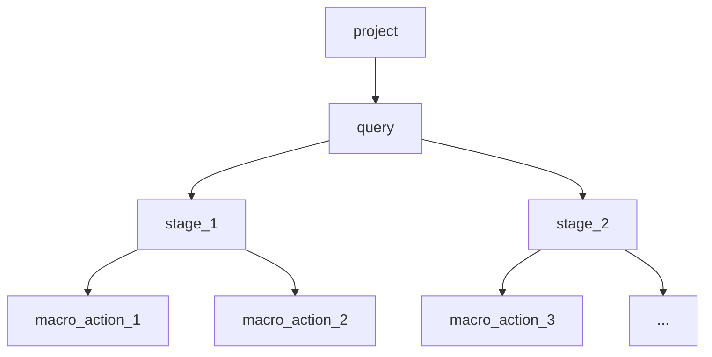

- 树的根节点是 `project`，表示一个完整研究项目，对应整个项目级记忆空间
- `project` 下一层是用户实验目标 `query`，例如“催化率提高 5%”“稳定性提高 5%”
- 每个 `query` 下是一条按执行顺序展开的 `stage` 序列；每个 `stage` 表示一个由多组 `macro-action` 共同服务的超短期阶段目标
- 每个 `stage` 下是一条按执行顺序展开的 `macro-action` 序列；`macro-action` 是最细粒度的执行记忆块
- 每个 `macro-action` 节点必须保存该段最核心的细节，包括：执行前后的实验结果状态、该段具体执行了哪些事情、执行前的安全判定等级，以及执行后的安全状态或风险变化
- 上层节点不需要重复保存全部底层细节，而应主要保存对子节点的总结信息和 `meta_info`，例如安全性、是否符合预期、结果是否好、好在哪、坏在哪、是否值得继续推进
- 动态 `workflow` 的版本演化、每次修改 / 增补 / 删减的原因、异常修正过程、路线切换原因和最终结论，也必须挂接到对应的 `query`、`stage` 或 `macro-action` 节点上，形成可追溯的项目因果链
- 树状记忆的目的，是把长期项目经验切成逻辑清晰的块状结构，避免 LLM 在推理时把整棵树全部塞进上下文，侵占上下文窗口并影响判断准确性
- 因此，记忆层必须具备成熟的触发机制：默认只激活当前任务真正相关的节点摘要，需要时再沿着树向下钻取具体 `macro-action` 细节，而不是进行全量读取与遍历

一句话：

- 研究层做科学判断
- 设备适应层生成可执行并可远程发射的方案
- 执行层只做安全门与远程发射，并回收执行事件和观测事件
- 记忆层以项目级树状记忆和触发式召回机制沉淀阶段目标、动态 `workflow` 与结果经验
- 再回到研究层继续判断下一步

---

## 3. 设计原则

本版需求必须遵守下面 6 条原则。  
这些原则不是实现建议，而是系统边界。后续的模块设计、数据结构、运行流程和 agent 协作，都不能违背它们。

### 3.1 研究层与设备适应层解耦

- 研究层与设备适应层必须明确分层，不能让实验 workflow 生成模块同时承担“科学研究规划”和“实验设备适配”两类职责
- 研究层负责安全隐患分析、实验结果分析和 `stage-level` 规划分析，维护实验的长期目标与中期目标，判断当前阶段下一步在科学上应该推进什么
- 研究层保留长期、中期与阶段级规划，只把下一步短期 `macro-action` 的科学思路传递给下一层，包括要验证什么、成功判据、关键风险与约束
- 设备适应层核心关注“如何在本实验设备上实现下一步 `macro-action`”，需要基于本机 `workstation` 能力、状态、依赖和限制，把上层思路翻译成当前可执行的短期实验方案
- 设备适应层在生成 `macro_action_plan` 时，必须同时考虑设备能力边界、安全要求与实验规范，确保方案不仅可执行，而且可安全、规范地执行

### 3.2 在线规划粒度必须是 `macro-action`

- 系统不能把完整 `workflow` 一次性规划到底后盲执行，也不能把单个 `workstation` 当作唯一规划单位
- `workflow` 负责提供当前 round 的全局结构，但运行时真正被生成、执行、评估和续规划的核心对象，必须是一段段 `macro-action`
- `workstation` 是最小执行单位，只负责具体执行；它不承载上层科学判断，不应直接替代 `macro-action` 级规划
- 每一轮在线续规划，都应围绕“当前 `decision point` 到下一个 `decision point` 之间该执行什么”来展开

### 3.3 观测请求与决策边界必须显式化

- 实验结果返回不是默认动作，而是由上层显式发起的 `observation request`
- 只有 `result-capable workstation` 才可能承担结果采集职责，但是否在该点取结果，必须由规划阶段明确决定
- 只有当一次真实 `observation event` 返回后，系统才获得新的合法 `decision point`
- 不允许在没有新观测依据的情况下随意声称”进入下一轮科学判断”，也不允许把运行时结果采集写成默认必经流程
- **最大盲执行长度**：连续 N 个 workstation（建议 N=5）无观测时，系统必须在下一个 `result-capable workstation` 强制发起 `observation request`，不允许 Agent Team 跳过
- **异常触发强制观测**：任一 workstation 报告执行异常（参数越界、设备故障、前驱体异常等）时，系统必须在最近的 `result-capable workstation` 强制观测，不论原规划是否安排了该点的观测

### 3.4 执行必须受真实设备约束，并以安全为硬门

- 设备适应层提出的方案必须建立在当前实验室真实 `workstation` 能力、状态、依赖关系和可用性之上，不能脱离设备条件空想实验路径
- 执行层的职责是对 `macro_action_plan` 做安全检查并完成执行，而不是自行改写研究意图或临时发明新的实验目标
- 安全检查不是建议项，而是执行前硬门；只要风险超过允许阈值，系统就必须中断、回退或申请人工介入
- 即使某条路径在科学上看起来合理，只要在当前设备条件下不安全、不规范或不可控，也不得进入执行

### 3.5 记忆必须是项目级树状记忆，并采用触发式召回

- 记忆层的根对象是 `project`，其下按 `query -> stage -> macro-action` 的层级组织项目经验
- 记忆不能只是按时间平铺堆积的日志，而必须按逻辑块组织：上层节点保存摘要和 `meta_info`，下层节点保存具体执行细节
- `macro-action` 节点必须能够回溯执行前后实验状态、该段具体动作、安全判定等级变化，以及与后续判断有关的异常和结果
- 记忆读取必须以触发为主、以钻取为辅：优先激活与当前目标、当前阶段、最新观测、异常信号和安全风险最相关的节点，而不是全量扫描历史

### 3.6 系统必须以动态闭环运行，并始终有明确停止条件

- 初始 `workflow` 只是当前 round 的起点，不是一次性生成后不可更改的最终答案
- 系统在运行中真正持续演化的核心产物，应是“初始 `workflow` + 不断更新的 `macro_action_plan` + 项目级记忆”，而不是单个静态文件
- 每完成一段 `macro-action` 并获得新的有效观测后，系统都必须允许重新分析、修正后续行为，并决定是否继续当前路线
- `workflow`、`stage` 与 `macro-action` 的变化必须可追溯，系统需要能够解释“为什么改、依据什么改、改后风险如何变化”
- 系统必须在目标达成、时间耗尽、轮数耗尽或安全越界时停止，不能为了保持闭环而无限循环

### 3.7 设备适应层与研究层之间必须存在快速回退通道

- 设备适应层连续 N 次（建议 N=2）找不到可执行方案时，通过 `FeasibilityFeedback` 直接传递给研究层，不走完整闭环（即不经过执行层 → 记忆层 → runtime 的正常路径）
- 研究层维护 `feasibility_prior`（基于历史搜索成功率），避免重复生成不可行方向
- 设备适应层传递的是"什么做不到"（设备知识），不是"应该做什么"（科学判断），因此不违反 §3.1 的解耦原则
- 快速回退通道的目的是减少无效闭环的资源浪费：如果研究层提出的方向在当前设备上根本不可行，系统不应该让这个方向走完安全门 → 执行 → 记忆 → 分析的全流程才发现问题

---

## 4. 分层实现设计

本节给出一版可落地的实现设计。

- `runtime` 是统一控制层，负责调度、状态推进、停止判断与重规划路由
- 研究层负责科学解释、归因、判断与假设更新
- 设备适应层负责把科学意图翻译为本机真实可执行、可远程发射的实验方案
- 执行层的软件部分只负责 **安全门** 与 **将 `macro-action` 发射到远程执行端**，并回收执行事件与观测事件
- 记忆层负责项目级树状记忆的写入、总结、触发式召回与有效性检查

系统建议采用如下总分层：

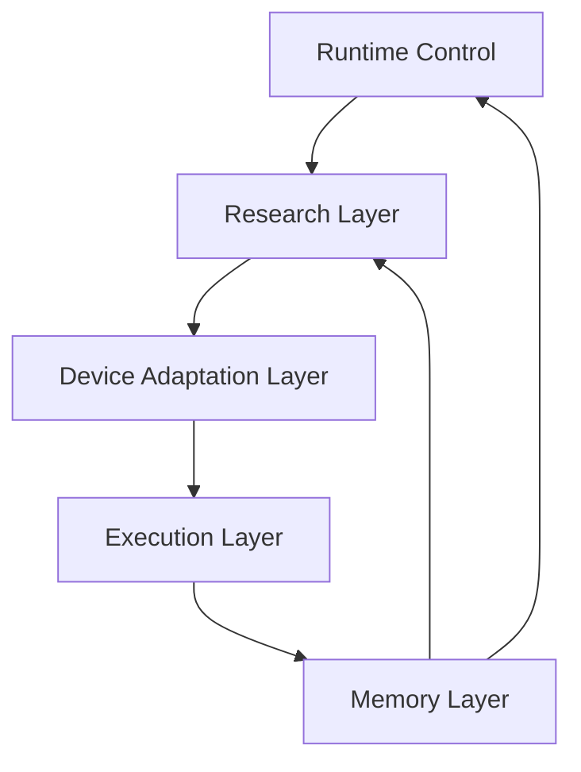

### 4.1 Runtime 控制层

**简要功能**

`runtime` 是整个系统的统一控制层，不负责科学研究本身，也不直接替代搜索与执行，而是负责把各层组织成一个真正稳定的闭环系统。

- 维护当前 `RuntimeState`
- 维护当前 `workflow_version` 与当前激活的 `macro_action_plan`
- 组织上下文装配，包括 `Session Context`、`Decision Context`、`Plan Context`、`Memory Context`
- 决定何时调用研究层、设备适应层、执行层与记忆层
- 管理停止条件、重规划入口与版本切换
- 负责把执行事件和观测事件路由到正确的后续阶段

**输入**

- 用户目标、时间预算、轮数预算、危险等级上限
- 当前设备注册表与实时设备状态
- 当前 `workflow_version`、当前 `stage`、当前 `macro-action`
- 执行层返回的事件流
- 记忆层返回的 `MemoryContext`

**输出**

- 对各层的调用请求
- 更新后的 `RuntimeState`
- `ReplanTicket`
- `StopDecision`
- 当前有效的 `workflow_version`

**推荐内部组件**

- `Runtime Orchestrator`
- `Context Assembler`
- `Stop Evaluator`
- `Replan Router`
- `Version Manager`

**流程图**

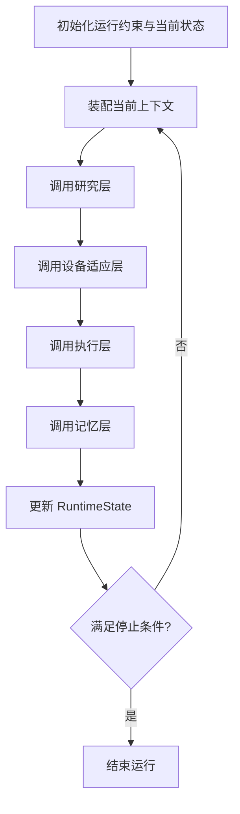

### 4.2 研究层

**简要功能**

研究层是系统的科学判断核心。它负责理解实验结果、维护阶段目标、更新假设，并决定下一段 `macro-action` 在科学上应该追求什么。

- 分析最新 `observation event`
- 结合论文 API、知识图谱和历史记忆做解释与归因
- 判断当前路线是否继续、补证、降级、改线或终止
- 输出下一步短期 `macro-action` 的科学目标、成功判据、关键风险与约束

**输入**

- 当前 `query`
- 当前 `stage`
- 最新 `ObservationEvent`
- 记忆层召回的 `MemoryContext`
- 外部知识结果
- 当前运行约束

**输出**

- `ScientificDirective`
- `ResearchJudgement`
- `ObservationIntent`

**推荐内部组件**

- `Result Analyst`
- `Hypothesis Planner`
- `Scientific Risk Reviewer`
- `Research Facade`

**流程图**

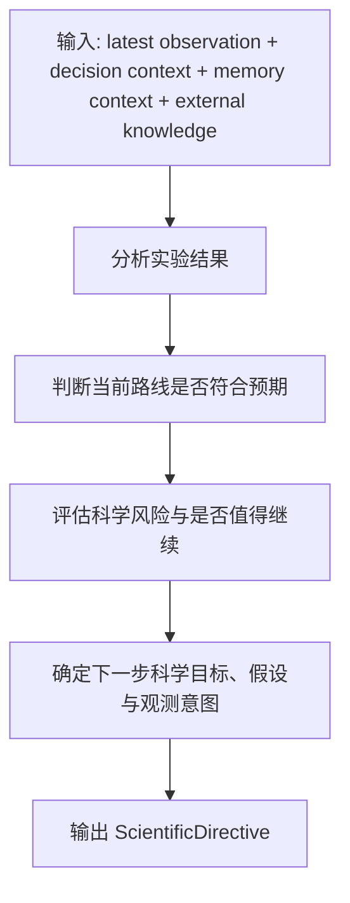

### 4.3 Device Adaptation Layer

**简要功能**

这一层负责把研究层给出的科学意图，翻译为当前实验室条件下可执行的下一段 `macro-action`，同时承担 **设备适应** 的职责。  
也就是说，这一层不仅要决定“做什么”，还要决定“在本机设备体系内如何组织、如何参数化、如何适配成可远程发射的实验方案”。

- 将科学目标映射为当前设备能力空间
- 生成多个候选 `macro-action`
- 检查依赖、参数边界、设备状态与规范约束
- 完成对远程执行端的设备适配，形成可发射的 `macro_action_plan`
- 选择最可执行、最安全、最符合观测目标的方案

**输入**

- `ScientificDirective`
- 工作站注册表
- 当前设备状态
- 当前 `workflow` 上下文
- 当前 `stage` 与当前边界信息

**输出**

- `MacroActionPlan`
- `AdaptationFailure`
- 必要时输出 `WorkflowPatch` 或 `ReplanTicket`

**推荐内部组件**

- `Capability Grounder`
- `Candidate Composer`
- `Constraint Verifier`
- `Device Adaptation Planner`
- `Plan Ranker`

**流程图**

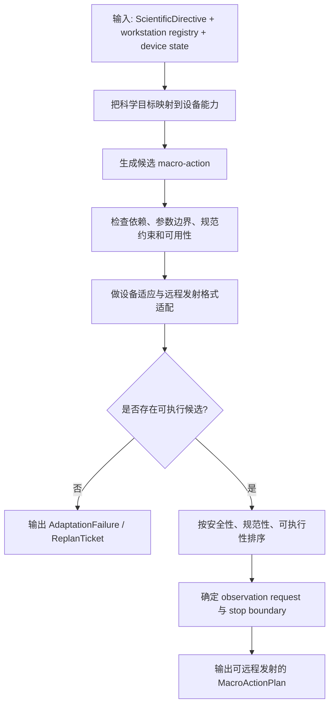

### 4.4 执行层

**简要功能**

执行层的软件部分只负责两件事：

- 在真正执行前做硬性安全校验
- 在安全通过后，把已经由设备适应层适配好的 `macro-action` 发射到远程执行端，并回收执行事件与观测事件

它不负责设备适配，不负责把科学意图翻译成设备动作，不负责重新组织 workstation 序列。

**输入**

- 已经完成设备适应的 `MacroActionPlan`
- 当前实验环境状态
- 当前安全约束

**输出**

- `SafetyAssessment`
- `DispatchReceipt`
- `ObservationEvent`
- `SafetyBlockedEvent`
- `ExecutionAnomalyEvent`
- `MacroActionCompletedEvent`

**推荐内部组件**

- `Safety Gate`
- `Remote Launcher`
- `Observation Collector`

**流程图**

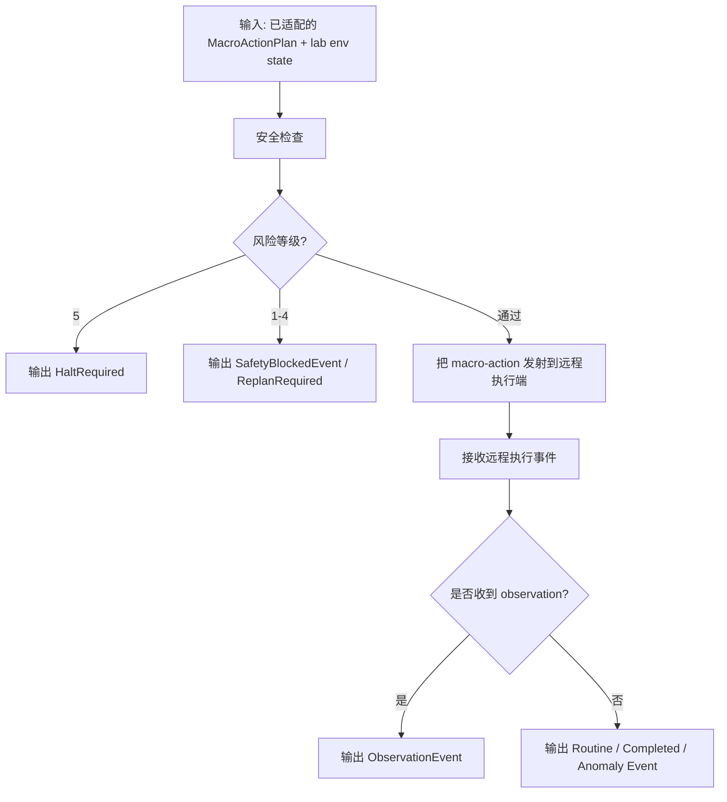

### 4.5 记忆层

**简要功能**

记忆层不是一个被动日志桶，而是项目级长期记忆系统。  
它既负责把执行与观测过程写入树状结构，也负责在正确的时机只召回最相关的局部记忆。

- 把执行前后状态、安全等级、观测结果写入 `project -> query -> stage -> macro-action`
- 维护上层摘要与 `meta_info`
- 根据当前目标、观测、异常与风险做触发式召回
- 对被召回记忆做有效性检查，避免旧结论直接污染当前判断

**输入**

- 记忆写入触发：执行结果、观测事件、安全结果、路线切换信息
- 记忆读取触发：当前 `query / stage / latest observation / anomaly / safety signal`

**输出**

- `MemoryWriteReceipt`
- `MemoryContext`
- 上层摘要更新结果

**推荐内部组件**

- `Memory Writer`
- `Memory Summarizer`
- `Memory Selector`
- `Memory Freshness Checker`

**流程图**

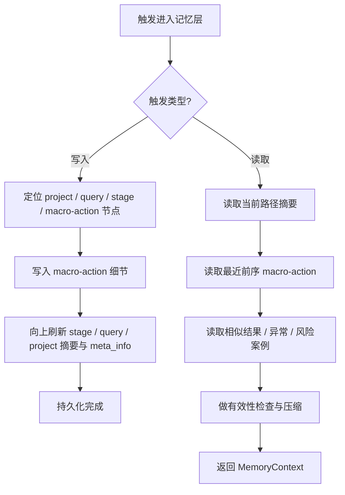

### 4.6 核心层间契约

为了让各层真正可独立开发、独立测试、独立替换，系统需要一组稳定的中间对象作为通信契约。

- `ScientificDirective`
  - 研究层输出给设备适应层的标准对象
  - 核心内容包括：科学目标、假设、成功判据、失败信号、风险提示、推荐观测意图、约束
  - 新增字段：`evidence_sources`（每个核心判断的证据来源标注）、`confidence_level`（整体置信度 high/medium/low）、`grounding_tool_refs`（本次调用的外部验证工具列表）、`unverified_claims`（明确标记为未经验证的推测列表）

- `MacroActionPlan`
  - 设备适应层输出给执行层的标准对象
  - 核心内容包括：当前段目标、`workstation_sequence`、参数、前置条件、`observation_request`、停止边界、远程发射所需的适配结果

- `SafetyAssessment`
  - 执行层安全门输出的标准对象
  - 核心内容包括：风险等级、阻断原因、缓解建议、是否允许执行

- `ObservationEvent`
  - 执行层输出给 `runtime` 与研究层的标准结果对象
  - 核心内容包括：来源工作站、观测数据、时间戳、是否形成新的 `decision point`

- `MemoryContext`
  - 记忆层输出给研究层与 `runtime` 的标准对象
  - 核心内容包括：当前路径摘要、最近前序 `macro-action`、相似案例、相关风险片段

- `RuntimeState`
  - `runtime` 持有的统一运行态对象
  - 核心内容包括：当前 `query`、当前 `stage`、当前 `macro-action`、当前 `workflow_version`、预算消耗、停止状态

- `ReplanTicket`
  - 当执行异常、设备适配失败或安全阻断时，由 `runtime` 路由给研究层 / 设备适应层的重规划对象
  - 核心内容包括：断点位置、触发原因、证据、允许的修复范围

- `StopDecision`
  - `runtime` 的统一停止判定对象
  - 核心内容包括：是否停止、停止原因、触发层级、是否需要人工介入

- `FeasibilityFeedback`
  - 设备适应层 → 研究层的快速回退对象，用于设备适应层发现方案不可行时直接反馈研究层
  - 核心内容包括：关联的 `directive_id`、失败原因类型（`device_unavailable` / `param_out_of_range` / `dependency_unmet` / `no_capability_match`）、具体被阻断的约束、方向调整提示
  - 设备适应层连续 N 次适配失败后触发，不经过执行层和记忆层的完整闭环

---

## 5. 层间协作闭环与状态迁移设计

本节定义系统如何把 `runtime`、研究层、设备适应层、执行层、记忆层组织成一个真正稳定的闭环。  
核心原则是：

- 研究层只在合法决策边界上做科学判断
- 设备适应层只在研究层给出明确科学意图后做实验实现与设备适配
- 执行层只负责安全门、远程发射与事件回传
- 记忆层既负责写入，也负责为下一轮判断提供局部上下文
- `runtime` 是唯一有权推进主状态机的控制层

### 5.1 总体协作闭环

系统的正常运行不是单次直线流程，而是围绕 `decision point` 展开的层间协作闭环。

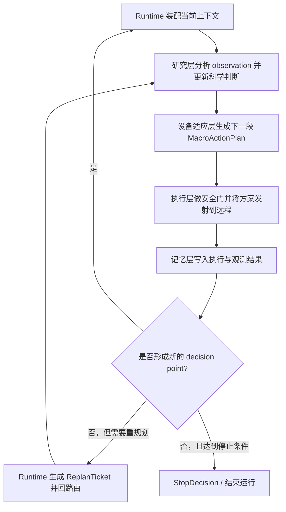

### 5.2 启动闭环：初始 workflow 与首段 `macro-action`

启动阶段的目标不是一次性生成未来所有执行细节，而是建立：

- 初始 `workflow` 骨架
- 当前 `query`
- 当前 `stage`
- 第一段已完成设备适配的 `macro_action_plan`

启动阶段应按下面的逻辑推进：

- `runtime` 初始化全局状态
- `runtime` 装配启动上下文
- 研究层生成初始 `ScientificDirective`
- 设备适应层生成首段 `MacroActionPlan`
- `runtime` 基于首段计划构建初始 `workflow` 骨架

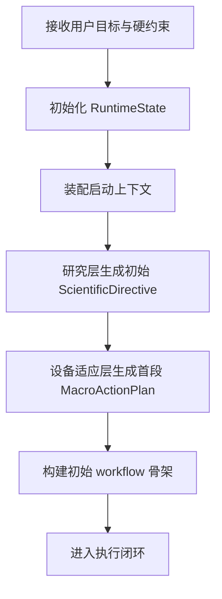

### 5.3 正常在线闭环：基于 `decision point` 的续规划

当执行层返回新的 `ObservationEvent` 时，系统进入新的合法 `decision point`。  
只有在这个时刻，研究层才应重新评估路线并决定下一步。

正常在线闭环应满足：

- `runtime` 识别新的合法决策边界
- `runtime` 装配 `Decision Context + Memory Context`
- 研究层输出新的 `ScientificDirective`
- 设备适应层输出新的已适配 `MacroActionPlan`
- 执行层只做安全门与远程发射
- 记忆层记录这一段的经验

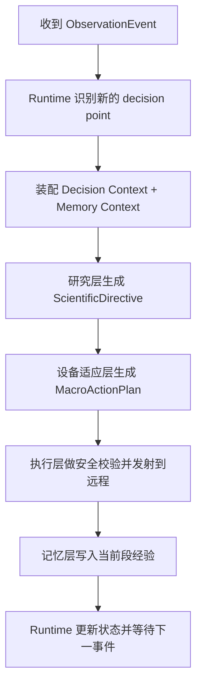

### 5.4 异常闭环：安全阻断、执行异常与设备适配失败

并不是所有轮次都会以正常 `ObservationEvent` 结束。  
系统必须显式支持异常回路。

异常入口至少包括：

- 设备适应层找不到可执行方案
- 安全门阻断当前 `MacroActionPlan`
- 远程执行异常
- 观测结果显示当前路线明显失效

异常时 `runtime` 应生成 `ReplanTicket`，并根据范围决定回到哪一层：

- 如果是科学目标本身有问题，回研究层
- 如果是实验实现路径或设备适配有问题，回设备适应层
- 如果是最高风险等级触发，直接终止并申请人工介入

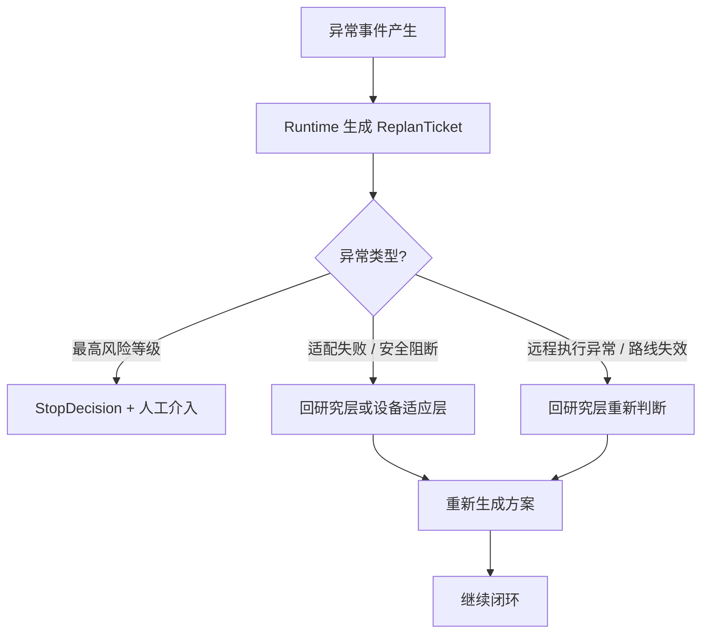

### 5.5 Runtime 状态机

建议实现为显式状态机，而不是隐含在若干 `if / while` 中。

建议状态集合如下：

- `INIT`
- `BOOTSTRAP_CONTEXT`
- `BOOTSTRAP_RESEARCH`
- `BOOTSTRAP_ADAPTATION`
- `SAFETY_GATE`
- `DISPATCHING_MACRO_ACTION`
- `WAITING_OBSERVATION`
- `DECISION_POINT_READY`
- `POST_OBSERVATION_RESEARCH`
- `POST_OBSERVATION_ADAPTATION`
- `MEMORY_SYNC`
- `REPLAN_ROUTING`
- `STOP_EVALUATION`
- `COMPLETED`
- `HALTED`

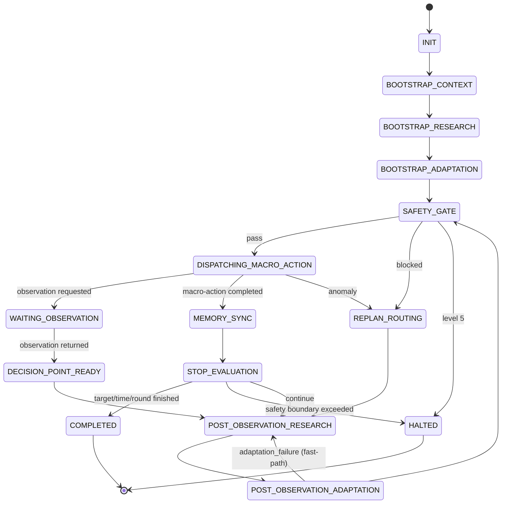

### 5.6 状态迁移规则

为避免多层互相越权，状态迁移规则必须明确。

- 只有 `runtime` 可以切换主状态机状态
- 研究层不能直接进入执行，只能输出 `ScientificDirective`
- 设备适应层不能直接改写 `RuntimeState`，只能输出 `MacroActionPlan` 或 `AdaptationFailure`
- 执行层不能改写研究目标，只能输出安全结果、远程发射结果与事件
- 记忆层不能推动状态，只能提供 `MemoryContext` 和写入回执

推荐迁移条件如下：

- `INIT -> BOOTSTRAP_CONTEXT`
  - 条件：用户目标、预算、工作站注册表已装载

- `BOOTSTRAP_ADAPTATION -> SAFETY_GATE`
  - 条件：已生成首段 `MacroActionPlan`

- `SAFETY_GATE -> DISPATCHING_MACRO_ACTION`
  - 条件：`SafetyAssessment.status == pass`

- `SAFETY_GATE -> REPLAN_ROUTING`
  - 条件：`SafetyAssessment.status == replan_required`

- `SAFETY_GATE -> HALTED`
  - 条件：`SafetyAssessment.status == halt_required`

- `WAITING_OBSERVATION -> DECISION_POINT_READY`
  - 条件：真实 `ObservationEvent.decision_point == true`

- `MEMORY_SYNC -> STOP_EVALUATION`
  - 条件：当前段写入完成

- `STOP_EVALUATION -> COMPLETED`
  - 条件：目标达成、时间耗尽或轮数耗尽

- `STOP_EVALUATION -> HALTED`
  - 条件：安全越界或人工介入触发

- `STOP_EVALUATION -> POST_OBSERVATION_RESEARCH`
  - 条件：仍可继续，且已经形成新的合法决策边界

---

## 6. 上下文分层与装配机制

系统实现时，不能把所有信息都直接塞给研究层或设备适应层。  
`runtime` 必须负责把上下文拆层并只注入当前真正相关的内容。

### 6.1 上下文分层

- `Session Context`
  - 当前运行的全局硬约束
  - 包括：时间预算、轮数预算、危险等级上限、设备注册表摘要、当前环境状态摘要

- `Decision Context`
  - 当前合法决策边界上的局部事实
  - 包括：当前 `query`、当前 `stage`、最新 `ObservationEvent`、当前目标、当前假设

- `Plan Context`
  - 当前有效执行骨架
  - 包括：当前 `workflow_version`、当前 `workflow` 摘要、当前待执行 `macro_action_plan`、最近一次 `ReplanTicket`

- `Memory Context`
  - 由记忆层触发式召回的局部经验
  - 包括：当前路径摘要、最近前序 `macro-action`、相似案例、风险提示、有效性检查结果

### 6.2 上下文装配原则

- 研究层默认读取 `Decision Context + Memory Context + 外部知识`
- 设备适应层默认读取 `ScientificDirective + Session Context + Plan Context`
- 执行层默认读取 `MacroActionPlan + Session Context`
- 记忆层读取写入触发对象，而不是整个历史项目
- 任意一层都不允许默认全量读取完整项目记忆树

### 6.3 上下文装配流程

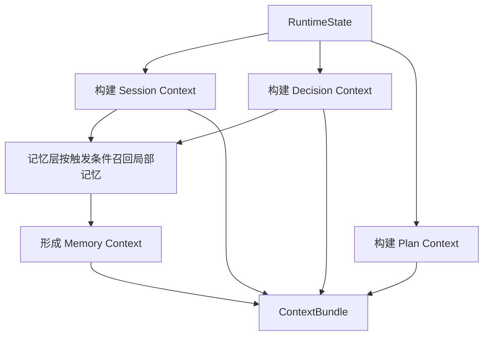

---

## 7. 核心数据结构定义

本节把 `4.6` 中的核心契约扩展为字段级 schema。  
这里不写代码形式的伪实现，只给出结构化字段建议。

### 7.1 约定与公共类型

以下约定默认适用于本节所有对象：

- 所有 `*_id` 字段均应为全局唯一字符串
- 所有时间戳字段统一采用 ISO 8601
- 所有 `status / type / mode` 字段均应用有限枚举，不使用自由文本
- 所有对象都应保留 `created_at` 或 `updated_at` 以支持回放与追踪
- 所有跨层对象都应支持 `summary` 和 `refs` 字段，以避免大块原文跨层传播

公共类型建议包括：

- `ObservationIntent`
  - 字段：`observation_type`、`target_workstation_type`、`target_metrics`、`success_signal`、`failure_signal`、`notes`

- `WorkstationParameter`
  - 字段：`name`、`value`、`unit`、`source`

- `BoundaryRef`
  - 字段：`boundary_type`、`boundary_id`、`description`

### 7.2 `Workstation`

`Workstation` 是设备适应层与执行层共享的设备能力对象。

- `workstation_id`
- `workstation_name`
- `workstation_type`
- `capabilities`
- `parameter_schema_ref`
- `constraints`
- `state`
- `result_capable`
- `result_types`
- `safety_rules_ref`
- `updated_at`

字段说明：

- `capabilities`：该工作站可完成的能力描述
- `constraints`：设备边界、顺序要求、环境限制
- `result_capable`：是否能承担 `observation request`
- `result_types`：如果可回数，能返回哪些类型结果

### 7.3 `ScientificDirective`

`ScientificDirective` 是研究层输出给设备适应层的标准对象。

- `directive_id`
- `project_id`
- `query_id`
- `stage_id`
- `source_decision_point_id`
- `scientific_goal`
- `stage_goal`
- `hypothesis`
- `rationale_summary`
- `success_criteria`
- `failure_signals`
- `preferred_observation`
- `risk_notes`
- `hard_constraints`
- `continue_mode`
- `memory_refs`
- `created_at`
- `evidence_sources`
- `confidence_level`
- `grounding_tool_refs`
- `unverified_claims`

字段说明：

- `scientific_goal`：下一步短期科学目标
- `stage_goal`：当前所在 `stage` 的超短期目标
- `hypothesis`：当前要验证或修正的假设列表
- `continue_mode`：当前路线是继续、改线、降级还是终止
- `evidence_sources`：每个核心判断（hypothesis, risk_notes, rationale_summary）的证据来源标注，值为 `{experiment_result, tool_calculation, literature, llm_inference}` 之一或组合
- `confidence_level`：研究层对本次 directive 整体置信度的自评（high / medium / low）。设备适应层对 `low` 置信度 directive 应发出 `ClarificationRequest`
- `grounding_tool_refs`：研究层在生成本 directive 时调用的外部验证工具列表（如论文 API、热力学计算器、知识图谱等）
- `unverified_claims`：研究层明确标记为未经外部验证的推测列表，供设备适应层和记忆层区分对待

### 7.4 `MacroActionPlan`

`MacroActionPlan` 是设备适应层输出给执行层的可执行对象。

建议包含两层信息：

- 实验逻辑层
  - `macro_action_id`
  - `project_id`
  - `query_id`
  - `stage_id`
  - `workflow_version`
  - `source_directive_id`
  - `goal`
  - `rationale_summary`
  - `start_boundary`
  - `end_boundary`
  - `workstation_sequence`
  - `target_observation`
  - `stop_conditions`
  - `expected_risk_level`
  - `search_notes`
  - `created_at`

- 设备适应与远程发射层
  - `dispatch_target`
  - `dispatch_protocol`
  - `dispatch_payload_ref`
  - `dispatch_constraints`
  - `adapter_notes`

字段说明：

- `workstation_sequence`：当前段内顺序执行的设备调用序列
- `target_observation`：这一段结束时希望获得的结果类型
- `dispatch_payload_ref`：已经适配完成、可被远程执行端直接接收的方案载荷引用

### 7.5 `SafetyAssessment`

`SafetyAssessment` 是执行前硬性安全门的输出对象。

- `assessment_id`
- `macro_action_id`
- `workflow_version`
- `risk_level`
- `status`
- `blocking_reasons`
- `mitigation_suggestions`
- `rule_hits`
- `llm_risk_notes`
- `requires_human_intervention`
- `assessed_at`

字段说明：

- `risk_level`：风险等级，建议固定在 `1-5`
- `status`：真正驱动状态机的控制结果
- `rule_hits`：触发的规则校验项

### 7.6 执行事件族

执行层不应返回自由文本，而应返回统一事件族。

基础字段建议包括：

- `event_id`
- `event_type`
- `project_id`
- `query_id`
- `stage_id`
- `macro_action_id`
- `workflow_version`
- `workstation_id`
- `timestamp`
- `summary`
- `refs`

具体事件建议包括：

- `RoutineExecutionEvent`
  - 额外字段：`status`、`step_id`

- `DispatchReceipt`
  - 额外字段：`remote_run_id`、`dispatch_target`、`accepted`

- `ObservationEvent`
  - 额外字段：`observation_type`、`observation_payload_ref`、`extracted_metrics`、`decision_point`

- `SafetyBlockedEvent`
  - 额外字段：`assessment_id`、`risk_level`

- `ExecutionAnomalyEvent`
  - 额外字段：`anomaly_type`、`severity`

- `MacroActionCompletedEvent`
  - 额外字段：`completed_without_observation`

### 7.7 记忆树节点

项目级记忆树应至少定义四层节点。

- `ProjectMemoryNode`
  - 字段：`project_id`、`project_name`、`queries`、`meta_info`

- `QueryMemoryNode`
  - 字段：`query_id`、`project_id`、`query_text`、`stages`、`meta_info`

- `StageMemoryNode`
  - 字段：`stage_id`、`query_id`、`stage_goal`、`macro_actions`、`meta_info`

- `MacroActionMemoryNode`
  - 字段：`macro_action_id`、`stage_id`、`before_state_summary`、`action_summary`、`after_state_summary`、`safety_before`、`safety_after`、`observation_refs`、`anomaly_refs`、`workflow_change_refs`、`meta_info`

- `MemoryMetaInfo`
  - 字段：`summary`、`safety_eval`、`expectation_match`、`result_eval`、`continue_recommendation`、`updated_at`

### 7.8 `MemoryContext`

`MemoryContext` 是记忆层提供给研究层与 `runtime` 的局部召回结果。

- `context_id`
- `project_id`
- `query_id`
- `stage_id`
- `current_path_summaries`
- `recent_predecessors`
- `similar_cases`
- `risk_memories`
- `freshness_warnings`
- `created_at`

每个 `MemorySnippet` 建议包含：

- `node_id`
- `node_type`
- `snippet_summary`
- `freshness`
- `relevance_score`
- `ref`

### 7.9 `ContextBundle`

`ContextBundle` 是 `runtime` 在调用研究层或设备适应层前装配好的运行上下文。

- `bundle_id`
- `session_context`
- `decision_context`
- `plan_context`
- `memory_context`
- `external_knowledge_refs`

其中：

- `SessionContext`
  - `project_id`
  - `runtime_constraints`
  - `time_budget_remaining`
  - `round_budget_remaining`
  - `danger_level_limit`
  - `workstation_state_summary`

- `DecisionContext`
  - `query_id`
  - `query_goal`
  - `stage_id`
  - `stage_goal`
  - `latest_observation_id`
  - `latest_observation_summary`
  - `current_hypothesis`

- `PlanContext`
  - `workflow_version`
  - `workflow_summary`
  - `current_macro_action_id`
  - `latest_replan_ticket_id`

### 7.10 `RuntimeState`

`RuntimeState` 是 `runtime` 唯一持有并持续更新的主状态对象。

- `run_id`
- `project_id`
- `current_state`
- `workflow_version`
- `current_query_id`
- `current_stage_id`
- `current_macro_action_id`
- `latest_observation_id`
- `latest_execution_event_id`
- `latest_replan_ticket_id`
- `elapsed_time_sec`
- `macro_action_count`
- `danger_level_limit`
- `stop_flags`
- `updated_at`

建议的 `current_state` 枚举包括：

- `INIT`
- `BOOTSTRAP_CONTEXT`
- `BOOTSTRAP_RESEARCH`
- `BOOTSTRAP_ADAPTATION`
- `SAFETY_GATE`
- `DISPATCHING_MACRO_ACTION`
- `WAITING_OBSERVATION`
- `DECISION_POINT_READY`
- `POST_OBSERVATION_RESEARCH`
- `POST_OBSERVATION_ADAPTATION`
- `MEMORY_SYNC`
- `REPLAN_ROUTING`
- `STOP_EVALUATION`
- `COMPLETED`
- `HALTED`

### 7.11 `ReplanTicket`

`ReplanTicket` 是异常回路的标准输入对象，用于把重规划原因、证据和修复边界传递给研究层或设备适应层。

- `ticket_id`
- `project_id`
- `query_id`
- `stage_id`
- `macro_action_id`
- `workflow_version`
- `trigger_type`
- `trigger_summary`
- `evidence_refs`
- `scope_hint`
- `allowed_repair_modes`
- `created_at`

建议的 `trigger_type` 至少支持：

- `adaptation_failure`
- `safety_blocked`
- `execution_anomaly`
- `route_invalidated`
- `manual_interrupt`

### 7.12 `StopDecision`

`StopDecision` 是 `runtime` 输出的统一停止判定对象。

- `decision_id`
- `should_stop`
- `stop_type`
- `reason`
- `source_layer`
- `requires_human_intervention`
- `created_at`

建议的 `stop_type` 至少支持：

- `target_achieved`
- `time_budget_exhausted`
- `round_budget_exhausted`
- `safety_halt`
- `manual_stop`
- `research_requested_stop`
- `continue`

### 7.13 `FeasibilityFeedback`

`FeasibilityFeedback` 是设备适应层向研究层发出的快速回退对象，用于在设备适应层发现当前科学方向在设备条件下不可行时，绕过完整闭环直接反馈研究层。

- `feedback_id`
- `directive_id`
- `project_id`
- `query_id`
- `stage_id`
- `failure_reason_type`
- `blocked_constraint`
- `attempted_adaptation_count`
- `direction_adjustment_hint`
- `device_context_snapshot`
- `created_at`

字段说明：

- `directive_id`：关联的 `ScientificDirective` ID，标识是哪个科学指令触发了回退
- `failure_reason_type`：失败原因分类，取值为 `device_unavailable`（所需设备不存在或不可用）/ `param_out_of_range`（参数超出设备能力范围）/ `dependency_unmet`（前置依赖无法满足）/ `no_capability_match`（没有设备组合能实现目标）
- `blocked_constraint`：具体被阻断的约束描述，例如"目标温度 1200°C 超出可用加热站最高 1000°C"
- `attempted_adaptation_count`：设备适应层已尝试的适配次数（达到阈值 N 后触发此回退）
- `direction_adjustment_hint`：设备适应层基于设备知识给出的方向调整建议（仅限设备层面，不涉及科学判断）
- `device_context_snapshot`：触发回退时的设备状态快照，供研究层了解当前设备条件

---

## 8. Workflow Versioning / Replan Scope / Patch Strategy

本节专门定义三件事：

- `workflow versioning`：每次重规划后，系统如何生成、继承和切换新的 `workflow` 版本
- `replan scope`：不同重规划请求允许修改的范围到底有多大
- `patch strategy`：`runtime` 应该在什么条件下选择“局部修复、下一段重生成、后缀重规划、整条重生成”

这一节的目标，是把下面这件事彻底讲清楚：

**系统不是每次有问题就把整条 workflow 全推翻重来。**  
系统应尽可能在不破坏已验证前缀的情况下，最小化地修改未来未执行部分；只有在当前路线整体失效时，才升级到更大范围的重规划。

### 8.1 为什么必须有显式的 workflow versioning

由于本系统是动态闭环系统，`workflow` 不可能始终保持静态不变。  
一旦发生下面任一情况，就可能触发新的版本：

- 新的 `ObservationEvent` 表明当前路线的后续部分已不再合理
- 设备适应层在当前设备状态下无法找到可执行后续方案
- 安全门阻断当前计划
- 远程执行异常导致原后续路径失去前提
- 研究层判断当前科学路线需要改线、降级或补证

因此，系统必须满足以下版本化要求：

- 每次被接受的重规划结果，都必须形成一个新的不可变 `workflow_version`
- 运行中任意时刻，`runtime` 只能绑定到一个当前激活版本
- 已经执行完成的前缀，必须在新版本中被视为历史事实，而不是可被改写的草稿
- 每个新版本都必须可追溯到其父版本、触发原因、变更范围和证据来源

### 8.2 Version 设计原则

建议把 `workflow` 看作一个有血缘关系的版本树，而不是单独散落的文件。

每个 `workflow_version` 至少应满足：

- 有唯一 `version_id`
- 有 `parent_version_id`
- 有触发它产生的 `replan_ticket_id`
- 有变更范围描述
- 有变更摘要
- 有“保留前缀”边界

推荐的版本关系如下：

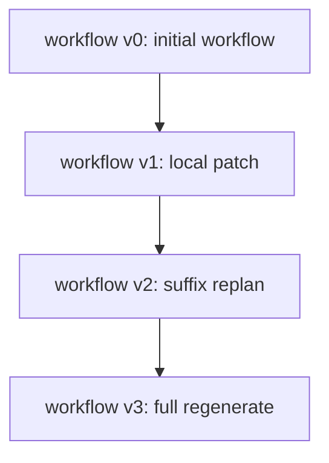

建议记录的版本元信息包括：

- `version_id`
- `parent_version_id`
- `root_version_id`
- `created_from_ticket_id`
- `change_scope`
- `preserved_prefix_boundary_id`
- `changed_region_summary`
- `reason_summary`
- `created_at`

### 8.3 版本切换不变式

无论采用哪一种重规划策略，以下不变式都必须成立：

- 已执行完成的 `macro-action` 不可被回滚、删除或改写
- 已发生的 `ObservationEvent` 不可被伪造覆盖，只能被后续判断重新解释
- 新版本只能修改未来未执行区域，或者在必要时整体替换未来部分
- 任何版本切换都必须留下清晰的 lineage：旧版本是谁、新版本是谁、为什么切换
- `runtime` 切换版本时，必须同时更新当前 `workflow_version`、当前边界和当前 `macro_action_plan`

换句话说：

**版本化系统允许改未来，不允许改过去。**

### 8.4 Replan Scope 的四个标准级别

建议把重规划范围标准化为四档，从小到大依次升级：

1. `local_patch`
2. `next_macro_action_regen`
3. `suffix_replan`
4. `full_regenerate`

#### 8.4.1 `local_patch`

定义：

- 只允许修改当前尚未执行部分中的极小局部
- 不改变当前整体 `workflow` 结构
- 不改变当前 `stage` 目标
- 不改变已经确定的长期路线

典型适用场景：

- 某个工作站当前暂不可用，需要等价替换一个未来步骤
- 某个参数越界，需要在同一实现路径下做小修正
- 当前 `macro-action` 的后半段顺序需要微调

允许修改：

- 当前待执行 `macro-action` 中未来的 1-N 个 `workstation`
- 当前段的参数、顺序、局部前置条件
- 当前段的远程发射细节

禁止修改：

- 已执行前缀
- 已完成的观测节点
- 当前 `stage` 的科学目标
- 后续多个 `stage` 的整体路线

#### 8.4.2 `next_macro_action_regen`

定义：

- 保留当前 `workflow` 主体结构
- 不动已执行部分
- 只重新生成“下一段” `macro-action`

典型适用场景：

- 当前观测结果正常返回，但下一段执行思路需要调整
- 当前段执行完成后，研究层对下一步科学验证意图有了更精确的修正
- 当前 `workflow` 总体还成立，但紧接着的下一段需要换一种实现

允许修改：

- 下一个 `macro-action` 的边界、设备序列、参数、观测请求
- 下一段的设备适配与远程发射格式

禁止修改：

- 已执行前缀
- 远端后续大段结构
- 当前 `query / stage` 的主目标定义

#### 8.4.3 `suffix_replan`

定义：

- 保留从起点到当前断点的执行前缀
- 从当前断点开始，整个未来后缀全部重规划
- 允许重组多个后续 `macro-action`

典型适用场景：

- 新观测结果表明当前路线后续局部仍有价值，但原后缀整体安排不再合理
- 当前设备状态变化导致原后缀整体不可执行
- 当前 `stage` 目标不变，但实现策略需要整段重排

允许修改：

- 当前断点之后的多个 `macro-action`
- 后续观测点布置
- 后续设备组合与顺序
- 后续远程发射适配方式

禁止修改：

- 已执行前缀
- 已确认完成的历史观测事实
- 当前 `query` 的顶层目标

#### 8.4.4 `full_regenerate`

定义：

- 视为当前未来路线整体失效
- 保留历史执行事实与记忆
- 重新生成一条新的未来 `workflow`

典型适用场景：

- 研究层判断当前科学路线已不值得继续
- 新结果直接推翻核心假设
- 当前后缀没有任何修补价值
- 多次局部修复后系统已经出现严重漂移，需要回到上层重新统筹

允许修改：

- 当前版本未来所有未执行部分
- `stage` 组织方式
- 后续 `macro-action` 划分
- 后续观测策略
- 全部未来设备适配与远程发射组织方式

仍然禁止修改：

- 已执行历史本身
- 已发生的观测事实
- 已记录的安全事件

### 8.5 四种 Replan Scope 的对比

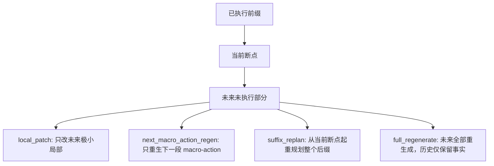

可以把四者理解成：

- `local_patch`：改一点点未来细节
- `next_macro_action_regen`：只换下一段
- `suffix_replan`：从这里往后全部重排
- `full_regenerate`：未来全部推翻重来，但历史事实保留

### 8.6 Patch Strategy 选择规则

`runtime` 不能任意挑一种修复方式，而应根据触发原因和影响范围做升级式选择。

推荐的一般性决策表如下：

- 设备临时不可用，但存在等价替换路径
  - 优先：`local_patch`

- 当前参数或顺序有问题，但科学意图不变
  - 优先：`local_patch`

- 下一步验证方式需要调整，但当前阶段目标不变
  - 优先：`next_macro_action_regen`

- 当前阶段目标仍成立，但后续多个 `macro-action` 已不合理
  - 优先：`suffix_replan`

- 核心假设被推翻，或者当前路线整体失效
  - 优先：`full_regenerate`

- 最高风险等级触发
  - 不重规划，直接 `halt`

### 8.7 Runtime 如何应用 Patch

`runtime` 在拿到新方案后，不应“直接覆盖旧 workflow 文件然后当作什么都没发生”。  
正确做法是：

1. 先冻结当前版本及其执行位置
2. 生成带 lineage 的新版本
3. 记录变更范围与变更原因
4. 切换当前激活版本指针
5. 从新的断点继续运行

### 8.8 何时不该升级到更大范围的重规划

系统实现中有一个常见错误：

一旦出问题，就直接 `full_regenerate`。

这会带来三个明显问题：

- 破坏已经验证有效的执行前缀
- 让系统频繁丢失局部稳定性
- 让版本 lineage 失去分析价值

因此，推荐以下策略：

- 能 `local_patch`，就不要直接 `suffix_replan`
- 能 `next_macro_action_regen`，就不要直接 `full_regenerate`
- 只有当上层科学判断本身变化，或者未来后缀整体已经无修补价值时，才升级到更大范围

### 8.9 Versioning / Replan / Patch 的统一闭环

最后，这三件事应形成一个统一闭环：

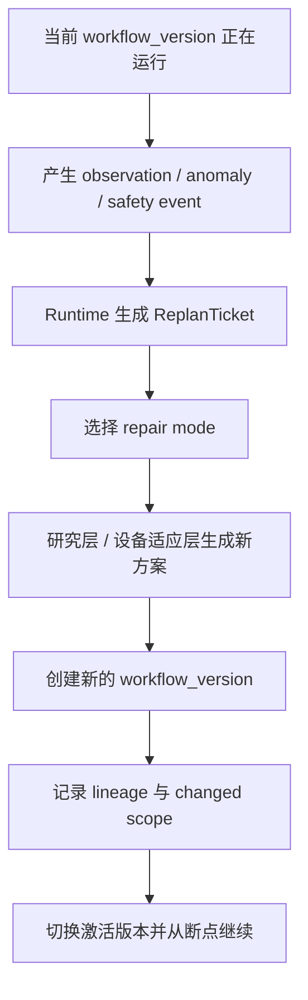

这意味着：

- `versioning` 决定“新旧版本如何共存与追溯”
- `replan scope` 决定“允许改多大范围”
- `patch strategy` 决定“这次到底选哪一种修复方式”

三者必须同时成立，系统才能真正做到：

**既能动态重规划，又不会把整个执行历史搅乱。**
