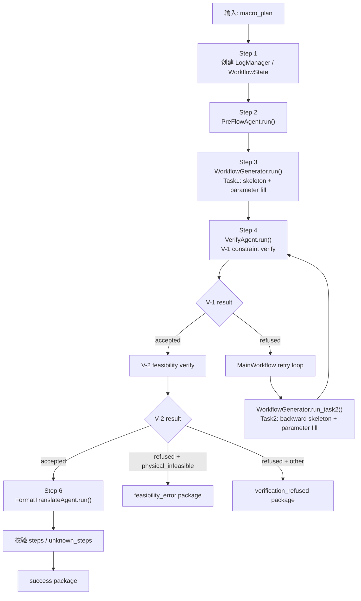
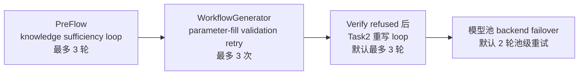
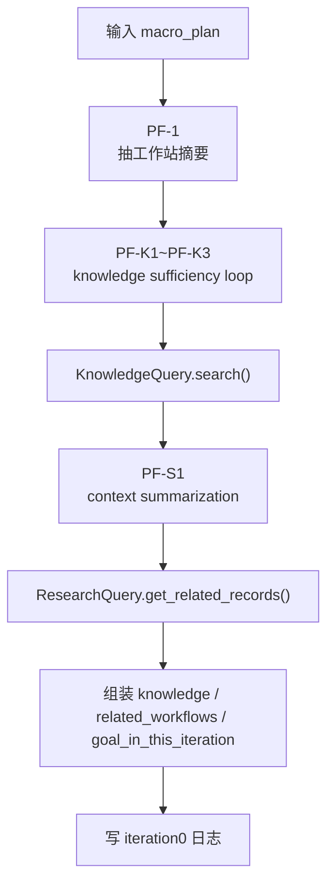
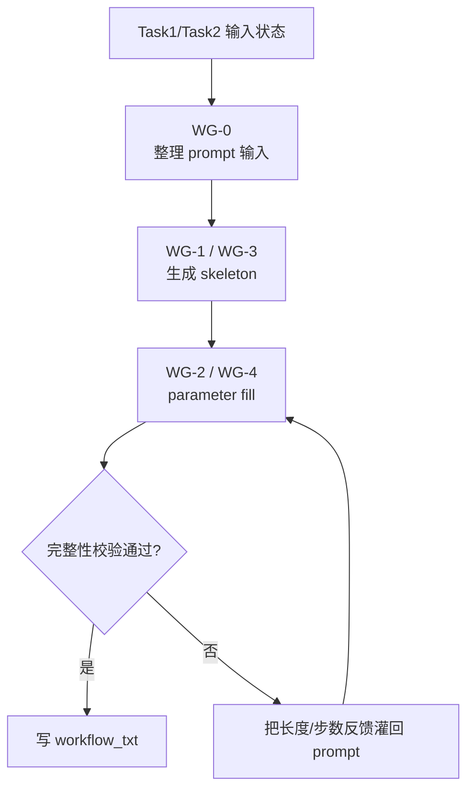
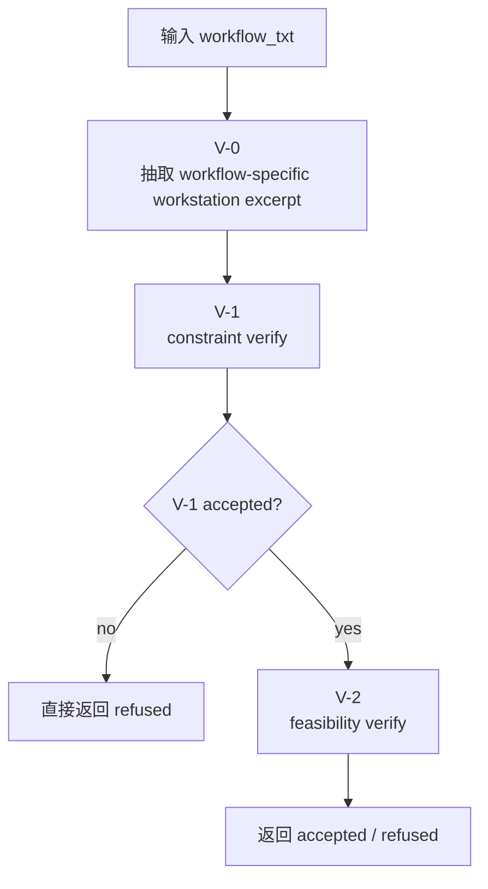
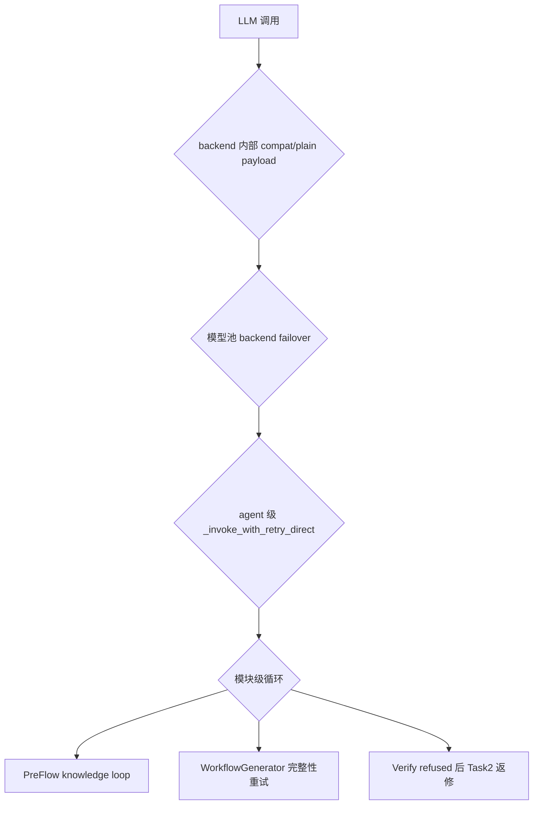

# Chem Agent Wiki

> 本文以 `/workspace/chem_agent` 当前代码为唯一依据重写。
> 目标是把当前系统的真实主链、递归/循环结构、所有 LLM 调用、状态输入输出、关键硬编码逻辑、能力边界、当前妥协和下一步计划完整讲清楚。
> 本文只描述已经接入当前主链的逻辑；知识库的未来设计单独放在 `knowledge_base_design.md`。

## 1. 当前系统的真实边界

当前 `chem_agent` 不是“开放式研究代理”，也不是“直接从最终科研目标产出 workflow_json”的老版本定位。
它现在是一个围绕 `macro_plan` 的设备适应层原型，真实外部合同是：

```python
result = MainWorkflow(...).run(macro_plan)
```

也就是说：

- 输入只有 `macro_plan: str`
- 输出只可能是三种终态：
  - `success package`
  - `feasibility_error package`
  - `verification_refused package`

它当前负责的事情是：

- 接收一段局部、具体、自然语言形式的 `macro_plan`
- 通过临时 knowledge / memory 通道补齐与该计划直接相关的上下文
- 把 `macro_plan` 翻译成工作站级 txt workflow
- 审核 txt workflow 的底层约束与当前环境可达性
- 只有在审核通过时，再把 txt workflow 翻译成工作站 JSON

它当前不负责的事情是：

- 不负责研究层 route planning / hypothesis / closure
- 不负责真实实验执行
- 不负责真实 observation 结果读取
- 不负责正式 memory backend / knowledge backend
- 不负责 necessity checking
- 不负责设备库存、排产、实例数量台账的真实维护

## 2. 运行时真源与数据依赖

### 2.1 设备真源

当前唯一设备真源是：

- `/workspace/chem_resources/workstations_new`

`utils/workstation_loader.py` 会从每个工作站目录读取：

- `USAGE.md`
- `AUDIT-RULES.md`
- `SKILL.md`

当前主链对这些文件的使用方式不是“全文盲喂”：

- `PreFlowAgent` 使用相关工作站的简摘要
- `WorkflowGenerator` 使用与当前 query 相关的 `USAGE + AUDIT-RULES` 片段
- `VerifyAgent` 使用从当前 `workflow_txt` 反解析出的“工作站-操作”对应 excerpt
- `FormatTranslateAgent` 使用从当前 `workflow_txt` 反解析出的 `USAGE` 片段，不带 audit

这意味着当前系统对设备真源有两个明确前提：

1. 设备能力、参数、输入限制、默认输出状态，以 `workstations_new` 为准。
2. 如果 `workstations_new` 没有权威写出设备实例数、独占规则或并行调度规则，系统不会凭空把这些事实当成硬前提。

但有一个更强的补充规则：

- 如果 `macro_plan` 显式写出了设备数量、独立设备、同步开始/结束、独占，或者“若不满足则不可执行”的前提，而下层真源无法权威证明满足，或真源已明确不满足，那么当前系统会把它判为 `physical_infeasible`。

### 2.2 格式参考

主链初始化时会读取：

- txt 参考：`/workspace/chem_resources/format_reference/reference.txt`
- json 参考：`/workspace/chem_resources/format_reference/reference.json`

它们的用途分别是：

- txt 参考供 `WorkflowGenerator` 用来贴近当前 DSL 风格
- json 参考供 `FormatTranslateAgent` 用来映射字段结构

### 2.3 临时 memory 数据源

当前没有正式 memory service，临时使用：

- `/workspace/chem_resources/exp_logs`

真实调用链是：

1. `PreFlowAgent` 先完成 knowledge sufficiency loop
2. 再做 1 次 context summarization，产出 `memory_query`
3. 然后用 `ResearchQuery.get_related_records(query)` 去历史实验日志里检索相似记录

当前 `ResearchQuery` 的工程特征是：

- 简单 token 匹配排序
- 对历史 `accepted` workflow 给 bonus
- 偏向“优先复用历史过审写法”

这是一种稳定性偏置，不代表正式 memory 语义。

### 2.4 临时 knowledge 数据源

当前没有正式论文知识库，临时使用：

- `/workspace/chem_resources/knowledge_agent/knowledge.txt`
- `/workspace/chem_resources/knowledge_agent/summary.txt`
- `/workspace/chem_resources/knowledge_agent/expriment_workflow_paper.txt`

真实调用链是：

1. `PreFlowAgent` 进入最多 3 轮的 knowledge sufficiency loop
2. 每轮让 LLM 判断当前 chemistry/process knowledge 是否已足够
3. 若不足，则生成下一轮 `knowledge_query`
4. `KnowledgeQuery.search(query)` 从上述三个临时文本里做 chunk 检索
5. 循环结束后，再统一做 1 次 context summarization，产出 `macro_plan_summary`、`observation_requirements`、`memory_query` 和 `knowledge_takeaways`

当前 knowledge 仍然只是：

- 文本片段检索
- LLM 摘要
- 文本上下文拼装

它还不是：

- 结构化论文知识对象
- 带引用的可回溯知识条目
- 正式知识图谱或向量库

### 2.5 当前 LLM 创建方式

所有 agent 默认通过 `utils/llm_factory.py` 创建模型实例。

当前工厂已改造成模型池，默认顺序是：

1. `elysiver_glm5_1`
   - `https://elysiver.h-e.top/v1`
   - `glm-5.1`
2. `ikuncode_gpt5_4mini`
   - `https://api.ikuncode.cc/v1`
   - `gpt-5.4-mini`

模型池配置来自 `/workspace/.env`，相关环境变量包括：

- `REFINER_LLM_POOL_1_NAME`
- `REFINER_LLM_POOL_1_PROVIDER`
- `REFINER_LLM_POOL_1_MODEL_NAME`
- `REFINER_LLM_POOL_1_API_KEY`
- `REFINER_LLM_POOL_1_ENDPOINT_URL`
- `REFINER_LLM_POOL_2_*`
- `REFINER_LLM_POOL_MAX_ROUNDS`
- `REFINER_LLM_POOL_BACKOFF_SECONDS`

默认运行时常量是：

- `temperature = 0`
- `timeout = 360s`
- `max_tokens = 3072`
- `pool_max_rounds = 2`
- `pool_backoff_seconds = [2, 5]`

此外还有两层重要容错：

1. 单 backend 内部容错
   `OpenAICompatChatModel` 会先尝试带 `extra_body` 的 compat payload；若遇到确定性的格式拒绝，会永久记住该 backend 不支持 `extra_body`，后续只走 plain payload。它不会在同一个 backend 内自动切换到其他 model。

2. backend 池级容错
   `ModelPoolChatModel` 会按 backend 顺序依次尝试；主 backend 失败时自动切到下一 backend。若整轮 backend 都失败，再按 `[2, 5]` 回退后重试整个池。

### 2.6 当前测试入口

当前端到端烟测入口是：

- `/workspace/chem_agent/test_main_workflow.py`

当前 fixture 路线仍然是手写 `macro_plan`，不是正式 research layer 输出。

## 3. 顶层主链总览

主编排位于：

- `/workspace/chem_agent/workflow.py`

真实主链如下：



### 3.1 顶层输入

`MainWorkflow.run(macro_plan)` 的直接输入只有：

- `macro_plan: str`

初始化阶段自动补齐：

- `exp_id`
- `exp_log_path`
- `iteration_id = 0`
- `workflow_id = 0`
- `workstation_descriptions`
- `txt_format_reference`
- `json_format_reference`
- `use_temp_data_flow`

### 3.2 顶层状态对象

主状态对象是 `/workspace/chem_agent/state.py` 里的 `WorkflowState`。

关键字段分组如下：

| 分组 | 字段 |
| --- | --- |
| 输入 | `final_goal`, `macro_plan`, `exp_id`, `exp_log_path`, `iteration_id`, `workflow_id` |
| 配置 | `workstation_descriptions`, `txt_format_reference`, `json_format_reference`, `use_temp_data_flow` |
| PreFlow 输出 | `macro_plan_summary`, `observation_requirements`, `knowledge`, `related_workflows_unformatted`, `related_workflows_txt`, `goal_in_this_iteration`, `knowledge_raw_inputs`, `memory_raw_inputs` |
| Generator 输出 | `workflow_skeleton_txt`, `workflow_txt` |
| Verify 输出 | `verification_result`, `verification_category`, `blocking_constraints`, `verification_suggestion`, `retry_count` |
| Translate 输出 | `workflow_json`, `terminal_package` |
| 追踪 | `current_stage`, `status`, `errors`, `logs`, `created_at` |

关于 `final_goal` 的真实语义要特别说明：

- 它现在只是兼容字段。
- 在当前系统里，应把它视为 `macro_plan` 的别名。

### 3.3 顶层终态输出

#### success

```python
{
    "status": "success",
    "exp_id": ...,
    "iteration_id": 0,
    "workflow_id": ...,
    "macro_plan": ...,
    "macro_plan_summary": ...,
    "observation_plan": {...},
    "verification_summary": {
        "result": "accepted",
        "category": "none",
        "blocking_constraints": [],
        "message": ...,
    },
    "workflow_txt": ...,
    "workflow_json": {...},
}
```

#### feasibility_error

```python
{
    "status": "feasibility_error",
    "exp_id": ...,
    "iteration_id": 0,
    "workflow_id": ...,
    "macro_plan": ...,
    "macro_plan_summary": ...,
    "observation_plan": {...},
    "error_package": {
        "type": "physical_infeasible",
        "blocking_constraints": [...],
        "message": ...,
        "last_workflow_txt": ...,
    },
}
```

#### verification_refused

```python
{
    "status": "verification_refused",
    "exp_id": ...,
    "iteration_id": 0,
    "workflow_id": ...,
    "macro_plan": ...,
    "macro_plan_summary": ...,
    "observation_plan": {...},
    "error_package": {
        "type": ...,
        "blocking_constraints": [...],
        "message": ...,
        "last_workflow_txt": ...,
    },
}
```

### 3.4 顶层递归/重试结构

当前系统有四种显式循环：



对应常量位置：

- `PreFlowAgent.MAX_KNOWLEDGE_ROUNDS = 3`
- `WorkflowGenerator.PARAMETER_FILL_VALIDATION_RETRIES = 3`
- `MainWorkflow(max_verify_retries=3)`，测试入口也默认传 3
- `LLMFactory.DEFAULT_POOL_MAX_ROUNDS = 2`

### 3.5 顶层关键分流规则

当前主链的硬规则是：

1. `VerifyAgent` 只要给出 `refused + physical_infeasible`，主链立即结束，输出 `feasibility_error package`。
2. 只要不是 `accepted`，就不会进入 `FormatTranslateAgent`。
3. 非 `physical_infeasible` 的 `refused` 会进入 `WorkflowGenerator Task2 -> VerifyAgent` 返修环。
4. 达到返修上限后仍不通过，会显式输出 `verification_refused package`。
5. 顶层已经没有 `soft accept`。

## 4. 所有 LLM 调用总表

| 调用编号 | 所属模块 | 代码位置 | 作用 | 主要输入 | 主要输出 |
| --- | --- | --- | --- | --- | --- |
| `PF-K1 ~ PF-K3` | `PreFlowAgent` | `_step2_iterative_knowledge_collection` | 判断 chemistry/process knowledge 是否充分；若不充分，给出下一轮 `knowledge_query` | `macro_plan`，已有 knowledge 片段 | `knowledge_sufficient`，`knowledge_gap`，`knowledge_query` |
| `PF-S1` | `PreFlowAgent` | `_step3_context_summarization` | 汇总 macro_plan、knowledge 和工作站摘要，产出真正给下游使用的结构化上下文 | `macro_plan`，knowledge 检索结果，工作站摘要 | `macro_plan_summary`，`observation_requirements`，`memory_query`，`knowledge_takeaways` |
| `WG-1` | `WorkflowGenerator Task1` | `_step2_forward_skeleton` | 先生成 txt workflow 骨架 | `macro_plan`，summary，observation，knowledge，history，相关工作站 excerpt | `workflow_skeleton_txt` |
| `WG-2` | `WorkflowGenerator Task1` | `_step3_forward_parameter_fill` | 在骨架上补全参数，生成完整 txt workflow | `workflow_skeleton_txt`，txt 参考，knowledge，history，相关工作站 excerpt | `workflow_txt` |
| `V-1` | `VerifyAgent` | `_step2_forward_constraint_verifying` | 做格式、字段、参数、体积账、状态连续性、observation 落地审核 | `macro_plan`，goal，observation，knowledge，history，workflow-specific excerpt，`workflow_txt` | `verification_result`，`verification_category`，`blocking_constraints`，`verification_suggestion` |
| `V-2` | `VerifyAgent` | `_step3_forward_feasibility_verifying` | 做环境/资源/可达性审核 | `macro_plan`，summary，observation，workflow-specific excerpt，`workflow_txt` | 同上 |
| `WG-3` | `WorkflowGenerator Task2` | `_step2_backward_skeleton` | 根据 verify 建议重构骨架 | `macro_plan`，goal，observation，knowledge，history，相关工作站 excerpt，被拒 workflow，verify suggestion | `workflow_skeleton_txt` |
| `WG-4` | `WorkflowGenerator Task2` | `_step3_backward_parameter_fill` | 在修正骨架上补参，生成返修后的完整 txt workflow | 修正骨架，txt 参考，knowledge，history，相关工作站 excerpt，verify suggestion | `workflow_txt` |
| `T-1` | `FormatTranslateAgent` | `_step2_forward_format_translate` | 把已通过审核的 txt workflow 忠实翻译成 JSON | `workflow_txt`，workflow-specific `USAGE` excerpt，knowledge，json 参考 | `workflow_json` |

需要额外说明的事实：

- `PreFlowAgent` 里保留了 `forward_translating_prompt`，但它当前只记录装配说明，不触发新 LLM 调用。
- 所有四个 agent 都没有走 `BaseAgent.invoke()` 的标准 prompt 模板，而是都自己直接调用 `_invoke_with_retry_direct()`。
- `FormatTranslateAgent` 逻辑上只会在 `accepted` 之后运行。

## 5. 各模块深度说明

## 5.1 MainWorkflow

### 代码位置

- `/workspace/chem_agent/workflow.py`

### 真实职责

`MainWorkflow` 是顶层 orchestrator，负责：

- 初始化实验日志和主状态
- 拉起 `PreFlowAgent`
- 拉起 `WorkflowGenerator Task1`
- 拉起 `VerifyAgent`
- 在非 `physical_infeasible` 拒绝时驱动 `Task2` 返修环
- 在通过审核后拉起 `FormatTranslateAgent`
- 生成三种终态 package

### 真实步骤

| 步骤 | 方法 | 输入 | 输出 |
| --- | --- | --- | --- |
| Step 1 | `_step1_create_log_and_get_inputs` | `macro_plan` | 初始化后的 `WorkflowState` |
| Step 2 | `_step2_pre_flow_agent` | 主状态 | 写回 PreFlow 输出字段 |
| Step 3 | `_step3_workflow_generator` | 主状态 | 写回 `workflow_skeleton_txt` 和 `workflow_txt` |
| Step 4 | `_step4_verify_agent_with_retry` | 主状态 | 写回 verify 结论；必要时驱动 Task2 |
| Step 5 | `_step5_workflow_generator_task2` | 主状态 + verify suggestion | 生成返修后的 txt workflow |
| Step 6 | `_step6_format_translate_agent` | 主状态 | 写回 `workflow_json` |

### 顶层硬编码规则

- `physical_infeasible` 一旦出现，直接终止。
- `verification_refused` 被保留为 debug/testing fallback path。
- `workflow_json` 还会经过顶层二次校验：
  - 若 `unknown_steps` 是非空 list，直接报错
  - 若没有 `steps` 字段，直接报错

## 5.2 PreFlowAgent

### 代码位置

- `/workspace/chem_agent/pre_flow_agent/workflow.py`
- `/workspace/chem_agent/pre_flow_agent/state.py`
- `/workspace/chem_agent/pre_flow_agent/prompts/system_prompt.py`
- `/workspace/chem_agent/pre_flow_agent/prompts/task_prompts.py`

### 真实职责

当前 `PreFlowAgent` 负责三件事：

1. 先判断 knowledge 是否已经足够。
2. 再统一总结下游真正需要的上下文。
3. 再用 `memory_query` 去临时历史实验日志里检索相似 workflow。

它不是“先一次性生成所有 query，再统一检索”的旧结构。

### 直接输入

- `macro_plan`
- `workstation_descriptions`
- `txt_format_reference`
- `iteration_id`
- `exp_log_path`

### 直接输出

- `macro_plan_summary`
- `observation_requirements`
- `knowledge`
- `related_workflows_unformatted`
- `related_workflows_txt`
- `goal_in_this_iteration`
- `knowledge_raw_inputs`
- `memory_raw_inputs`

### 内部执行流



### 真实步骤

| 步骤 | 方法 | 作用 | 关键输入 | 关键输出 |
| --- | --- | --- | --- | --- |
| PF-1 | `_step1_get_inputs` | 规范化 `macro_plan/final_goal` 并抽相关工作站能力摘要 | `macro_plan` | `_input_data` |
| PF-K | `_step2_iterative_knowledge_collection` | 最多 3 轮判断 knowledge 是否充足并检索新片段 | `macro_plan`，已有 knowledge | `knowledge_raw_inputs.rounds`，`queries`，累积 `search_result` |
| PF-S1 | `_step3_context_summarization` | 汇总 summary / observation / memory_query / knowledge_takeaways | `macro_plan`，knowledge context，工作站摘要 | `macro_plan_summary`，`observation_requirements`，`memory_raw_inputs.query`，`knowledge_takeaways` |
| PF-M | `_step4_query_memory` | 用 `memory_query` 查历史实验记录 | `memory_query` | `related_workflows_unformatted` |
| PF-A | `_step5_synthesize_context` | 组装下游可直接消费的 `knowledge` 和 `goal_in_this_iteration` | summary，observation，knowledge_takeaways，history | `knowledge`，`related_workflows_txt`，`goal_in_this_iteration` |
| PF-L | `_step6_update_log` | 把 iteration 级中间产物写入日志 | 全部中间结果 | 日志 |

### 重要硬编码逻辑

1. knowledge loop 上限
   `MAX_KNOWLEDGE_ROUNDS = 3`

2. observation 强约束
   当前常量是：
   - `OBSERVATION_PRIMARY_WORKSTATION = "dual-station-electrochemical-workstation"`
   - `OBSERVATION_FUTURE_XRD_WORKSTATION = "xrd-workstation"`

   真实含义是：
   - 当前有效 observation-capable 工作站只有 `dual-station-electrochemical-workstation`
   - 代码里预留了对 `xrd/xdr` 文本的归一化入口
   - 但 `allowed_observation_workstations` 当前仍只会写入 `["dual-station-electrochemical-workstation"]`

3. observation 归一化
   `_parse_observation_requirements()` 会把 observation 位置做归一化：
   - 提到 electrochemical 就归一成 `dual-station-electrochemical-workstation`
   - 提到 `xrd/xdr/衍射` 时会归一成 `xrd-workstation`
   - 若需要观察但没给出合法位置，会默认补成 `dual-station-electrochemical-workstation`

4. observation 自动推断
   如果 summarization 输出里没有 observation 段，`_infer_observation_text()` 会根据 `macro_plan` 里的关键词推断是否需要 observation。

5. 下游 knowledge 文本的组装结构
   `_build_knowledge_context()` 当前会拼成：
   - `### macro_plan摘要`
   - `### 观察要求`
   - `### knowledge要点`
   - `### 临时knowledge检索结果`
   - `### 当前可用临时knowledge源`

6. 当前 prompt 记录但不执行的步骤
   `_step5_synthesize_context()` 里的 `FORWARD_TRANSLATING_PROMPT` 只用于日志留痕，不再触发 LLM。

### 当前能力边界

- 它能判断 chemistry/process knowledge 是否大致足够。
- 它不能用 knowledge 补设备实例数、资源独占或真实库存。
- 它能把 observation 位置强行收紧到 observation-capable 工作站。
- 它不能读取真实 observation 结果。

## 5.3 WorkflowGenerator

### 代码位置

- `/workspace/chem_agent/workflow_generator/workflow.py`
- `/workspace/chem_agent/workflow_generator/state.py`
- `/workspace/chem_agent/workflow_generator/prompts/system_prompt.py`
- `/workspace/chem_agent/workflow_generator/prompts/task_prompts.py`

### 真实职责

`WorkflowGenerator` 负责把 `macro_plan` 上下文翻译成工作站级 txt workflow。

它有两条路径：

- `Task1 = forward`
- `Task2 = backward`

每条路径都有两次 LLM 调用：

- 一次生骨架
- 一次补参数

### 内部执行流



### 直接输入

- `macro_plan`
- `macro_plan_summary`
- `observation_requirements`
- `goal_in_this_iteration`
- `knowledge`
- `related_workflows_txt`
- `txt_format_reference`
- `workstation_descriptions`
- `iteration_id`
- `workflow_id`

### 直接输出

- `workflow_skeleton_txt`
- `workflow_txt`
- 更新后的 `workflow_id`

### 真实步骤

| 路径 | 方法 | 作用 |
| --- | --- | --- |
| 共用 | `_step1_get_inputs` | 规范化输入，并基于 `macro_plan + goal + history + knowledge` 选取相关工作站 excerpt |
| Task1 | `_step2_forward_skeleton` | 生成 forward skeleton |
| Task1 | `_step3_forward_parameter_fill` | 生成完整 forward workflow |
| Task2 | `_step2_backward_skeleton` | 基于被拒 workflow 和 verify suggestion 生成修正 skeleton |
| Task2 | `_step3_backward_parameter_fill` | 生成完整 backward workflow |
| 共用 | `_step4_append_workflow` | 写 workflow 级日志，并更新 `workflow_id` |

### 重要硬编码逻辑

1. 输入截断常量
   - `KNOWLEDGE_CHAR_LIMIT = 1800`
   - `RELATED_WORKFLOW_CHAR_LIMIT = 1400`
   - `REFERENCE_CHAR_LIMIT = 1800`

2. 参数补全完整性校验
   - `PARAMETER_FILL_VALIDATION_RETRIES = 3`
   - 若 `workflow_txt` 长度 `< 200`，直接判不完整
   - 若最终步骤数 `< max(3, skeleton_steps - 2)`，判不完整
   - 不完整时，会把“长度过短/步骤不足”的反馈再灌回 prompt 进行重试

3. LLM 直连重试
   - `_invoke_with_retry_direct(max_retries=8)`
   - 等待序列 `[5, 10, 20, 30, 60, 60, 90, 120]`

4. 工作站上下文不是全量喂入
   `_step1_get_inputs()` 先构造：
   - `macro_plan`
   - `goal_in_this_iteration`
   - `related_workflows_txt`
   - `knowledge`

   再把它们拼成 `prompt_query_text`，交给 `WorkstationLoader.format_relevant_for_prompt()` 选相关工作站 excerpt。

5. 当前 prompt 合同非常强调：
   - 不能输出“本轮不可执行”的占位 workflow
   - 必须给出完整 workflow 全文
   - 必须维护体积账和相邻步骤的物理连续性
   - 若 `macro_plan` 明确要求“洗涤 N 次且每次后超声重分散”，必须显式落下每一轮超声
   - 若最后超声后仍有自由液体，而下游要烘干，必须补出合法最终去液终态
   - 如果历史里有高度相似且已过审 workflow，应优先复用主链结构

### 当前能力边界

- 它能把 `macro_plan` 翻译成相当完整的工作站 txt workflow。
- 它能在 verify suggestion 下做返修。
- 它不能自己做最终 feasibility 判定。
- 它现在仍然高度依赖 prompt 稳定性，而不是规则引擎。

## 5.4 VerifyAgent

### 代码位置

- `/workspace/chem_agent/verify_agent/workflow.py`
- `/workspace/chem_agent/verify_agent/state.py`
- `/workspace/chem_agent/verify_agent/prompts/system_prompt.py`
- `/workspace/chem_agent/verify_agent/prompts/task_prompts.py`

### 真实职责

`VerifyAgent` 是一个“两段式审核器”：

1. 先做底层约束审核
2. 底层约束通过后，再做 feasibility 审核

它不再做 necessity checking。

### 内部执行流



### 直接输入

- `macro_plan`
- `macro_plan_summary`
- `observation_requirements`
- `goal_in_this_iteration`
- `knowledge`
- `related_workflows_txt`
- `workflow_txt`
- `iteration_id`
- `workflow_id`

### 直接输出

- `verification_result`
- `verification_category`
- `blocking_constraints`
- `verification_suggestion`

### 真实步骤

| 步骤 | 方法 | 作用 | 关键输入 |
| --- | --- | --- | --- |
| V-0 | `_step1_get_inputs` | 从 `workflow_txt` 反解析“工作站-操作”，抽相关 `USAGE + AUDIT-RULES` excerpt | `workflow_txt` |
| V-1 | `_step2_forward_constraint_verifying` | 审核格式、字段、参数、体积账、状态连续性、observation 落地 | `macro_plan`，goal，observation，knowledge，history，excerpt，`workflow_txt` |
| V-2 | `_step3_forward_feasibility_verifying` | 审核环境/资源/设备真源的可达性 | `macro_plan`，summary，observation，excerpt，`workflow_txt` |
| V-L | `_step4_update_log` | 写 workflow 级审核结果日志 | 审核结果 |

### 重要硬编码逻辑

1. 输入截断常量
   - `KNOWLEDGE_CHAR_LIMIT = 800`
   - `RELATED_WORKFLOW_CHAR_LIMIT = 800`

2. 分类优先级

```python
[
    "physical_infeasible",
    "safety_risk",
    "description_constraint_error",
    "format_or_parameter_error",
]
```

只要模型一次吐多个类别，最终会按这个优先级归一。

3. V-1 与 V-2 的默认分类不同
   - `V-1 default_category = "description_constraint_error"`
   - `V-2 default_category = "physical_infeasible"`

4. 只要 V-1 拒绝，V-2 就不会运行
   也就是说，feasibility 审核只有在底层约束审核通过后才发生。

5. V-1 当前主要拦截：
   - 非法字段
   - 非法参数
   - 体积账错误
   - 容器状态打架
   - observation 缺失或落在非法工作站
   - 偷偷改写 `macro_plan` 的显式要求
   - “能靠重写 workflow 修好的内部错误”

6. V-2 当前主要拦截：
   - 真源明确不支持的环境/资源前提
   - `macro_plan` 显式要求的设备数量、独立设备、同步、独占前提无法被真源满足或证明满足

7. observation 硬约束
   当前 observation 只能落在 observation-capable 工作站上；当前有效真源里只有：
   - `dual-station-electrochemical-workstation`

8. V-2 不直接消费 `knowledge`
   它只看：
   - `macro_plan`
   - `macro_plan_summary`
   - `observation_requirements`
   - workflow-specific workstation excerpt
   - `workflow_txt`

### 当前 feasibility 口径

这一点非常重要，当前系统明确区分两类错误：

1. 设备适应层内部错误
   例子：
   - 参数写错
   - 体积超限
   - 相邻步骤状态矛盾
   - observation 丢失
   - 把 `macro_plan` 的同步/独占要求偷改成串行

2. 当前环境不可达错误
   例子：
   - `macro_plan` 明写需要两套独立磁搅设备
   - `macro_plan` 明写三条线必须同步开始/结束
   - `macro_plan` 明写若只有单套设备则本轮不可执行
   - 下层真源无法权威证明满足这些前提，或已明确不满足

只有第二类，才进入 `physical_infeasible`。

## 5.5 FormatTranslateAgent

### 代码位置

- `/workspace/chem_agent/format_translate_agent/workflow.py`
- `/workspace/chem_agent/format_translate_agent/state.py`
- `/workspace/chem_agent/format_translate_agent/prompts/system_prompt.py`
- `/workspace/chem_agent/format_translate_agent/prompts/task_prompts.py`

### 真实职责

`FormatTranslateAgent` 负责把已经通过审核的 txt workflow 忠实翻译成 JSON。

它不是：

- 第二个 verifier
- 业务修正器
- feasibility 判定器

### 直接输入

- `final_goal`
- `goal_in_this_iteration`
- `workflow_txt`
- `knowledge`
- `json_format_reference`

### 直接输出

- `workflow_json`

### 真实步骤

| 步骤 | 方法 | 作用 |
| --- | --- | --- |
| T-0 | `_step1_get_inputs` | 规范化输入，并从 `workflow_txt` 抽 workflow-specific `USAGE` excerpt |
| T-1 | `_step2_forward_format_translate` | 调 LLM，把 txt workflow 翻译成 JSON |
| T-L | `_step3_update_log` | 把 `workflow_json` 写回 workflow 日志 |

### 重要硬编码逻辑

1. 输入截断常量
   - `KNOWLEDGE_CHAR_LIMIT = 600`
   - `JSON_REFERENCE_CHAR_LIMIT = 2200`

2. 只抽 `USAGE`，不抽 audit
   `format_workflow_specific_for_prompt(..., include_audit=False)`

3. JSON 解析逻辑
   - 如果是 dict，直接接受
   - 如果是字符串，会先尝试提取 fenced `json` code block
   - 否则尝试直接 `json.loads()`
   - 若没有 `steps` 字段，直接报错

4. 顶层还有额外校验
   - `unknown_steps` 若是非空 list，会在 `MainWorkflow` 里被拒绝

## 6. WorkstationLoader 的真实作用

### 代码位置

- `/workspace/chem_agent/utils/workstation_loader.py`

### 它做的不是“简单读文件”

它实际上承担了当前系统的设备 excerpt 裁剪逻辑，主要功能有：

1. 读取 `workstations_new`
2. 通过 `KEYWORD_MAP` 选择相关工作站
3. 通过 `STATION_ALIAS_MAP` 把 workflow 里的工作站名称归一成 code
4. 通过 `OPERATION_ALIAS_MAP` 把 workflow 里的操作词归一成关键词
5. 通过 `format_relevant_for_prompt()` 和 `format_workflow_specific_for_prompt()` 产出 prompt 可消费 excerpt

### 关键硬编码

- `PROMPT_USAGE_CHAR_LIMIT = 500`
- `PROMPT_AUDIT_CHAR_LIMIT = 1200`

workflow-specific excerpt 的抽取上限更大：

- `USAGE max_chars = 900`
- `AUDIT-RULES max_chars = 1100`

### 当前启发式特征

1. 如果 query 没选出任何工作站，会退回全量工作站。
2. 如果选中了除电化学外的任何工作站，会自动补上 `material-workstation`。
3. `VerifyAgent` 和 `FormatTranslateAgent` 都不是直接看全量真源，而是看 workflow-specific excerpt。

这意味着：

- excerpt 选得准，prompt 上下文会更干净
- excerpt 选得不准，agent 行为就会偏

## 7. 重试、递归与容错体系



### 7.1 agent 级重试

| 模块 | 方法 | 最大次数 | 等待序列 |
| --- | --- | --- | --- |
| `PreFlowAgent` | `_invoke_with_retry_direct` | 5 | `[5, 10, 20, 30, 60]` |
| `VerifyAgent` | `_invoke_with_retry_direct` | 5 | `[5, 10, 20, 30, 60]` |
| `FormatTranslateAgent` | `_invoke_with_retry_direct` | 5 | `[5, 10, 20, 30, 60]` |
| `WorkflowGenerator` | `_invoke_with_retry_direct` | 8 | `[5, 10, 20, 30, 60, 60, 90, 120]` |

### 7.2 模块级循环

- `PreFlowAgent`: knowledge sufficiency loop，最多 3 轮
- `WorkflowGenerator`: parameter fill 完整性重试，最多 3 次
- `MainWorkflow`: verify refused 后 Task2 返修，默认最多 3 次
- `ModelPoolChatModel`: backend 池级重试，默认最多 2 轮

## 8. 日志与可审阅性

所有主链运行都会写入：

- `/workspace/chem_resources/exp_logs/<exp_id>/exp_log.json`
- `/workspace/chem_resources/exp_logs/<exp_id>/iteration0.json`

workflow 级附加记录会出现在同一实验目录中。

### 8.1 iteration 级重点字段

- `macro_plan_summary`
- `observation_requirements`
- `knowledge_raw_inputs`
- `memory_raw_inputs`
- `knowledge`
- `related_workflows_unformatted`
- `related_workflows_txt`
- `goal_in_this_iteration`

其中 `knowledge_raw_inputs` 当前包含：

- `query`
- `queries`
- `rounds`
- `search_result`
- `sources`
- `knowledge_sufficient`
- `final_summary_output`
- `knowledge_takeaways`

### 8.2 workflow 级重点字段

- `workflow_skeleton_txt`
- `workflow_txt`
- `verification_result`
- `verification_category`
- `blocking_constraints`
- `verification_suggestion`
- `workflow_json`

### 8.3 状态中保存的 prompt 副本

为了支持人工审阅，当前代码会把关键 prompt 文本保存在 state 里：

| 模块 | prompt 副本字段 |
| --- | --- |
| `PreFlowAgent` | `knowledge_decision_prompts`, `context_summary_prompt`, `forward_translating_prompt` |
| `WorkflowGenerator` | `forward_skeleton_prompt`, `forward_parameter_prompt`, `backward_skeleton_prompt`, `backward_parameter_prompt` |
| `VerifyAgent` | `forward_constraint_verifying_prompt`, `forward_feasibility_verifying_prompt` |
| `FormatTranslateAgent` | `forward_format_translate_prompt` |

## 9. 当前能力边界

当前系统已经能做的事：

- 从一段 `macro_plan` 生成工作站级 txt workflow
- 对 txt workflow 做底层约束审核
- 对显式环境可达性前提做 feasibility 审核
- 在审核通过后把 txt workflow 翻译成 JSON
- 通过双 backend 模型池增强稳定性

当前系统还不能稳定做的事：

- 不保证所有可做 `macro_plan` 都能收敛到 `success`
- 不具备正式论文知识库
- 不具备正式 memory service
- 不具备结构化设备实例数/占用/库存真源
- 不执行真实实验，不读取真实 observation 结果
- 不向上游 research layer 提供成熟的 `verification_refused` 消费合同

## 10. 当前最重要的硬编码逻辑清单

1. `final_goal` 只是 `macro_plan` 的兼容别名。
2. 只有 `dual-station-electrochemical-workstation` 当前可作为有效 observation-capable 工作站。
3. `verification_refused` 被保留为 debug/testing fallback path。
4. 顶层没有 `soft accept`。
5. `unknown_steps` 只要是非空 list，主链就会拒绝 success。
6. `VerifyAgent` 的 `physical_infeasible` 只保留给“当前环境不可达”。
7. `WorkflowGenerator` 会用步骤数和文本长度做完整性校验，不是无条件接受 parameter fill 的第一次输出。
8. `WorkstationLoader` 不是全量喂入，而是启发式裁剪 excerpt。
9. `MainWorkflow` 在主链里硬编码 `use_knowledge_agent=False` 和 `use_research_agent=False`，说明当前还没接正式服务。
10. 当前所有 agent 都自己实现了 `_invoke_with_retry_direct()`，没有共用 `BaseAgent.invoke()` 的输出解析路径。

## 11. 当前妥协

当前系统为了先把主链跑通，保留了这些临时实现：

1. 上游输入仍是手写 `macro_plan fixture`，不是正式 research layer 输出。
2. memory 仍然是 `exp_logs` 检索适配器。
3. knowledge 仍然是 `knowledge_agent/*.txt` 文本检索适配器。
4. `ResearchQuery` 仍偏向历史 accepted workflow。
5. 设备真源还没有结构化实例数、占用和排产数据。
6. `verification_refused` 仍是存在于对外合同里的终态之一，但设计上应视为调试保底通路。

## 12. 下一步计划

当前最合理的下一步，不是再往代码里加更多先验逻辑，而是继续把 prompt 合同、上下文供给和正式检索层补齐。优先级建议如下：

1. 继续收敛 `WorkflowGenerator` 与 `VerifyAgent` 的 prompt，使常规 `success` 样例能稳定收口为 `success`。
2. 保持 `verification_refused` 作为调试保底通路存在，但在成熟系统中尽量不让它成为上游常规结果。
3. 以 `knowledge_base_design.md` 为蓝图，实现正式论文知识库，并优先从 `PreFlowAgent` 的 `knowledge_query.py` 接缝替换当前临时文本检索。
4. 若未来要让 feasibility 更精细，需要补一个正式的设备资源真源，显式表达：
   - 设备实例数
   - 独占规则
   - 并行调度规则
   - 可用库存或排产状态
5. 用正式 research layer 输出替换当前手写 `macro_plan` fixture。

## 13. 一句话总结

当前 `chem_agent` 的真实闭环是：

**输入一段 `macro_plan`，先由 `PreFlowAgent` 通过最多 3 轮 knowledge sufficiency loop 和 1 次上下文汇总，产出 summary / observation / memory_query / knowledge_takeaways；再由 `WorkflowGenerator` 通过 forward 或 backward 的两阶段 LLM 翻译链生成工作站级 txt workflow；随后由 `VerifyAgent` 先做底层约束审核、再做显式环境可达性审核；只有 accepted 才进入 `FormatTranslateAgent` 翻成 JSON，否则显式返回 `feasibility_error` 或 `verification_refused`。**
