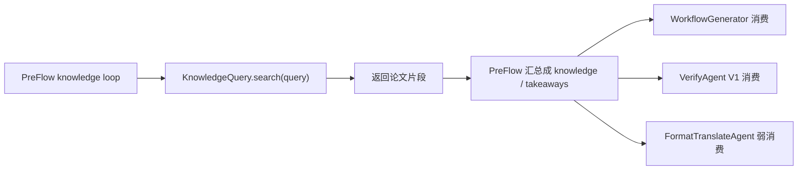
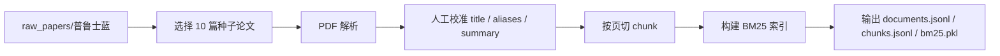

# 最小论文知识库 MVP 设计与现状

## 1. 目标
这套知识库当前只服务一个目标：

- 替换 `PreFlowAgent` 中临时 `knowledge_agent/*.txt` 检索
- 让 `PreFlow` 能按 query 取回更可信、更可审阅的论文片段
- 先独立开发、独立测试，不接入主链

它当前**不负责**：

- 设备库存、独占、调度、可达性判断
- `VerifyAgent` 或 `WorkflowGenerator` 的二次检索
- 向量库、知识图谱、复杂 workflow card

## 2. 当前代码中的使用位置
当前主链里，查 knowledge 的动作只发生在 `PreFlow`：



所以正式接入时，最小改动面仍然是：

- `/workspace/chem_agent/pre_flow_agent/tools/knowledge_query.py`

## 3. MVP 范围
当前 MVP 只覆盖一批精选论文，不追求全量：

- 数据源：`/workspace/chem_resources/knowledge_base/raw_papers/普鲁士蓝`
- 当前已选：10 篇 PDF
- 当前输出：一个可构建、可加载、可检索、可审阅的小型 BM25 知识库

## 4. 当前实现
实现目录：

- `/workspace/chem_agent/knowledge_base/`

核心文件：

- `mvp.py`
  - 离线构建器 `KnowledgeBaseBuilder`
  - 运行时检索器 `KnowledgeBaseStore`
- `cli.py`
  - 构建、统计、检索、inspect 命令
- `seed_documents.json`
  - 10 篇论文的人工校准清单
- `smoke_test.py`
  - 独立烟测

## 5. 数据结构
当前实现保留两类主对象。

### 5.1 document

```json
{
  "doc_id": "paper_0004",
  "filename": "22_NC_锰基铁氰化物普鲁士蓝做正极材料.pdf",
  "title": "Defect-Free Potassium Manganese Hexacyanoferrate Cathode Material for High-Performance Potassium-Ion Batteries",
  "aliases": ["K2Mn[Fe(CN)6]", "无缺陷 锰基普鲁士蓝"],
  "summary": "Defect-free K2Mn[Fe(CN)6] cathode for high-performance potassium-ion batteries.",
  "full_text": "...",
  "page_count": 12
}
```

字段说明：

- `doc_id`
  - 内部唯一标识
- `filename`
  - 原始 PDF 文件名
- `title`
  - 论文标题
- `aliases`
  - 少量人工校准别名，主要用于提升中文/缩写检索
- `summary`
  - 一句人工校准摘要，主要用于提升召回和人工审阅
- `full_text`
  - 解析后的全文文本
- `page_count`
  - 页数

### 5.2 chunk

```json
{
  "chunk_id": "paper_0004_chunk_001",
  "doc_id": "paper_0004",
  "filename": "22_NC_锰基铁氰化物普鲁士蓝做正极材料.pdf",
  "title": "Defect-Free Potassium Manganese Hexacyanoferrate Cathode Material for High-Performance Potassium-Ion Batteries",
  "source": "page 1",
  "text": "..."
}
```

字段说明：

- `chunk_id`
  - 片段唯一标识
- `doc_id`
  - 所属文档
- `filename`
  - 原始文件名
- `title`
  - 文档标题
- `source`
  - 当前最小来源信息，格式为 `page N`
- `text`
  - 片段正文

## 6. 构建流程



当前细节：

- 解析器：`PyMuPDF`
- 分词器：`jieba`
- 索引：`rank_bm25`
- chunk 规模：
  - `chunk_size = 1100`
  - `chunk_overlap = 180`
  - `min_chunk_chars = 160`

## 7. 为什么要加人工校准数据
第一版纯自动解析有两个问题：

- 少量 PDF 的 `title` 会被页眉、刊名或正文首句污染
- 纯英文正文对中文 query、缩写 query 的召回不稳定

所以当前实现对 10 篇论文补了少量人工校准信息：

- `title`
- `aliases`
- `summary`

它们不会把知识库做重，但能显著提升：

- 中文 query 命中率
- 缩写 query 命中率
- 人工审阅体验

## 8. 检索逻辑
当前索引不是只对 `chunk.text` 建立，而是对以下拼接文本建索引：

1. `document.title`
2. `document.summary`
3. `document.aliases`
4. `filename stem`
5. `chunk.text`

这样做的目的：

- 让中文别名和缩写也能命中英文正文
- 让 query 不必完全和 chunk 原文逐词一致

运行时默认还会做一个轻量限制：

- `max_hits_per_doc = 2`

作用是避免 top-k 全被同一篇文档占满。

## 9. CLI 能力
当前 CLI 已实现：

```bash
python3 -m knowledge_base.cli build
python3 -m knowledge_base.cli stats
python3 -m knowledge_base.cli search --query "..."
python3 -m knowledge_base.cli search --query "..." --render
python3 -m knowledge_base.cli inspect-doc --doc-id paper_0004
python3 -m knowledge_base.cli inspect-chunk --chunk-id paper_0004_chunk_001
```

## 10. 当前测试范围
当前独立测试不接主链，分为四层：

1. 语法测试
   - `python3 -m py_compile`
2. 构建测试
   - `python3 -m knowledge_base.cli build`
3. 统计测试
   - `python3 -m knowledge_base.cli stats`
4. 烟测
   - `python3 -m knowledge_base.smoke_test`

烟测当前覆盖：

- `document_count == 10`
- `chunk_count >= 100`
- 10 篇文档标题与人工校准标题完全一致
- 每篇文档都有非空 `summary`
- 多条英中文主题 query 能稳定命中预期论文
- `get_doc()` 和 `get_chunk()` 可正常回看内容

## 11. 当前产物
构建输出目录：

- `/workspace/chem_resources/knowledge_base/mvp_prussian_blue_10`

输出文件：

- `build_info.json`
- `parsed/documents.jsonl`
- `chunks/chunks.jsonl`
- `index/bm25.pkl`
- `index/tokenized_corpus_sizes.json`

## 12. 当前能力边界
这版 MVP 现在适合：

- `PreFlow` 做一次或几次 query
- 给下游提供论文知识背景和可引用片段
- 让我们快速验证“正式知识库能否替换临时 txt 检索”

这版 MVP 现在还不适合：

- 全量论文生产级覆盖
- 高精度段落类型分类
- 从论文中抽结构化实验卡片
- 支持所有 agent 各自二次检索

## 13. 下一步
等这套独立知识库接入主链前，推荐顺序是：

1. 先保持这 10 篇种子库稳定可用
2. 把 `pre_flow_agent/tools/knowledge_query.py` 接到这里
3. 观察 `PreFlow` 的 query 分布与命中质量
4. 再逐步扩到更多论文
5. 最后再考虑 workflow card、结构化抽取或向量检索
