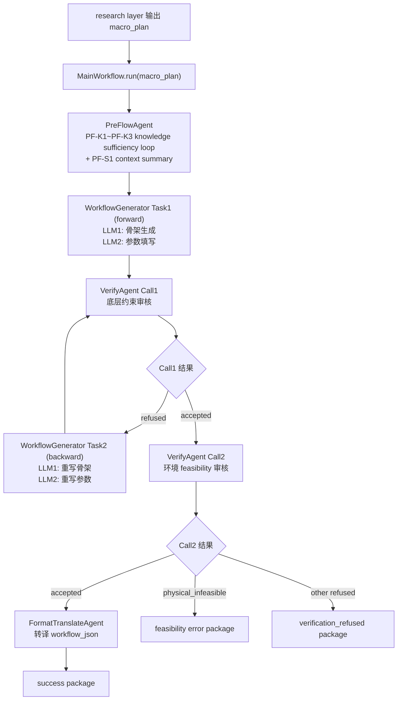
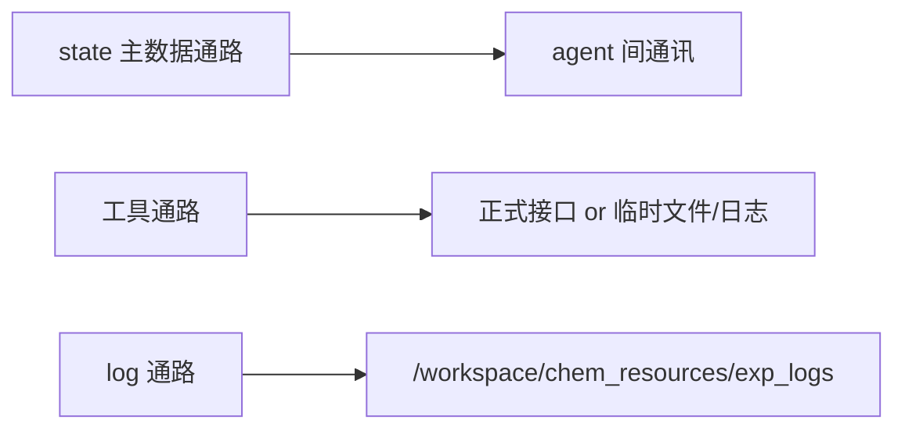
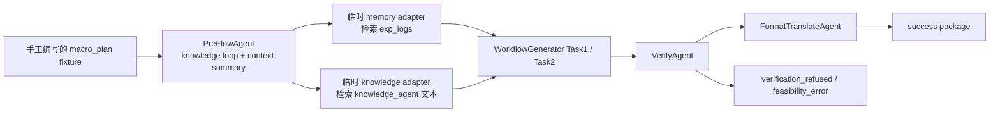
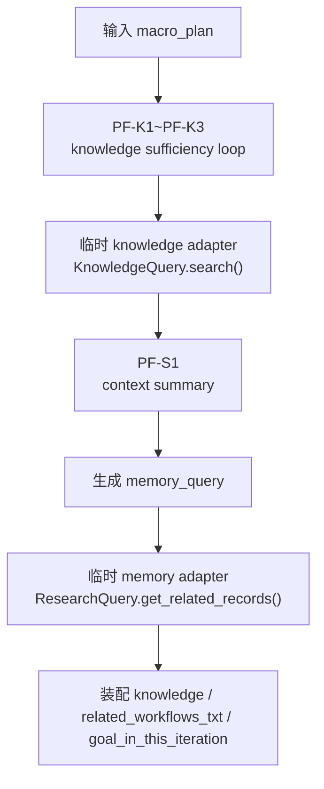
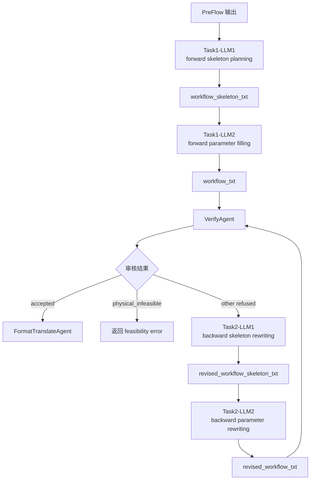
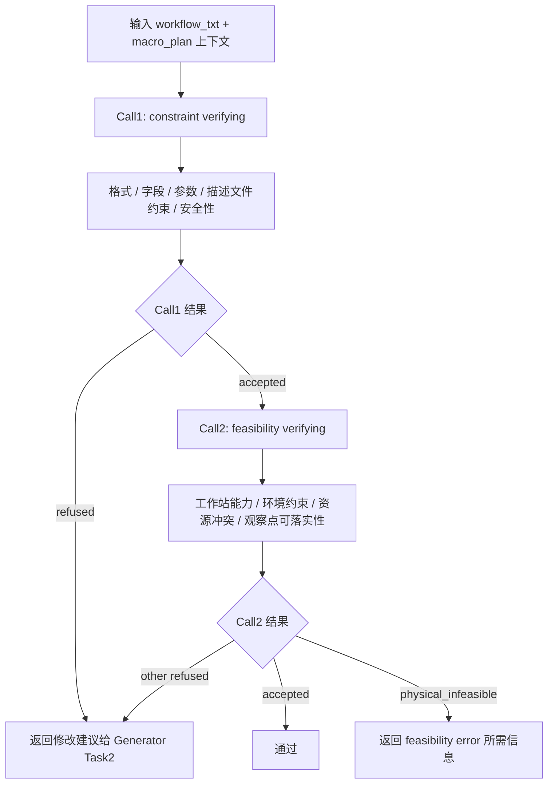

# Chem Agent 设备适应层改造文档（按当前开发规范重写）

> 文档用途：
> 1. 作为本轮设备适应层改造的总设计文档。
> 2. 供人工审核边界、agent 设计、硬编码改造点与测试方案。
> 3. 作为后续各个 `modify_prompt.md` 与代码修改的上位依据。
>
> 本文档的权威事实来源固定为：
> 1. `/workspace/chem_agent/develop_prompt.md`
> 2. `/workspace/chem_agent/WIKI.md`
> 3. `/workspace/chem_agent` 当前真实代码
> 4. `/workspace/chem_resources/workstations_new`
> 5. 当前阶段已经冻结的目标：`macro_plan -> success package | feasibility_error package | verification_refused package`

---

## 0. 审核先看结论

### 0.1 当前真实实现边界

根据 `WIKI.md` 与当前代码，`chem_agent` 当前真实跑通的是一条串行翻译链：

- `PreFlowAgent`
- `WorkflowGenerator`
- `VerifyAgent`
- `FormatTranslateAgent`

当前系统从外部看，真实行为仍然是：

- 输入：`macro_plan`
- 终态输出：`success package` / `feasibility_error package` / `verification_refused package`

其中 `verification_refused package` 当前保留为调试/测试期保底通路：它用于显式暴露“非 physical_infeasible、但多轮返修后仍未收敛”的设备适应层内部失败。在成熟系统中，这条通路理论上不应成为上层 research layer 的常规消费结果。

`knowledge_agent` 与 `research_agent` 在代码结构里存在，但当前主执行链并没有接入正式后端；当前跑通的是“临时 knowledge / memory adapter + 真实 LLM”的测试路线。

### 0.2 本轮目标边界

本轮不做 `research layer` 本体，也不做实验执行层。
本轮只把当前 `chem_agent` 改造成一个狭义的设备适应层。

它对外只负责一件事：

- 接收 `research layer` 给出的本轮 `macro_plan`
- 尽力把这段 `macro_plan` 翻译成工作站格式的实验方案
- 如果在当前实验室约束下无法落地，就输出 `feasibility error package`
- 如果 workflow 最终未过审但根因不是环境不可达，就输出 `verification_refused package`

本轮明确不负责：

- 不负责实际执行实验方案
- 不负责产出 observation 结果
- 不负责运行时分支控制
- 不负责研究方向与研究策略判断
- 不负责设计 memory 和知识库的正式后端
- 不负责 necessity judging

### 0.3 本轮强制冻结的约束

本轮重写文档时，必须同时满足下面八条约束：

1. 工作站描述固定使用 `/workspace/chem_resources/workstations_new`。
2. 代码与文档都应当默认使用 `WorkstationLoader(use_new_format=True)` 的语义。
3. `memory` 与 `knowledge` 的正式后端本轮不落代码，但 `knowledge` 的数据结构、检索接口和下游消费合同需要在文档中冻结。
4. 当前测试执行流允许使用临时数据通路，但不能伪造流程，也不能跳过后端 LLM。
5. `PreFlowAgent` 当前可使用的临时知识来源固定为：
   - `/workspace/chem_resources/knowledge_agent/knowledge.txt`
   - `/workspace/chem_resources/knowledge_agent/summary.txt`
   - `/workspace/chem_resources/knowledge_agent/expriment_workflow_paper.txt`
6. `PreFlowAgent` 当前可使用的临时 memory 来源固定为：
   - `/workspace/chem_resources/exp_logs/*/exp_log.json`
   - `/workspace/chem_resources/exp_logs/*/iteration*.json`
7. 现有 prompt 已被证明有效，因此本轮修改必须尽量仿照现有 prompt 组织形式，尽量少改。
8. `VerifyAgent` 删除“必要性检查”，改成两次约束/可行性审核：
   - 第一次检查格式、字段、参数、描述文件规则等底层约束
   - 第二次检查当前实验室环境是否支持该方案执行

### 0.4 本轮沿用的开发规范

`develop_prompt.md` 中除了 agent 角色描述之外，还有若干必须沿用的开发规范。
为保证本文档自包含，本轮必须继续沿用以下规则：

1. 所有 agent 的主通讯通路仍然是 `state`，不是日志文件。
2. 日志文件只用于记录中间结果，不承担 agent 间真实通讯职责。
3. 每个 agent 都必须同时考虑三条数据通路：
   - 主数据通路：`state`
   - 工具数据通路：正式接口 / 临时接口二选一
   - 日志通路：`exp_logs`
4. 当前阶段不允许让 LLM 自主决定何时调用工具；工具调用必须硬编码。
5. 所有开发与测试都要在 `/workspace/chem_agent` 的 `uv` 环境下进行。
6. 每个 agent 修改完成后，都需要补或更新对应目录下的 `architecture.md`。
7. 测试时必须最大限度模拟最终数据通路，不能通过跳过 LLM、人工伪造中间结果等方式偷工减料。
8. git 版本记录的范围仍然是 `/workspace/chem_agent` 与 `/workspace/chem_resources`。

### 0.5 总体流程图



---

## 1. 外部合同与核心对象冻结

### 1.1 `macro_plan` 的定义

本轮的 `macro_plan` 应被视为一段局部实验计划，而不是总研究目标。
它是 `research layer` 对当前这一轮实验的直接下发结果。

它至少应当包含：

- 采用什么化学方法
- 先合成什么，再合成什么，最后组合成什么
- 各步骤的重要参数线索
- 对观察点的建议，也就是“要不要观察、在何处观察、观察什么”

### 1.2 观察要求必须显式下传

`macro_plan` 中关于观察的建议，本轮不能丢。
设备适应层发给执行层的最终方案中，必须显式说明：

- 是否需要观察
- 在哪里观察
- 何时观察
- 观察什么
- 这条观察要求对应哪个实验步骤

建议在中间状态中统一使用 `observation_requirements` 表达这类信息。
该对象可以先是结构化文本或字典，但语义必须稳定。

### 1.3 成功包最小结构

```json
{
  "status": "success",
  "macro_plan": "...",
  "exp_id": "...",
  "iteration_id": 0,
  "workflow_id": 0,
  "macro_plan_summary": "...",
  "workflow_txt": "...",
  "observation_plan": {},
  "verification_summary": {},
  "workflow_json": {
    "steps": [],
    "unknown_steps": null
  },
  "verification_result": "accepted"
}
```

### 1.4 失败包最小结构

```json
{
  "status": "feasibility_error",
  "macro_plan": "...",
  "exp_id": "...",
  "iteration_id": 0,
  "workflow_id": 0,
  "macro_plan_summary": "...",
  "observation_plan": {},
  "error_package": {
    "type": "physical_infeasible",
    "blocking_constraints": ["...", "..."],
    "message": "...",
    "last_workflow_txt": "..."
  }
}
```

### 1.5 `verification_refused package` 最小结构

```json
{
  "status": "verification_refused",
  "macro_plan": "...",
  "exp_id": "...",
  "iteration_id": 0,
  "workflow_id": 0,
  "macro_plan_summary": "...",
  "observation_plan": {},
  "error_package": {
    "type": "format_or_parameter_error",
    "blocking_constraints": ["...", "..."],
    "message": "...",
    "last_workflow_txt": "..."
  }
}
```

### 1.6 不属于业务失败包的情况

以下情况都属于本层内部异常，不应伪装成 `feasibility error package`：

- LLM 调用失败
- 输出解析失败
- `workflow_json` 解析失败
- `unknown_steps` 非空
- verify 最终 refused，但失败类型不是 `physical_infeasible`

---

## 2. 资源来源与当前阶段的数据通路

### 2.1 工作站描述来源

本轮工作站描述固定来自：

- `/workspace/chem_resources/workstations_new`

其中：

- `USAGE.md` 用于方案生成
- `AUDIT-RULES.md` 用于审核
- `SKILL.md` 用于补充元信息

文档与代码都应当统一成：

- `use_new_format=True`

### 2.2 当前阶段的知识来源

正式 knowledge backend 本轮不设计。
当前阶段的临时知识来源固定为：

- `/workspace/chem_resources/knowledge_agent/knowledge.txt`
- `/workspace/chem_resources/knowledge_agent/summary.txt`
- `/workspace/chem_resources/knowledge_agent/expriment_workflow_paper.txt`

这些来源在代码中仍然应被封装在 `KnowledgeQuery` 这一工具语义下，而不是在 agent 主流程里直接随手读文件。

### 2.2.1 当前 knowledge 在主链中的真实使用点

当前代码里，knowledge 的真实消费点有四处：

1. `PreFlowAgent`
   - 先做最多 3 轮 knowledge sufficiency 判断
   - 再汇总为 `knowledge_takeaways`
2. `WorkflowGenerator Task1 / Task2`
   - `knowledge` 会作为 txt workflow 生成的核心上下文之一
3. `VerifyAgent Call1`
   - `knowledge` 会进入底层约束审核，帮助理解参数、操作、observation 与工艺背景
4. `FormatTranslateAgent`
   - `knowledge` 仍会被传入，但只作为弱辅助上下文

当前明确不成立的点：

- `VerifyAgent Call2` 当前不直接消费 `knowledge`
- knowledge 不负责补出设备实例数、独占关系、库存事实或调度规则
- 这类信息只能来自 `macro_plan` 显式前提与 `workstations_new` 真源

### 2.2.2 正式论文知识库的冻结设计目标

本轮不落正式知识库代码，但设计上已经单独冻结为：

- `/workspace/chem_agent/knowledge_base_design.md`

本 spec 里只保留与主链接缝有关的约束：

1. 正式知识库面向论文与方法学知识，而不是设备库存知识。
2. 它替换的是当前 `pre_flow_agent/tools/knowledge_query.py` 这一 knowledge adapter，而不是整个主链合同。
3. 它不负责补出设备实例数、独占关系、库存事实或调度规则。
4. 它不负责替代 `PreFlow` 做 knowledge sufficiency 判断。
5. 它的输出仍然先被 `PreFlow` 汇总，再流向 `WorkflowGenerator / Verify / FormatTranslate`。

### 2.2.3 当前 observation 的冻结约束

当前 observation 存在强约束：

1. observation 点只能落在 observation-capable 工作站上。
2. 当前真源目录 `/workspace/chem_resources/workstations_new` 中，实际存在且可确认的 observation-capable 工作站是 `dual-station-electrochemical-workstation`。
3. 若未来真源中加入 XRD/XDR 工作站，则 observation 也只能落在 `dual-station-electrochemical-workstation` 与该 XRD/XDR 工作站上。
4. 不允许把磁搅、纯化、超声、烘干等工作站写成“返回观察结果”的 observation 位置。

### 2.3 当前阶段的 memory 来源

正式 memory backend 本轮不设计。
当前阶段的临时 memory 来源固定为：

- `/workspace/chem_resources/exp_logs/*/exp_log.json`
- `/workspace/chem_resources/exp_logs/*/iteration*.json`

这些来源在代码中仍然应被封装在“memory 检索”语义下。
为了最小改动，当前代码可以临时继续复用已有的 `ResearchQuery` 风格工具，但在文档语义中应明确它此轮承担的是 memory adapter 的角色。

### 2.4 当前阶段的三条数据通路



三条通路的职责必须分开：

- `state`：agent 间真实通讯
- 工具通路：调用 knowledge/memory/workstation 数据
- `exp_logs`：增量记录中间结果和测试证据

### 2.5 当前阶段对临时通路的限制

当前测试执行流可以用临时通路替代正式后端，但必须满足：

1. 仍然通过工具层调用，不允许把临时文件读取直接写死在 agent prompt 拼接逻辑里。
2. 仍然要走真实后端 LLM，不允许用伪造输出代替 LLM 调用。
3. 仍然要在日志中记录每轮输入、prompt、输出与中间结果。
4. 临时通路输出的信息至少要足够支撑下游 `WorkflowGenerator` 正常工作。

### 2.6 当前临时测试路线

在正式 `research layer / memory / knowledge` 数据流尚未接入完成前，当前端到端测试固定走下面这条临时路线：



当前固定的端到端验收入口是：

- `/workspace/chem_agent/test_main_workflow.py`

当前冻结的两组验收样例是：

- `SUCCESS_MACRO_PLAN`
- `FEASIBILITY_ERROR_MACRO_PLAN`

这两组样例都是测试 fixture，不是正式 `research layer` 的真实输出。

### 2.7 当前为了跑通端到端所做的妥协

当前为了在背景知识、正式后端和部分描述文档仍不完整的情况下先把执行流打通，代码层面存在以下临时妥协：

1. 顶层 `macro_plan` 当前来自手工 fixture，而不是正式 `research layer` 接口。
2. memory 当前不是正式 backend，而是“LLM 生成 query + `exp_logs` 检索 adapter”。
3. knowledge 当前不是正式 backend，而是“LLM 生成 query + `knowledge_agent/*.txt` 检索 adapter”。
4. memory 检索当前会偏向历史上已经通过审核的 workflow，以提高生成稳定性；这属于测试期稳定性偏置，不应默认沿用到正式 memory 语义。
5. `VerifyAgent` 当前 prompt 已收紧成“优先拦硬冲突与 `physical_infeasible`”，避免在背景知识不完整时因优化建议式判断反复打回。
6. 顶层 `MainWorkflow` 已移除 `soft accept`；当前只有 `accepted` 才进入 `FormatTranslateAgent`，其余情况分别收口成 `feasibility_error package` 或 `verification_refused package`。
7. 当前主链已经改造成模型池形式，默认顺序是 `elysiver / glm-5.1 -> ikuncode / gpt-5.4-mini`，用于降低单次 LLM 调用失败造成的整链单点故障。

### 2.8 迁移到正式数据流时的退出条件

当以下条件满足时，应开始拆除当前临时测试路线中的妥协：

1. 正式 `research layer -> chem_agent` 输入合同冻结，并能提供真实 `macro_plan`。
2. 正式 memory backend 可替换 `exp_logs` 检索 adapter。
3. 正式 knowledge backend 可替换 `knowledge_agent/*.txt` 检索 adapter。
4. 工作站约束、观察语义和背景知识补充到足以支撑更严格的 verify。
5. 正式知识库能稳定返回带引用、带片段类型、可审计的检索结果，并能无缝替换 `pre_flow_agent/tools/knowledge_query.py`。

---

## 3. 总体修改计划

### 3.1 两条主修改线

本轮修改计划固定拆成两条主线：

1. `改 agent`
   - 重新定义四个已接入 agent 的职责、输入、输出、执行流和 prompt 合同。
2. `改硬编码`
   - 把顶层 `MainWorkflow`、状态对象、日志对象、解析器和分流逻辑改成新合同。

### 3.2 实施顺序

本轮建议实施顺序固定为：

1. 重写本总设计文档
2. 按本总设计文档分别补四个 agent 的 `modify_prompt.md`
3. 再改顶层和各 agent 的硬编码
4. 再补测试与验证闭环
5. 最后更新每个 agent 的 `architecture.md`

### 3.3 建议 write set

- `/workspace/chem_agent/research_layer_integration_modification_spec.md`
- `/workspace/chem_agent/modify_prompt.md`
- `/workspace/chem_agent/workflow.py`
- `/workspace/chem_agent/state.py`
- `/workspace/chem_agent/utils/log_manager.py`
- `/workspace/chem_agent/utils/workstation_loader.py`
- `/workspace/chem_agent/pre_flow_agent/modify_prompt.md`
- `/workspace/chem_agent/pre_flow_agent/state.py`
- `/workspace/chem_agent/pre_flow_agent/workflow.py`
- `/workspace/chem_agent/pre_flow_agent/prompts/task_prompts.py`
- `/workspace/chem_agent/pre_flow_agent/prompts/system_prompt.py`
- `/workspace/chem_agent/pre_flow_agent/tools/knowledge_query.py`
- `/workspace/chem_agent/pre_flow_agent/tools/research_query.py`
- `/workspace/chem_agent/workflow_generator/modify_prompt.md`
- `/workspace/chem_agent/workflow_generator/state.py`
- `/workspace/chem_agent/workflow_generator/workflow.py`
- `/workspace/chem_agent/workflow_generator/prompts/task_prompts.py`
- `/workspace/chem_agent/workflow_generator/prompts/system_prompt.py`
- `/workspace/chem_agent/verify_agent/modify_prompt.md`
- `/workspace/chem_agent/verify_agent/state.py`
- `/workspace/chem_agent/verify_agent/workflow.py`
- `/workspace/chem_agent/verify_agent/prompts/task_prompts.py`
- `/workspace/chem_agent/verify_agent/prompts/system_prompt.py`
- `/workspace/chem_agent/format_translate_agent/modify_prompt.md`
- `/workspace/chem_agent/format_translate_agent/state.py`
- `/workspace/chem_agent/format_translate_agent/workflow.py`
- `/workspace/chem_agent/format_translate_agent/prompts/task_prompts.py`
- `/workspace/chem_agent/format_translate_agent/prompts/system_prompt.py`
- 测试文件与 `architecture.md`

---

## 4. 改 Agent 详细设计

## 4.1 PreFlowAgent

### 4.1.1 开发目标

`PreFlowAgent` 不再从开放式研究目标出发规划“本轮实验计划”。
因为 `macro_plan` 本身就是 `research layer` 已经确定好的局部实验计划。

新版 `PreFlowAgent` 的目标是：

- 读取 `macro_plan`
- 提取其中的实验步骤要点与观察建议
- 通过工具层获取临时知识与临时 memory 信息
- 让 LLM 在已有的有效 prompt 风格下，对这些信息进行筛选、压缩与组织
- 给下游 `WorkflowGenerator` 提供足够稳定、符合格式要求的上下文

### 4.1.2 设计原则

为了尽量少改现有 prompt，本轮 `PreFlowAgent` 继续保留当前“两次 LLM 调用”的总体结构：

1. `forward planning`
2. `forward translating`

但其输入语义和输出语义要重新定义。

### 4.1.3 当前阶段可落地的数据来源

- 知识来源：`knowledge.txt`、`summary.txt`、`expriment_workflow_paper.txt`
- memory 来源：`exp_logs` 下已有的实验日志
- 工作站描述：`workstations_new`

### 4.1.4 输入表

| 字段 | 实际运行时来源 | 当前测试通路 | 日志记录位置 |
| --- | --- | --- | --- |
| `macro_plan` | MainWorkflow/state | - | `exp_log.json["macro_plan"]` |
| 工作站描述与约束 | `workstations_new` | `WorkstationLoader(use_new_format=True)` | - |
| 临时知识文本 | `KnowledgeQuery` 工具 | 读取 `knowledge_agent/*.txt` | `iterationN.json["knowledge_raw_inputs"]` |
| 临时 memory 文本 | memory 查询工具语义 | 读取 `exp_logs/*` | `iterationN.json["memory_raw_inputs"]` |
| txt 格式参考 | `/workspace/chem_resources/format_reference/reference.txt` | - | - |

### 4.1.5 输出表

| 字段 | 说明 | 日志记录位置 |
| --- | --- | --- |
| `macro_plan_summary` | 对 `macro_plan` 的压缩理解 | `iterationN.json["macro_plan_summary"]` |
| `observation_requirements` | 从 `macro_plan` 提炼出的观察要求 | `iterationN.json["observation_requirements"]` |
| `knowledge` | 给下游使用的相关知识文本 | `iterationN.json["knowledge"]` |
| `related_workflows_unformatted` | 相关参考方案的非结构化文本 | `iterationN.json["related_workflows_unformatted"]` |
| `related_workflows_txt` | 参考方案的结构化 txt 表达 | `iterationN.json["related_workflows_txt"]` |
| `goal_in_this_iteration` | 为兼容现有链路保留的字段，其语义改成“本轮翻译目标摘要” | `iterationN.json["goal_in_this_iteration"]` |

### 4.1.6 执行流



### 4.1.7 knowledge loop 与汇总调用的 prompt 合同

#### PF-K1 ~ PF-K3：knowledge sufficiency loop

任务目标应改成：

- 第 1 轮只能基于 `macro_plan` 判断 knowledge 是否足够
- 第 2 / 3 轮才允许基于 `macro_plan + 已检索 knowledge 片段` 继续判断
- 如果 chemistry / process knowledge 已经足够，则直接停止继续检索
- 如果仍不足，则生成下一次 `knowledge_query`
- 不允许把设备数量、独占关系、库存状态、并行调度事实当成 knowledge 检索目标

#### PF-S1：context summary

任务目标应改成：

- 汇总 `macro_plan`、已检索 knowledge 片段与工作站能力摘要
- 产出：
  - `macro_plan_summary`
  - `observation_requirements`
  - `memory_query`
  - `knowledge_takeaways`

#### `forward_translating`

当前代码中仍保留 `forward_translating_prompt`，但它已经不再触发新的 LLM 调用。
它的职责只是把“上下文最终装配逻辑”记录进日志，便于人工审阅。

### 4.1.8 需要最小化修改的地方

1. 尽量保留当前 `SYSTEM_PROMPT` 的写法和语气。
2. 尽量保留当前 `FORWARD_PLANNING_PROMPT` 与 `FORWARD_TRANSLATING_PROMPT` 的章节组织。
3. 主要修改的是输入字段说明与任务目标，不重写整个 prompt 风格。
4. 不新增自主工具调用机制。
5. 工具调用顺序继续硬编码在 `workflow.py` 中。

### 4.1.9 当前阶段的实现边界

本轮不正式设计：

- memory query 的正式服务协议
- knowledge query 的正式线上服务实现
- 向外部服务发起真正检索请求的生产 backend

本轮只要求：

- 在代码结构上保留工具语义与知识库接缝
- 在测试时通过临时通路提供真实可用信息
- 让下游 `WorkflowGenerator` 能稳定获得足够的上下文

## 4.2 WorkflowGenerator

### 4.2.1 开发目标

`WorkflowGenerator` 的核心目标不变，仍然是把化学语义计划翻译成工作站格式的 `workflow_txt`。
本轮继续保留当前双入口设计：

- `run()` 对应 Task 1 `forward`
- `run_task2()` 对应 Task 2 `backward`

并且两个 task 内部都需要两次 LLM 调用：

- 第一次处理骨架
- 第二次处理参数

### 4.2.2 设计原则

为了尽量少改现有 prompt，本轮不推翻现有 `WorkflowGenerator` 的整体组织方式。
而是保持：

- 现有 `system_prompt` 风格
- 现有 `run()` / `run_task2()` 入口
- 现有“verify 打回后重写”的主骨架

真正要改的是：

- 输入从 `final_goal` 迁移到 `macro_plan` 语义
- 显式引入 `observation_requirements`
- 把每个 task 细化为“骨架 + 参数”两次调用

### 4.2.3 输入表

| 字段 | 实际运行时来源 | 使用阶段 | 日志记录位置 |
| --- | --- | --- | --- |
| `macro_plan` | MainWorkflow/state | Task 1 / Task 2 | `exp_log.json["macro_plan"]` |
| `macro_plan_summary` | PreFlow 输出 | Task 1 / Task 2 | `iterationN.json["macro_plan_summary"]` |
| `observation_requirements` | PreFlow 输出 | Task 1 / Task 2 | `iterationN.json["observation_requirements"]` |
| `knowledge` | PreFlow 输出 | Task 1 / Task 2 | `iterationN.json["knowledge"]` |
| `related_workflows_txt` | PreFlow 输出 | Task 1 / Task 2 | `iterationN.json["related_workflows_txt"]` |
| `goal_in_this_iteration` | PreFlow 输出兼容字段 | Task 1 / Task 2 | `iterationN.json["goal_in_this_iteration"]` |
| 工作站描述与约束 | `workstations_new` | Task 1 / Task 2 | - |
| txt 格式参考 | `reference.txt` | Task 1 / Task 2 | - |
| `source_workflow_txt` | 上一版 refused workflow | 仅 Task 2 | `workflows[workflow_id]["workflow_txt"]` |
| `verification_suggestion` | Verify 输出 | 仅 Task 2 | `workflows[workflow_id]["verification_suggestion"]` |

### 4.2.4 输出表

| 字段 | 说明 | 日志记录位置 |
| --- | --- | --- |
| `workflow_skeleton_txt` | 当前 task 的骨架中间结果 | `workflows[workflow_id]["workflow_skeleton_txt"]` |
| `workflow_txt` | 当前 task 的完整输出 | `workflows[workflow_id]["workflow_txt"]` |

### 4.2.5 执行流



### 4.2.6 两个 task 的 prompt 改造原则

#### Task 1 `forward`

- 继续保留当前 `run()` 的职责
- 继续沿用现有 `Forward Planning` prompt 风格
- 将任务拆分成两次调用：
  1. 先生成 `workflow_skeleton_txt`
  2. 再基于骨架补全参数，得到第一次完整的 `workflow_txt`

#### Task 2 `backward`

- 继续保留当前 `run_task2()` 的职责
- 继续沿用现有 `VERIFY_FEEDBACK_REGENERATE_PROMPT` 风格
- 将其拆分成两次调用：
  1. 先按审核意见重写骨架
  2. 再按审核意见重写参数，得到新的完整 `workflow_txt`

### 4.2.7 输出上的刚性要求

无论是 Task 1 还是 Task 2，最终 `workflow_txt` 都必须显式写出观察要求。
至少应显式体现：

- `是否观察`
- `观察时机`
- `观察位置`
- `观察对象`

## 4.3 VerifyAgent

### 4.3.1 开发目标

`VerifyAgent` 本轮必须收边界。
它不再承担“必要性检查”，而是只做设备适应层真正需要的两次审核：

1. 底层约束审核
2. 当前实验室环境 feasibility 审核

### 4.3.2 必须保留的旧审核能力

虽然删除了必要性检查，但以下旧审核能力必须保留：

- 工作站描述文件约束匹配
- txt 结构格式与字段完整性
- 参数完整性与参数合法性
- 参数和工作站能力、步骤语义的一致性
- 安全性检查

### 4.3.3 本轮新增审核点

在保留旧审核能力的基础上，本轮新增：

- 观察要求是否被显式落实
- 当前实验室环境是否支持该方案
- 是否出现工作站数量/并行使用/架子级操作冲突
- 是否出现工作站能力范围外的操作要求

### 4.3.4 两次 LLM 调用的语义

本轮 `VerifyAgent` 仍然保留两次 LLM 调用，但语义改为：

1. `constraint verifying`
2. `feasibility verifying`

不再有 `necessity verifying`。

### 4.3.5 输入表

| 字段 | 实际运行时来源 | 使用阶段 | 日志记录位置 |
| --- | --- | --- | --- |
| `macro_plan` | MainWorkflow/state | Call 1 / Call 2 | `exp_log.json["macro_plan"]` |
| `macro_plan_summary` | PreFlow 输出 | Call 1 / Call 2 | `iterationN.json["macro_plan_summary"]` |
| `observation_requirements` | PreFlow 输出 | Call 1 / Call 2 | `iterationN.json["observation_requirements"]` |
| `knowledge` | PreFlow 输出 | Call 1 / Call 2 | `iterationN.json["knowledge"]` |
| `workflow_txt` | WorkflowGenerator 输出 | Call 1 / Call 2 | `workflows[workflow_id]["workflow_txt"]` |
| 工作站描述与规则 | `workstations_new` | Call 1 / Call 2 | - |

### 4.3.6 输出表

| 字段 | 说明 | 日志记录位置 |
| --- | --- | --- |
| `verification_result` | `accepted / refused` | `workflows[workflow_id]["verification_result"]` |
| `verification_category` | `none / format_or_schema_violation / parameter_or_description_mismatch / physical_infeasible / other` | `workflows[workflow_id]["verification_category"]` |
| `blocking_constraints` | 阻塞约束列表 | `workflows[workflow_id]["blocking_constraints"]` |
| `verification_suggestion` | 修改建议 | `workflows[workflow_id]["verification_suggestion"]` |

### 4.3.7 执行流



### 4.3.8 prompt 改造原则

为了尽量少改现有 prompt，本轮：

1. 保留当前 `FORWARD_CONSTRAINT_VERIFYING_PROMPT` 的主体结构。
2. 删掉 `FORWARD_NECESSITY_VERIFYING_PROMPT` 的必要性语义。
3. 用一个新的 `FORWARD_FEASIBILITY_VERIFYING_PROMPT` 替代原 necessity prompt。
4. 继续沿用现有的 `审核结果 / 修改建议` 输出风格，只是在此基础上增加：
   - `失败类型`
   - `阻塞约束`

### 4.3.9 只有什么情况可以上报 `feasibility error`

只有在第二次审核明确发现以下问题时，才允许上报业务错误包：

- 当前实验室已知环境下无法执行
- 工作站能力不覆盖关键步骤
- 工作站数量或资源约束无法满足
- 观察要求在现有环境下无法落地
- 即使重写格式和参数，也不能把方案变成可执行方案

统一标记为：

- `verification_category = physical_infeasible`

## 4.4 FormatTranslateAgent

### 4.4.1 开发目标

`FormatTranslateAgent` 的边界基本不变。
它仍然负责把经过 verify 通过的 `workflow_txt` 转成 `workflow_json`。

本轮只做必要的小改动：

- 输入字段改成新的上下文命名
- 确保观察要求在 JSON 中也能显式表达
- 继续把 `unknown_steps` 当作内部异常信号

### 4.4.2 设计原则

为了尽量少改现有 prompt，本轮继续保留当前：

- `system_prompt` 风格
- 单次 LLM 调用
- 当前 JSON 解析方式

主要修改集中在：

- 输入字段名
- 观察字段校验
- 使用 `workstations_new`

---

## 5. 改硬编码按文件展开

## 5.1 `/workspace/chem_agent/workflow.py`

### 5.1.1 为什么要改

顶层 `workflow.py` 当前仍然围绕 `final_goal` 组织，
也没有把 `workstations_new`、`macro_plan` 和新的 verify 逻辑写死。

### 5.1.2 需要改成什么

1. `run()` 的入参改成 `macro_plan`。
2. 顶层创建 state 时，显式写入 `macro_plan`。
3. 顶层默认使用 `use_new_format=True`。
4. `_step2_pre_flow_agent()` 传递新的输入输出语义。
5. `_step3_workflow_generator()` 仍然对应 Task 1 `forward`。
6. `_step4_verify_agent_with_retry()` 改成“Call1 底层约束 -> Call2 feasibility”的逻辑。
7. `_step5_workflow_generator_task2()` 仍然对应 Task 2 `backward`。
8. `_step6_format_translate_agent()` 输入改成新上下文字段。
9. `run()` 最终返回业务包，而不是直接把 state 暴露给外层。

## 5.2 `/workspace/chem_agent/state.py`

### 5.2.1 建议新增字段

- `macro_plan: str = ""`
- `macro_plan_summary: str = ""`
- `observation_requirements: Dict[str, Any] | None = None`
- `workflow_skeleton_txt: str = ""`
- `verification_category: str = ""`
- `blocking_constraints: List[str] = []`
- `retry_count: int = 0`
- `terminal_package: Dict[str, Any] | None = None`

### 5.2.2 兼容字段处理

为了最小化改动，当前可以保留以下兼容字段：

- `final_goal`
- `goal_in_this_iteration`
- `knowledge`
- `related_workflows_txt`

但其语义要逐步迁移到新的 `macro_plan` 驱动模式。

## 5.3 `/workspace/chem_agent/utils/log_manager.py`

### 5.3.1 `exp_log.json` 改动点

建议至少新增：

- `macro_plan`
- 保留 `final_goal` 作为兼容镜像字段

### 5.3.2 `iterationN.json` 改动点

建议新增或规范化：

- `macro_plan_summary`
- `observation_requirements`
- `knowledge_raw_inputs`
- `memory_raw_inputs`
- `knowledge`
- `related_workflows_unformatted`
- `related_workflows_txt`
- `goal_in_this_iteration`

### 5.3.3 `workflows[]` 改动点

建议至少规范化：

- `workflow_skeleton_txt`
- `workflow_txt`
- `verification_result`
- `verification_category`
- `blocking_constraints`
- `verification_suggestion`
- `workflow_json`

## 5.4 `PreFlowAgent` 硬编码改点

### 5.4.1 需要改的文件

- `/workspace/chem_agent/pre_flow_agent/workflow.py`
- `/workspace/chem_agent/pre_flow_agent/state.py`
- `/workspace/chem_agent/pre_flow_agent/prompts/task_prompts.py`
- `/workspace/chem_agent/pre_flow_agent/prompts/system_prompt.py`
- `/workspace/chem_agent/pre_flow_agent/tools/knowledge_query.py`
- `/workspace/chem_agent/pre_flow_agent/tools/research_query.py`
- `/workspace/chem_agent/pre_flow_agent/modify_prompt.md`
- `/workspace/chem_agent/pre_flow_agent/architecture.md`

### 5.4.2 `workflow.py` 改动点

1. `_step1_get_inputs()` 改成读取 `macro_plan`。
2. 工作站描述固定走 `use_new_format=True`。
3. 工具层继续保留 `KnowledgeQuery` / memory adapter 语义。
4. 当前测试执行流从临时知识文本与 `exp_logs` 读取信息。
5. 两次 LLM 调用保留，但输入与输出语义按新版修改。
6. 日志写回补充 `macro_plan_summary`、`observation_requirements`、原始输入摘要等字段。

## 5.5 `WorkflowGenerator` 硬编码改点

### 5.5.1 需要改的文件

- `/workspace/chem_agent/workflow_generator/workflow.py`
- `/workspace/chem_agent/workflow_generator/state.py`
- `/workspace/chem_agent/workflow_generator/prompts/task_prompts.py`
- `/workspace/chem_agent/workflow_generator/prompts/system_prompt.py`
- `/workspace/chem_agent/workflow_generator/modify_prompt.md`
- `/workspace/chem_agent/workflow_generator/architecture.md`

### 5.5.2 `workflow.py` 改动点

#### `run()` 路径

- 保持 `run()` 作为 Task 1 `forward`
- 内部拆成两次 LLM 调用：
  1. `forward skeleton planning`
  2. `forward parameter filling`
- 最终输出完整 `workflow_txt`

#### `run_task2()` 路径

- 保持 `run_task2()` 作为 Task 2 `backward`
- 只在 verify 非 feasibility 打回后调用
- 内部拆成两次 LLM 调用：
  1. `backward skeleton rewriting`
  2. `backward parameter rewriting`
- 旧记录不覆盖，新记录追加

### 5.5.3 prompt 改动原则

- 尽量保留现有 `FORWARD_PLANNING_PROMPT` 与 `VERIFY_FEEDBACK_REGENERATE_PROMPT` 的语言风格
- 主要增加的是“骨架阶段”和“参数阶段”的拆分
- 不推翻当前 prompt 组织方式

## 5.6 `VerifyAgent` 硬编码改点

### 5.6.1 需要改的文件

- `/workspace/chem_agent/verify_agent/workflow.py`
- `/workspace/chem_agent/verify_agent/state.py`
- `/workspace/chem_agent/verify_agent/prompts/task_prompts.py`
- `/workspace/chem_agent/verify_agent/prompts/system_prompt.py`
- `/workspace/chem_agent/verify_agent/modify_prompt.md`
- `/workspace/chem_agent/verify_agent/architecture.md`

### 5.6.2 `workflow.py` 改动点

1. 删除必要性检查分支。
2. 保留两次 LLM 调用，但改成：
   - `constraint verifying`
   - `feasibility verifying`
3. 第一次审核不通过时，直接回 Generator Task2。
4. 第一次审核通过时，进入第二次 feasibility 审核。
5. 第二次审核如果 `physical_infeasible`，顶层构造业务错误包。

### 5.6.3 prompt 改动原则

- 尽量保留现有 `FORWARD_CONSTRAINT_VERIFYING_PROMPT` 的表达习惯
- 删除旧的 necessity prompt 语义
- 新 feasibility prompt 尽量仿照现有 verify 文风重写，而不是改成全新风格

## 5.7 `FormatTranslateAgent` 硬编码改点

### 5.7.1 需要改的文件

- `/workspace/chem_agent/format_translate_agent/workflow.py`
- `/workspace/chem_agent/format_translate_agent/state.py`
- `/workspace/chem_agent/format_translate_agent/prompts/task_prompts.py`
- `/workspace/chem_agent/format_translate_agent/prompts/system_prompt.py`
- `/workspace/chem_agent/format_translate_agent/modify_prompt.md`
- `/workspace/chem_agent/format_translate_agent/architecture.md`

### 5.7.2 改动原则

- 使用 `workstations_new`
- 输入改成 `macro_plan` 语义
- 对观察字段做显式保留
- `unknown_steps` 仍视为内部异常

---

## 6. 测试方案（按原开发规范收口）

### 6.1 测试总原则

本轮测试必须同时满足以下原则：

1. 所有测试都在 `/workspace/chem_agent` 的 `uv` 环境下执行。
2. 所有测试都必须调用真实后端 LLM，不允许伪造 LLM 输出。
3. 允许使用临时知识与临时日志数据通路，但必须经过工具层。
4. 所有测试都要尽量模拟最终真实数据流。
5. 所有关键 prompt 都必须落盘保存到测试日志中。
6. 所有测试都应在 `/workspace/chem_resources/exp_logs/exp_YYYYMMDD_xxx/` 下保留证据。

### 6.2 测试数据准备

当前阶段推荐使用：

- 工作站描述：`/workspace/chem_resources/workstations_new`
- 临时知识：`/workspace/chem_resources/knowledge_agent/*.txt`
- 临时 memory：`/workspace/chem_resources/exp_logs/exp_20260128_000/*` 及其它已有日志
- txt/json 参考：`/workspace/chem_resources/format_reference/*`

### 6.3 PreFlowAgent 测试

目标：

- 验证在临时知识与临时日志通路下，`PreFlowAgent` 仍能通过真实 LLM 输出对下游可用的信息。

测试要求：

1. 输入为真实 `macro_plan`，而不是旧的模糊 `final_goal`。
2. 工具层读取 `knowledge.txt`、`summary.txt`、`expriment_workflow_paper.txt` 和 `exp_logs`。
3. 通过“最多 3 轮 knowledge 判断 + 1 次最终汇总调用”得到：
   - `macro_plan_summary`
   - `observation_requirements`
   - `knowledge`
   - `related_workflows_unformatted`
   - `related_workflows_txt`
   - `goal_in_this_iteration`
4. 把每轮 knowledge prompt、最终 summary prompt 和对应输出写入测试日志，例如 `iterationN.json`。
5. 不允许直接伪造 `related_workflows_txt` 或 `knowledge`。

### 6.4 WorkflowGenerator 测试

目标：

- 验证 `Task1 forward` 与 `Task2 backward` 都能通过真实 LLM 正常工作。

测试要求：

1. Task 1 使用 PreFlow 的真实输出作为输入。
2. Task 1 内部必须发生两次真实 LLM 调用：骨架生成、参数填写。
3. Task 1 最终要输出完整 `workflow_txt`。
4. Task 2 只在 verify 打回后启动。
5. Task 2 内部也必须发生两次真实 LLM 调用：重写骨架、重写参数。
6. 重写后结果追加到同一 iteration 的 `workflows[]` 末尾。
7. 最终 `workflow_txt` 中必须显式体现观察要求。

### 6.5 VerifyAgent 测试

目标：

- 验证旧审核能力仍在，同时 necessity 已删除并被 feasibility 审核替代。

测试要求：

1. Call 1 检查格式、字段、参数、描述文件约束与安全性。
2. Call 2 检查当前实验室环境 feasibility。
3. 使用 `workstations_new` 的 `AUDIT-RULES.md` 作为主要审核依据。
4. 至少覆盖三类情况：
   - 底层约束错误，被 Call 1 拒绝
   - 环境不可行，被 Call 2 判为 `physical_infeasible`
   - 两轮都通过，最终 `accepted`
5. 测试中必须证明 necessity 分支已经不再存在。

### 6.6 FormatTranslateAgent 测试

目标：

- 验证 `workflow_txt -> workflow_json` 的转译仍然稳定。

测试要求：

1. 输入为 verify 通过的 `workflow_txt`。
2. 使用真实 LLM 完成 JSON 转译。
3. 检查 `workflow_json` 中是否保留观察字段。
4. `unknown_steps` 非空时，测试应视为内部异常，而不是成功。

### 6.7 MainWorkflow 联调测试

目标：

- 验证 `macro_plan -> success package | feasibility error package` 的顶层合同。

测试要求：

1. 使用真实 `macro_plan` 作为顶层输入。
2. 全链路走真实 LLM。
3. 默认使用 `workstations_new`。
4. 至少覆盖两条路径：
   - success path
   - `physical_infeasible` path
5. 输出包结构必须与本文档第 1 章冻结的结构一致。

### 6.8 测试产物要求

每次测试至少要产出：

- 测试脚本执行日志
- 关键 prompt 文本
- 关键中间结果
- 最终包或最终异常
- 对应 `exp_logs` 目录下的 JSON 记录

---

## 7. 人工审核清单

审核这份文档时，建议重点核对以下问题：

1. 是否已经明确固定 `workstations_new` 为唯一工作站描述来源。
2. 是否已经把 `develop_prompt.md` 中真正需要沿用的开发规范写进本文档。
3. 是否已经明确区分 `state`、工具通路、`exp_logs` 三条数据通路。
4. 是否已经明确本轮不设计正式 memory/knowledge backend，只用临时通路代替测试执行流。
5. 是否已经明确“不允许伪造执行流、不允许跳过 LLM”。
6. `PreFlowAgent` 是否已经收口成“围绕 `macro_plan` 组织上下文”的角色。
7. `WorkflowGenerator` 是否已经收口成 `Task1 forward` 与 `Task2 backward` 两条通路，并且每条通路都有两次 LLM 调用。
8. `VerifyAgent` 是否已经删除 necessity 检查，并改成“底层约束 + feasibility”两次审核。
9. 测试方案是否符合之前的开发规范，尤其是：
   - 使用 `uv`
   - 使用真实 LLM
   - 通过日志保留证据
   - 不伪造中间结果

### 7.1 本轮冻结结论

如果这份文档通过审核，本轮冻结结论应当是：

- `chem_agent` 的新边界已经收敛为 `macro_plan -> workstation json | feasibility error package`
- 工作站描述已经固定为 `/workspace/chem_resources/workstations_new`
- `PreFlowAgent` 已被定义为“使用临时知识/日志工具通路的上下文适配层”
- `WorkflowGenerator` 已被定义为“保留现有 prompt 风格、最小修改实现的双 task 翻译器”
- `VerifyAgent` 已被定义为“删除必要性检查后的双阶段约束/feasibility 审核器”
- `FormatTranslateAgent` 仍然是轻量的格式转译层
- 测试方案已经与历史开发规范对齐，后续可以按本文档继续补 `modify_prompt.md` 和代码改造
