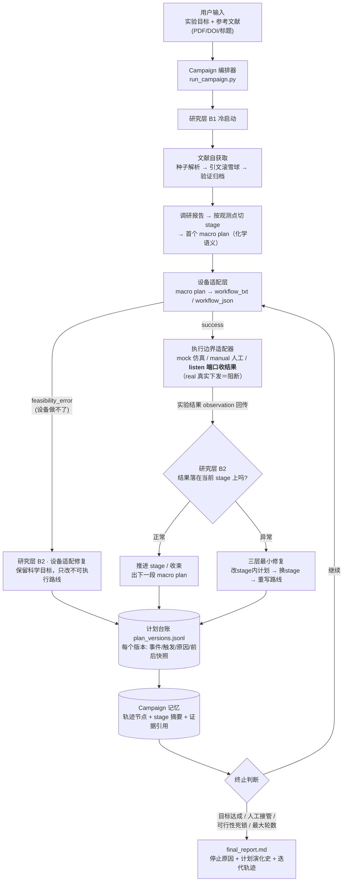
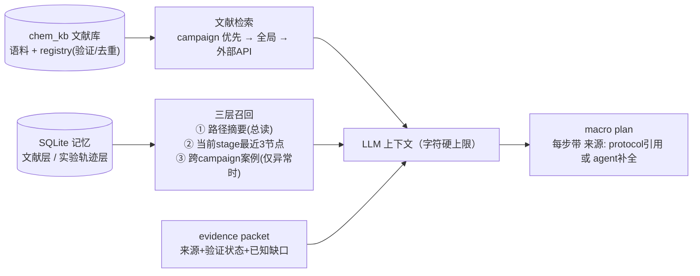

# 快速上手（QUICKSTART）

> 完整项目说明见仓库根目录 [README.md](../README.md)。

## 一句话

给系统一个**实验目标**和几篇**参考文献**（PDF/DOI/标题），它自己查文献、定计划、把计划翻译成工作站指令、等机器结果回传、根据结果**动态修改计划并记录每次修改的原因**——循环直到达成目标或轮数用尽；真实下发链路默认安全阻断。

## 大致流程图



知识与记忆如何进入每次 LLM 决策（上下文有界，不随轮数膨胀）：



## 如何使用

### 0. 安装

```bash
python -m venv .venv && source .venv/bin/activate
pip install -r device_agent/requirements.txt
# LLM 凭据写根目录 .env（REFINER_LLM_MODEL_NAME / _API_KEY / _ENDPOINT_URL）
```

### 1. 一条命令跑完整闭环（推荐入口）

```bash
python run_campaign.py \
  --query "合成 NiFe-PBA 前驱体并优化电化学活化性能" \
  --reference paper.pdf --reference "10.1038/xxx" --reference "某论文标题" \
  --max-iterations 10 \
  --execution-adapter listen --listen-port 8899 \
  --enable-memory --include-device-context \
  --device-status-json lab_status.json \
  --wire-api codex_responses --reasoning-effort xhigh
```

- 机器执行完后，把结果 JSON `POST http://127.0.0.1:8899/observation` 即可驱动下一轮
- 换 `--execution-adapter manual`：把结果写入 `campaigns/<id>/iteration_XX/observation_in.json`
- 换 `--execution-adapter mock`：仿真结果，适合演练流程
- 退出码：`0` 目标达成 / `2` 轮数耗尽 / `3` 需人工 / `4` 可行性死锁

**无 LLM、无网络的离线演练**（验证链路用）：

```bash
python run_campaign.py --query "合成 K-PBA 并离线 XRD 确认目标相" \
  --disable-llm --execution-adapter mock --max-iterations 3
```

### 2. 查看产物

```
campaigns/<campaign_id>/
├── plan_versions.jsonl      # 计划全史：每个版本的事件/触发/原因/前后快照
├── final_report.md          # 停止原因 + 计划演化表 + 迭代轨迹
├── campaign_summary.json    # 机器可读汇总
└── iteration_XX/
    ├── research_state.json  # 该轮研究层完整状态
    ├── device_package.json  # 该轮工作站 workflow（或 feasibility_error 包）
    └── observation_in.json  # 该轮回传的实验结果
```

### 3. 单独跑某一层（调试用）

```bash
# 研究层：冷启动（带参考文献，自动查文献）
python reaserch_agent/run_research_agent.py --event-type bootstrap \
  --query "..." --reference paper.pdf --reference "10.1038/xxx" \
  --enable-memory --include-device-context --save-state s1.json

# 研究层：喂回一个实验结果（或设备错误包）
python reaserch_agent/run_research_agent.py --event-type new_observation \
  --previous-state s1.json --observation "XRD 显示目标相纯相" --save-state s2.json

# 设备层：把研究状态映射成工作站 workflow
python device_agent/run_from_research_state.py \
  --research-state s1.json --print-package-json
```

### 4. 预先充实本地文献库（可选）

```bash
python reaserch_agent/ingest_knowledge.py --input /path/to/papers --output-dir reaserch_agent/chem_kb
python reaserch_agent/ingest_knowledge.py --query "NiFe Prussian blue analogue OER" \
  --sources arxiv,crossref,semantic_scholar,openalex,google_scholar --max-results 5 --download-pdfs
```

**数据来源**：学术 API（Semantic Scholar / Crossref / arXiv / OpenAlex 免钥默认；Google Scholar 需 `SERPER_API_KEY`；PubMed 按需）+ S2 引文滚雪球；给 campaign 或研究 CLI 加 `--web-search` 可开启**通用网页线**（Tavily→Serper(Google)→Brave→SearXNG→DuckDuckGo 按已配置密钥自动降级，Jina Reader 读页）。开启后**模型还可在任何规划步骤中主动调用工具**：输出 `{"tool_request": {"tool": "web_search"|"web_read", ...}}` 即由系统执行并把结果回喂（每任务默认最多 2 轮）。网页内容一律标 `web_unverified`，只作线索、不作参数级证据。相关密钥都放 `.env`：`TAVILY_API_KEY` / `SERPER_API_KEY` / `BRAVE_API_KEY` / `JINA_API_KEY` 等。

### 5. 跑测试

```bash
python -m unittest discover -s reaserch_agent -t . -p "test*.py"   # 研究层
python -m unittest discover -s orchestrator  -t . -p "test*.py"   # 编排层
```

## 三条安全须知

1. **真实实验下发默认阻断**（`dispatch_guard` + `real` 适配器拒绝执行），接通需人工授权
2. 交接载荷中的**中文键是数据契约**（如 `待执行 macro plan`），不要改名
3. `campaigns/` 与 `.env` 已 gitignore——运行产物和密钥不会入库
