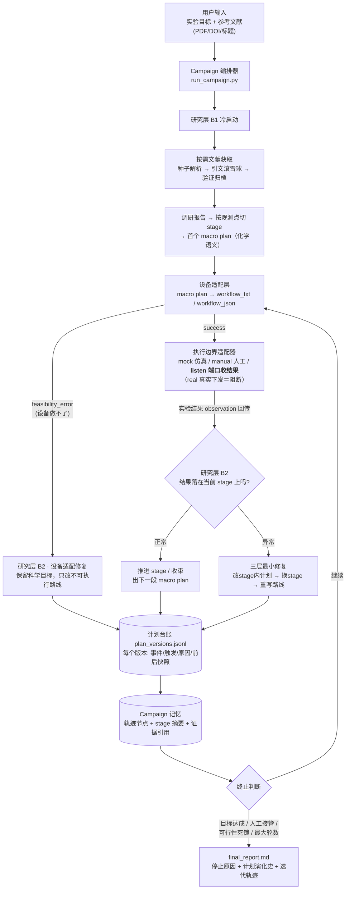
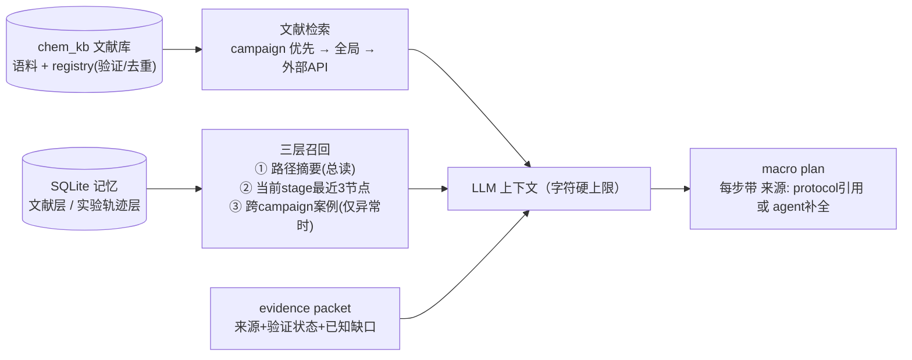

# 快速上手（QUICKSTART）

> 完整项目说明见仓库根目录 [README.md](../README.md)。

## 一句话

给系统一个**实验目标**和可选的**参考文献**（PDF/DOI/标题），它按配置获取文献、制定计划、把计划翻译成工作站指令、等待结果回传，并根据结果**动态修改计划及记录原因**，循环直到达成目标或轮数用尽。真实下发链路默认安全阻断。

## 大致流程图



知识与记忆如何进入每次 LLM 决策（上下文有界，不随轮数膨胀）：



## 如何使用

### 0. 安装

```bash
python3 -m venv .venv && source .venv/bin/activate
python -m pip install -r device_agent/requirements.txt
cp .env.example .env
# 在根目录 .env 填写所需凭据；不要提交真实密钥
```

### Web 控制台（前后端分离）

```bash
# 终端 1
./.venv/bin/python -m pip install -r backend/requirements.txt
./.venv/bin/uvicorn backend.app:app --host 127.0.0.1 --port 8000

# 终端 2
cd frontend && npm install
npm run dev -- --host 127.0.0.1 --port 5173
```

打开 `http://127.0.0.1:5173`。`Research Preview` 不调用 LLM；`Full Campaign` 还会执行设备映射。Online literature 与 Web Search 可独立开启，Download PDFs 仅在 Online literature 开启时可用。后端没有内置鉴权，请保持绑定本机地址。

### 1. 一条命令跑完整闭环（推荐入口）

```bash
python run_campaign.py \
  --query "合成 NiFe-PBA 前驱体并优化电化学活化性能" \
  --reference paper.pdf --reference "10.1038/xxx" --reference "某论文标题" \
  --online-literature --web-search --download-pdfs \
  --max-iterations 10 \
  --execution-adapter listen --listen-port 8899 \
  --enable-memory --include-device-context \
  --device-status-json lab_status.json \
  --wire-api codex_responses --reasoning-effort xhigh
```

- 机器执行完后，把结果 JSON `POST http://127.0.0.1:8899/observation` 即可驱动下一轮
- 换 `--execution-adapter manual`：把结果写入 `campaigns/<id>/iteration_XX/observation_in.json`
- 换 `--execution-adapter mock`：仿真结果，适合演练流程
- 退出码：`0` 目标达成 / `2` 轮数耗尽 / `3` 需人工 / `4` 可行性死锁 / `5` 设备错误 / `6` 研究错误
- `--device-status-json` 要同时影响研究层时，需像示例一样搭配 `--include-device-context`
- 三个外部能力开关均可省略；`--download-pdfs` 需与 `--online-literature` 一起使用

**离线研究层 smoke test**：

当前没有完整闭环的无 LLM 模式：`run_campaign.py --disable-llm` 只关闭研究层 LLM，设备映射仍需要 LLM。下面的命令只验证研究层 heuristic 路径，不访问网络：

```bash
python reaserch_agent/run_research_agent.py --event-type bootstrap \
  --query "合成 K-PBA 并离线 XRD 确认目标相" \
  --disable-llm --no-online-literature --no-web-search --no-ledger \
  --save-state research_state.json
```

### 2. 查看产物

```
campaigns/<campaign_id>/
├── plan_versions.jsonl      # 计划全史：每个版本的事件/触发/原因/前后快照
├── final_report.md          # 停止原因 + 计划演化表 + 迭代轨迹
├── campaign_summary.json    # 机器可读汇总
└── iteration_XX/
    ├── research_state.json  # 该轮研究层完整状态
    ├── device_state.json    # 设备层完整状态（进入设备映射时）
    ├── device_package.json  # 工作站 workflow 或 feasibility_error 包
    └── observation_in.json  # 成功执行并收到结果时生成
```

### 3. 单独跑某一层（调试用）

```bash
# 研究层：冷启动（带参考文献，自动查文献）
python reaserch_agent/run_research_agent.py --event-type bootstrap \
  --query "..." --reference paper.pdf --reference "10.1038/xxx" \
  --enable-memory --include-device-context --save-state s1.json

# 研究层：喂回一个实验结果（或设备错误包）
python reaserch_agent/run_research_agent.py --event-type new_observation \
  --previous-state s1.json --observation "XRD 显示目标相纯相" --save-state s2.json

# 设备层：把研究状态映射成工作站 workflow
python device_agent/run_from_research_state.py \
  --research-state s1.json --print-package-json
```

### 4. 预先充实本地文献库（可选）

```bash
python reaserch_agent/ingest_knowledge.py --input /path/to/papers --output-dir reaserch_agent/chem_kb
python reaserch_agent/ingest_knowledge.py --query "NiFe Prussian blue analogue OER" \
  --sources semantic_scholar,openalex,arxiv,crossref,google_scholar --max-results 5 --download-pdfs
```

**数据来源**：论文关键词检索会查询所选来源并轮询聚合、去重，CLI 默认来源为 Semantic Scholar、OpenAlex、arXiv、Crossref；可选 Serper Scholar / PubMed。DOI、arXiv 和标题解析会按供应商顺序降级。`--download-pdfs` 按 arXiv → S2 OA → Unpaywall → CORE → 元数据 URL → Web PDF 自动切换，候选 PDF 无可提取正文时继续下一来源；`--web-search` 使用 Tavily → Serper → Brave → SearXNG → DuckDuckGo。LLM 模式按开关开放 `web_search`、`web_read`、`paper_search`，只有加 `--download-pdfs` 才开放 `paper_download`。网页只标为 `web_unverified`；密钥放根目录 `.env`，变量清单见 `.env.example`。

### 5. 跑测试

```bash
python -m unittest discover -s reaserch_agent -t . -p "test*.py"   # 研究层
python -m unittest discover -s orchestrator  -t . -p "test*.py"   # 编排层
python device_agent/test_single_agent.py                          # 设备层（需已装依赖）
```

## 三条安全须知

1. **真实实验下发默认阻断**（`dispatch_guard` + `real` 适配器拒绝执行），接通需人工授权
2. 交接载荷中的**中文键是数据契约**（如 `待执行 macro plan`），不要改名
3. `campaigns/`、`backend/data/` 与 `.env` 已 gitignore——运行产物和密钥不会入库；在线请求会把检索词、论文标识或目标 URL 发送给相应第三方服务
