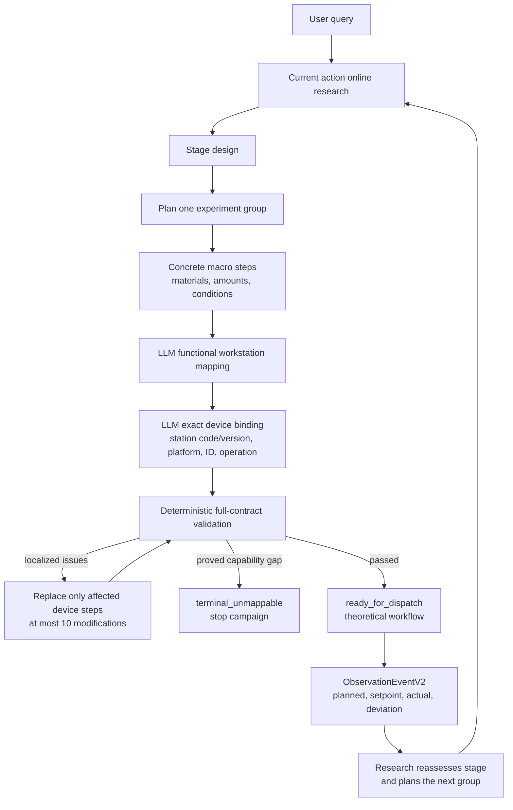

# Chem Agent V2 architecture

Chem Agent V2 uses one scientific planning contract from Research and one
machine binding contract from Device. The public campaign entry point defaults
to V2 and accepts `--contract-version v1` for rollback.

The canonical contracts live in `chem_agent_contracts/v2.py`. Compatibility
adapters in `chem_agent_contracts/adapters.py` accept legacy Research state and
preserve the current Chinese CLI/frontend fields alongside the V2 objects.

Capability disclosure uses one content-addressed snapshot across four tiers:

| Tier | Consumer | Exposed information |
| --- | --- | --- |
| `stage` | Research stage design | Experiment and observation capabilities |
| `macro_action` | Research action design | Relevant chemical operations |
| `macro_step` | Research detailed design | Operation I/O, logical containers, scientific controls, dependency closure |
| `device` | Device mapping | Compact catalog for all 45 workstations; full Skill, audit and wire contract loaded on demand |

Research creates exactly one `experiment_group` in each
`ResearchActionPackageV2`. It performs a fresh `online_research` invocation for
the action and excludes prior retrieval results from the planning context.
When that invocation is empty, the plan may continue with explicit
`agent_inferred` values and rationales. Active material additions require an
exact number and unit; an unknown intermediate yield uses `all_available` or
`runtime_measured`.

Device performs two explicit mappings. `WorkstationRequirementV2` records the
functional role and candidates for each stable `macro_step_id`.
`DeviceStepV2` then records the exact station code and version, Chinese platform
name, numeric station ID, operation, machine parameters and container binding.
One macro step may expand into several device steps; every device step retains
`source_macro_step_id`.

V2 validation does not fill omitted machine parameters. It checks the complete
workflow and localizes every issue. Each failed source step is retranslated as
an independent unit while unaffected units remain protected by content hashes.
After ten failed modifications the package becomes `human_review_required`.
A complete-workstation proof of a hard capability gap produces
`terminal_unmappable` with exact macro step IDs and ends the campaign without a
Research retry.

The accepted endpoint is `ready_for_dispatch`. It contains a formatted,
theoretically dispatchable payload but does not call real hardware. An execution
adapter can later return `ObservationEventV2`, including a macro parameter
summary, device parameter traces, measurements, artifacts, material consumption
and execution errors.
