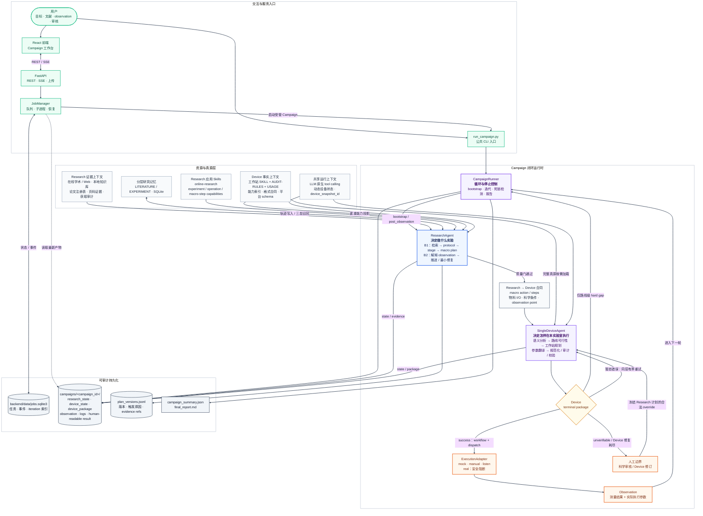

# Chem Agent 当前系统架构

这张图按当前代码展示交互入口、Campaign 闭环、Research/Device 职责边界、执行适配器、资源真源和可审计持久化。核心约束是：只有设备层证明存在路线级硬缺口时，才把问题退回 Research 重新规划；路线已通过后，工作流与设备内部问题留在 Device 层修复或转人工。

```mermaid
%%{init: {"theme":"base","themeVariables":{"fontFamily":"Arial, PingFang SC, Microsoft YaHei, sans-serif","fontSize":"17px","primaryTextColor":"#172033","lineColor":"#334155","clusterBkg":"#FFFFFF","clusterBorder":"#94A3B8"},"flowchart":{"htmlLabels":true,"curve":"basis","nodeSpacing":48,"rankSpacing":64}}}%%
flowchart TB
    subgraph access["交互与服务入口"]
        direction TB
        user(["用户<br/>目标 · 文献 · observation · 审核"])
        frontend["React 前端<br/>Campaign 工作台"]
        api["FastAPI<br/>REST · SSE · 上传"]
        jobs["JobManager<br/>队列 · 子进程 · 恢复"]
        cli["run_campaign.py<br/>公共 CLI 入口"]

        user --> frontend
        frontend <-->|"REST / SSE"| api
        api --> jobs
        user --> cli
    end

    subgraph runtime["Campaign 闭环运行时"]
        direction LR
        runner["CampaignRunner<br/><b>循环与停止控制</b><br/>bootstrap · 迭代 · 死锁检测 · 报告"]
        research["ResearchAgent<br/><b>决定做什么实验</b><br/>B1：检索 → protocol → stage → macro plan<br/>B2：解释 observation → 推进 / 最小修复"]
        contract["Research → Device 合同<br/>macro action / steps<br/>物料 I/O · 科学条件 · observation point"]
        device["SingleDeviceAgent<br/><b>决定怎样在本实验室执行</b><br/>语义分析 → 路线可行性 → 工作站规划<br/>参数翻译 → 规范化 / 审计 / 校验"]
        package{"Device<br/>terminal package"}
        execution["ExecutionAdapter<br/>mock · manual · listen<br/>real：安全阻断"]
        observation["Observation<br/>测量结果 + 实际执行参数"]
        human["人工边界<br/>科学审核 / Device 修订"]

        runner -->|"bootstrap / post_observation"| research
        research -->|"质量门通过"| contract
        contract --> device
        device --> package
        package -->|"success：workflow + dispatch"| execution
        execution --> observation
        observation -->|"进入下一轮"| runner
        package -->|"仅路线级 hard gap"| runner
        package -->|"unverifiable / Device 修复耗尽"| human
        package -->|"暂态错误：同层有界重试"| device
        human -->|"冻结 Research 计划的合法 override"| device
    end

    jobs -->|"启动受管 Campaign"| cli
    cli --> runner

    subgraph resources["资源与真源层"]
        direction TB
        evidence["Research 证据上下文<br/>在线学术 / Web · 本地知识库<br/>论文注册表 · 页码证据 · 获取审计"]
        memory["分层研究记忆<br/>LITERATURE / EXPERIMENT · SQLite"]
        researchSkills["Research 应用 Skills<br/>online-research<br/>experiment / operation / macro-step capabilities"]
        deviceTruth["Device 事实上下文<br/>工作站 SKILL + AUDIT-RULES + USAGE<br/>能力索引 · 格式合同 · 平台 schema"]
        shared["共享运行上下文<br/>LLM 原生 tool calling<br/>动态设备状态 · device_snapshot_id"]
    end

    evidence --> research
    memory <-->|"轨迹写入 / 三层召回"| research
    researchSkills --> research
    deviceTruth -->|"完整真源按需加载"| device
    deviceTruth -->|"紧凑能力投影"| research
    shared --> research
    shared --> device

    subgraph persistence["可审计持久化"]
        direction TB
        jobdb[("backend/data/jobs.sqlite3<br/>任务 · 事件 · iteration 索引")]
        campaign[("campaigns/&lt;campaign_id&gt;/<br/>research_state · device_state · device_package<br/>observation · logs · human-readable result")]
        ledger[("plan_versions.jsonl<br/>版本 · 触发原因 · evidence refs")]
        reports["campaign_summary.json<br/>final_report.md"]
    end

    jobs <-->|"状态 / 事件"| jobdb
    runner --> campaign
    research -->|"state / evidence"| campaign
    device -->|"state / package"| campaign
    research --> ledger
    runner --> reports
    jobs -.->|"读取最新产物"| campaign

    classDef accessNode fill:#ECFDF5,stroke:#10B981,stroke-width:1.8px,color:#064E3B;
    classDef orchestration fill:#F5F3FF,stroke:#7C3AED,stroke-width:2.2px,color:#3B0764;
    classDef researchNode fill:#EFF6FF,stroke:#2563EB,stroke-width:2.2px,color:#172554;
    classDef contractNode fill:#F8FAFC,stroke:#64748B,stroke-width:1.8px,color:#1E293B;
    classDef deviceNode fill:#F5F3FF,stroke:#8B5CF6,stroke-width:2.2px,color:#3B0764;
    classDef executionNode fill:#FFF7ED,stroke:#EA580C,stroke-width:2px,color:#7C2D12;
    classDef decisionNode fill:#FFFBEB,stroke:#D97706,stroke-width:2px,color:#78350F;
    classDef resourceNode fill:#F8FAFC,stroke:#94A3B8,stroke-width:1.5px,color:#1E293B;
    classDef storeNode fill:#F1F5F9,stroke:#475569,stroke-width:1.7px,color:#0F172A;

    class user,frontend,api,jobs,cli accessNode;
    class runner orchestration;
    class research researchNode;
    class contract contractNode;
    class device deviceNode;
    class package decisionNode;
    class execution,observation,human executionNode;
    class evidence,memory,researchSkills,deviceTruth,shared resourceNode;
    class jobdb,campaign,ledger,reports storeNode;

    linkStyle default stroke:#334155,stroke-width:2px;
```
