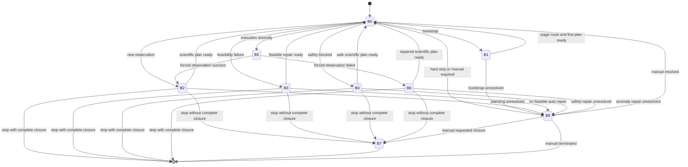
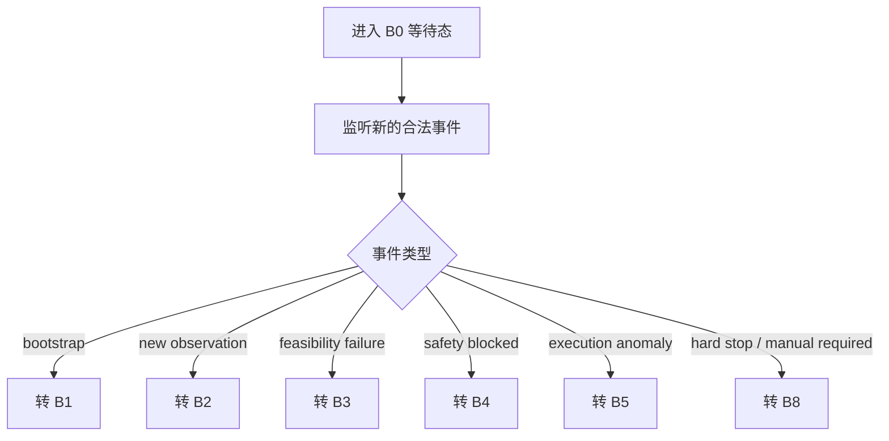
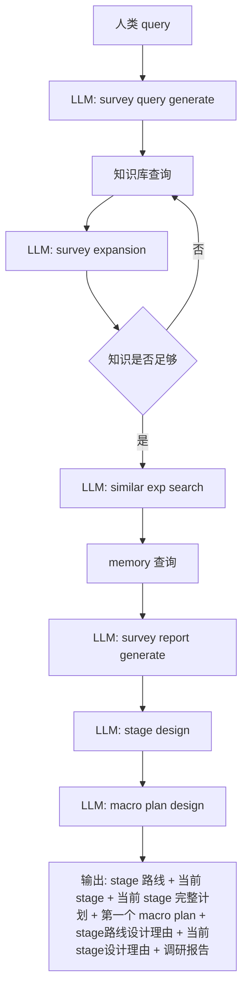
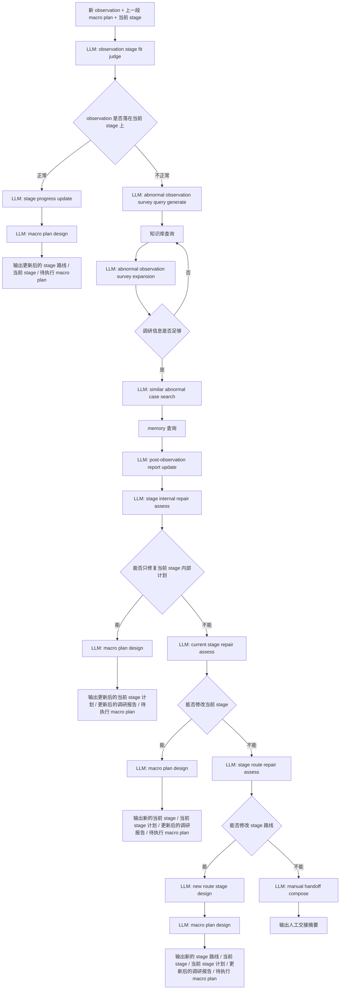
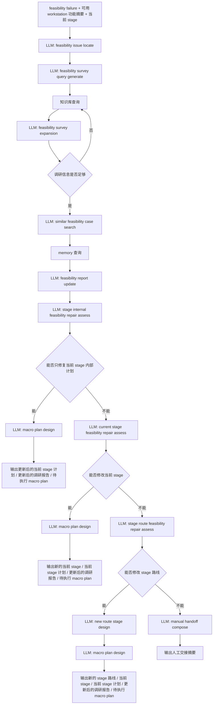
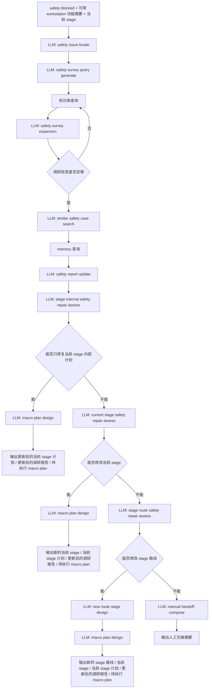
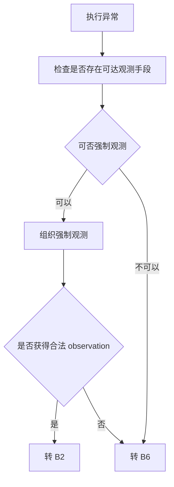
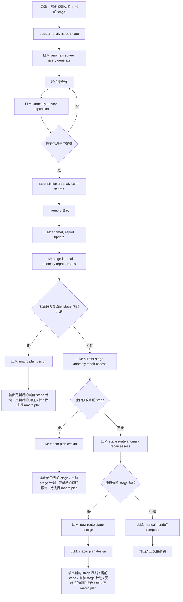
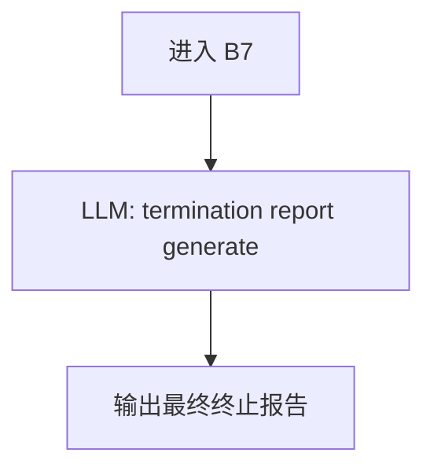
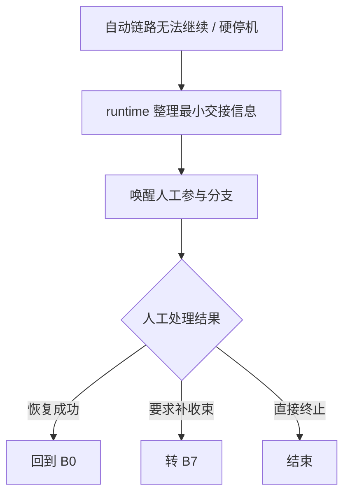

# Research Layer 状态机与逻辑分支设计

## 1. 分支总览

| 分支 | 是否进入 research | 当前定义 |
| --- | --- | --- |
| `B0 waiting` | 否 | 外层等待与分发分支 |
| `B1 bootstrap` | 是 | 初始化 `stage 路线`、当前 `stage` 与首个 `macro plan` 的启动子代理 |
| `B2 post_observation` | 是 | 根据新 observation 更新 `stage` 规划与下一步 `macro plan` 的后观测子代理 |
| `B3 feasibility_failure` | 是 | 当前条件不支持时做修复的可实现性修复子代理 |
| `B4 safety_blocked` | 是 | 收到安全阻断后做安全层面修复的安全修复子代理 |
| `B5 forced_observation` | 否 | 异常后优先补观测的 runtime 分支 |
| `B6 anomaly_without_observation` | 是 | 无新 observation 条件下修复科学计划的异常修复子代理 |
| `B7 closure_pass` | 是 | 生成收束结论的收束子代理 |
| `B8 manual_intervention` | 否 | 自动链路无法继续时的人工参与分支 |

## 2. 状态机图

图中的关键含义：

- `B1/B2/B4/B6` 先给出纯科学层面的计划
- 这些计划下发后，如果下游发现“当前条件不支持”，再触发 `B3`
- `B3` 是唯一显式处理 feasibility 的自动分支
- 每个自动分支如果逻辑上无法继续，最终都可以坍缩到 `B8`

## 3. 分支详细设计

### 3.1 B0 waiting

#### 类型

`runtime branch`

#### 功能概述

`B0` 是外层状态机的等待与分发节点。
它不调用 `research layer`，只负责等待新的合法事件并进行路由。
在当前阶段，它只负责监听 `bootstrap` 事件，并将其路由到 `B1`。

#### 内部执行编排

1. 监听是否出现新的外部事件
2. 若事件是 `bootstrap`，转 `B1`
3. 若事件不是 `bootstrap`，返回“当前阶段未实现该分支”的结果

#### 工作流图

#### 输入

- 新的外部事件
- 当前运行上下文

#### 输出

- 进入某个后续分支的路由结果

#### 内部执行编排

1. 监听是否出现新的合法触发事件
2. 若事件是启动，转 `B1`
3. 若事件是新的 observation，转 `B2`
4. 若事件是 feasibility failure，转 `B3`
5. 若事件是 safety blocked，转 `B4`
6. 若事件是 execution anomaly，转 `B5`
7. 若事件是 hard stop 或明确人工接管请求，转 `B8`

### 3.2 B1 bootstrap

#### 类型

`research subagent`

#### 功能概述

`B1` 是启动子代理。
它的职责是：根据人类给定的研究目标，初始化当前 query 的 `stage 路线` 与当前 `stage`，并产出第一个待执行的 `macro plan`。

它要回答的是：

- 这个 query 该拆成哪些 `stage`
- 当前首先进入哪个 `stage`
- 当前 `stage` 的完整化学语义实验计划是什么
- 当前最近一步应该先做哪个 `macro plan`

#### 工作流图

#### 输入

- 人类 `query`
- 可选的附加约束
  例如目标性能、禁用材料、优先变量、时间预算、已有中间体

#### 输出

`B1` 的输出分为两类：

##### A. research layer 内部持久化输出
- `stage 路线`
- `当前 stage`
- `当前 stage 的完整化学语义实验计划`
- `待执行 macro plan`
- `stage路线设计理由`
- `当前stage设计理由`
- `调研报告`

##### B. 发给下游 device adaptation layer agent 的外部交接输出
- `query`
- `stage 路线`
- `当前 stage`
- `当前 stage 的完整化学语义实验计划`
- `待执行 macro plan`
- `stage路线设计理由`
- `当前stage设计理由`

#### System Prompt

- 角色：启动分支研究规划代理
- 核心目标：从人类 query 初始化 `stage 路线`、当前 `stage` 与首个 `macro plan`
- 工作边界：
  - 只做科学语义与化学实验语义规划
  - 不输出设备/workstation/机器语义
  - 不判断当前实验室是否立即可执行
- 推理原则：
  - 先调研知识，再查询历史案例，再生成 `调研报告`，再做 `stage` 设计
  - `stage` 必须服务于 query
  - `macro plan` 必须严格隶属于当前 `stage`

#### 内部执行编排

##### 步骤 1：LLM 调用 `survey query generate`

输入：

- 人类 `query`
- 可选附加约束

目的：

- 根据 query 生成第一轮知识调研 query

输出：

- 一组可直接用于知识库查询的关键字列表

任务 prompt 大纲：

- 任务名称：`survey query generate`
- 任务目标：把人类 query 展开成第一轮知识调研 query
- 任务输入：人类 query 与附加约束
- 任务输出描述：输出一组可解析、可直接用于知识库检索的材料、工艺、性能、变量关键词

##### 步骤 2：硬编码知识库查询

输入：

- `survey query generate` 产出的关键字列表

输出：

- 第一轮知识文本拼接
- 可选的结构化知识摘录

##### 步骤 3：LLM 调用 `survey expansion`

输入：

- 人类 `query`
- 当前已查到的全部知识

目的：

- 判断知识是否足够进入 `stage` 规划
- 若不足，则提出下一轮还需补的调研方向

输出：

- `不需要继续调研`
  或
- 新的知识检索关键字列表

任务 prompt 大纲：

- 任务名称：`survey expansion`
- 任务目标：判断当前知识是否足够支撑 `stage` 设计
- 任务输入：人类 query 与当前累计知识
- 任务输出描述：若足够则明确返回“不需要继续调研”；若不足则返回新的检索关键字列表并指出缺口

##### 步骤 4：知识库查询与 `survey expansion` 循环

执行逻辑：

- 若 `survey expansion` 返回还需调研，则继续知识库查询
- 然后再次调用 `survey expansion`
- 直到：
  - 信息足够进入下一步规划
  - 或达到最大调研轮数

输出：

- 扩展后的累计知识上下文

##### 步骤 5：LLM 调用 `similar exp search`

输入：

- 人类 `query`
- 累计知识

目的：

- 生成 memory 查询关键字
- 检索已执行过的相似实验、相似材料、相似工艺或相似目标

输出：

- 一组面向 memory 的检索 query 或标签

任务 prompt 大纲：

- 任务名称：`similar exp search`
- 任务目标：生成 memory 检索 query
- 任务输入：人类 query 与累计知识
- 任务输出描述：输出适合检索相似实验案例的关键词、标签或短语

##### 步骤 6：memory 工具调用

输入：

- `similar exp search` 产出的 memory query

输出：

- 相关历史实验案例摘要
- 可选的相似计划与结果摘要

##### 步骤 7：LLM 调用 `survey report generate`

输入：

- 人类 `query`
- 累计知识
- memory 结果

目的：
- 整理已有的知识和 memory 结果
- 形成后续 `stage` 设计所依赖的 `调研报告`

输出：

- `调研报告`

任务 prompt 大纲：

- 任务名称：`survey report generate`
- 任务目标：整理已有知识与历史案例，生成可直接支撑后续规划的 `调研报告`
- 任务输入：人类 query、累计知识、历史实验案例
- 任务输出描述：输出结构化 `调研报告`

##### 步骤 8：LLM 调用 `stage design`

输入：

- 人类 `query`
- `调研报告`

目的：

- 设计当前 query 的 `stage 路线`
- 选出当前最应该进入的 `stage`
- 给出 `当前stage设计理由` 和 `stage路线设计理由`

输出：

- `stage 路线`
- `当前 stage`
- `stage路线设计理由`
- `当前stage设计理由`

任务 prompt 大纲：

- 任务名称：`stage design`
- 任务目标：基于 `调研报告` 设计 `stage 路线` 并确定当前 `stage`
- 任务输入：人类 query、`调研报告`
- 任务输出描述：输出清晰的 `stage` 链和当前 `stage`，并给出 `stage` 链和当前stage的设计理由

##### 步骤 9：LLM 调用 `macro plan design`

输入：

- 人类 `query`
- `调研报告`
- `stage 路线`
- `当前 stage`
-  `stage路线设计理由`
-  `当前stage设计理由`

目的：

- 设计当前最近一步的 `macro plan`
- 同时生成当前 `stage` 的完整化学语义实验计划

输出：

- `待执行 macro plan`
- `当前 stage 的完整化学语义实验计划`

任务 prompt 大纲：

- 任务名称：`macro plan design`
- 任务目标：在当前 `stage` 下设计最近一步 `macro plan`
- 任务输入：人类 query、`调研报告`、`stage 路线`、当前 `stage`、`当前stage设计理由`、`stage路线设计理由`
- 任务输出描述：输出一个属于当前 `stage` 的 `macro plan`，以及当前 `stage` 的完整化学语义实验计划

### 3.3 B2 post_observation

#### 类型

`research subagent`

#### 功能概述

`B2` 是后观测子代理。
它的职责是：在新的真实 `observation` 到来之后，先判断该结果是否落在预定义的当前 `stage` 上；若正常落在当前 `stage` 上，则直接规划下一段 `macro plan`；若不正常，则先增量更新 `调研报告`，再依次尝试在三个层级修复：

- 修改当前 `stage` 的完整化学语义实验计划
- 修改当前 `stage`
- 修改整个 `stage 路线`

若三层都无法修复，则输出 `人工交接摘要`。

#### 工作流图

#### 输入

- 人类原始 `query`
- 最新 `observation`
- 该 observation 对应的上一段 `macro plan`
- 当前 `stage`
- 当前 `stage 路线`
- 当前 `stage` 的完整化学语义实验计划
- `调研报告`
- `当前stage设计理由`
- `stage路线设计理由`

#### 输出

##### 整个输出分为两层:
##### A. research layer 内部持久化输出:

- `observation` 与当前 `stage` 的一致性判断
- 更新后的 `调研报告`
- 更新后的 `stage 路线`
- 更新后的 `当前 stage`
- 更新后的 `当前 stage` 设计理由
- 更新后的 `stage 路线` 设计理由
- 更新后的 `当前 stage` 的完整化学语义实验计划
- 待执行 `macro plan`
- 当前 observation 的结构化科学解释
- 当前阶段推进状态
- stop / closure / unresolved 等研究层状态标志
- `人工交接摘要`

##### B. 发给下游 device adaptation layer agent 的外部交接输出
- `query`
- `stage 路线`
- `当前 stage`
- `当前 stage 的完整化学语义实验计划`
- `待执行 macro plan`
- `stage路线设计理由`
- `当前stage设计理由`

#### System Prompt

- 角色：后观测研究判断代理
- 核心目标：基于新 `observation` 维护 `stage 路线` 与当前 `stage`，并输出下一段 `macro plan`
- 工作边界：
  - 只处理科学语义与化学语义规划
  - 不处理设备级执行方案
  - 不处理 feasibility 问题
- 推理原则：
  - 先判断 `observation` 是否正常
  - 若不正常，先增量更新 `调研报告`
  - 再按“当前 `stage` 的完整化学语义实验计划 -> 当前 `stage` -> `stage 路线`”三层递进
  - 每一层先判断能否修复，再执行对应设计

#### 内部执行编排

##### 步骤 1：LLM 调用 `observation stage fit judge`

输入：

- 最新 `observation`
- 上一段 `macro plan`
- 当前 `stage`
- 当前 `stage` 的完整化学语义实验计划
- `当前stage设计理由`

目的：

- 判断该 `observation` 是否表征正常的执行
- 若不正常，给出原因

输出：

- `落在当前 stage 上` 或 `不落在当前 stage 上`
- 不正常时的原因

任务 prompt 大纲：

- 任务名称：`observation stage fit judge`
- 任务目标：判断 `observation` 是否仍然支持当前 `stage`
- 任务输入：`observation`、上一段 `macro plan`、当前 `stage`、当前 `stage` 的完整化学语义实验计划、`当前stage设计理由`
- 任务输出描述：输出一致性判断和不正常原因

##### 步骤 2：若 `observation` 显示按计划执行，则调用 `stage progress update`

输入：

- 人类 `query`
- 最新 `observation`
- 上一段 `macro plan`
- 当前 `stage`
- 当前 `stage 路线`
- `stage路线设计理由`
- `当前stage设计理由`
- `observation stage fit judge` 的结果
- 当前 `stage` 的完整化学语义实验计划

目的：

- 在既有 `stage 路线` 中更新当前 `stage` 的推进位置
- 确定下一段 `macro plan` 仍属于当前 `stage`，还是转入 `stage 路线` 中的下一个 `stage`

输出：

- 更新后的 `当前 stage`
- 更新后的 `当前stage设计理由`
- 更新后的 `stage 路线`
- 更新后的 `stage路线设计理由`

任务 prompt 大纲：

- 任务名称：`stage progress update`
- 任务目标：在不重写 `stage 路线` 的前提下更新当前 `stage`
- 任务输入：`query`、`observation`、上一段 `macro plan`、当前 `stage`、`stage 路线`、当前 `stage` 计划、`当前stage设计理由`、`stage路线设计理由`、`observation stage fit judge` 的结果
- 任务输出描述：输出更新后的当前 `stage` 和 `stage 路线` 中的当前落点

##### 步骤 3：若 `observation` 显示按计划执行，则调用 `macro plan design`

输入：

- 人类 `query`
- 最新 `observation`
- 上一段 `macro plan`
- 更新后的 `当前 stage`
- 更新后的 `stage 路线`
- 更新后的 `stage路线设计理由`
- 更新后的 `当前stage设计理由`
- `stage内部实验计划`
- `调研报告`

目的：

- 生成下一段待执行 `macro plan`

输出：

- 待执行 `macro plan`

任务 prompt 大纲：

- 任务名称：`macro plan design`
- 任务目标：在当前 `stage` 上生成下一段 `macro plan`
- 任务输入：`query`、`observation`、上一段 `macro plan`、当前 `stage`、`stage 路线`、`stage路线设计理由`、`当前stage设计理由`、`调研报告`、`stage内部实验计划`
- 任务输出描述：输出待执行 `macro plan`

##### 步骤 4：若 `observation` 显示执行不正常，则调用 `abnormal observation survey query generate`

输入：

- 人类 `query`
- 当前 `observation`
- 上一段 `macro plan`
- 当前 `stage`
- 当前 `stage` 的完整化学语义实验计划
- 当前 `stage 路线`
- `stage路线设计理由`
- `当前stage设计理由`
- `调研报告`
- `observation stage fit judge` 的结果

目的：

- 根据当前异常 `observation` 与上一步判断生成增量调研 query
- 明确本轮调研需要补充的知识方向

输出：

- 一组新的知识检索关键字列表

任务 prompt 大纲：

- 任务名称：`abnormal observation survey query generate`
- 任务目标：围绕当前异常 `observation` 生成增量调研 query
- 任务输入：`query`、`observation`、上一段 `macro plan`、当前 `stage`、当前 `stage` 的完整化学语义实验计划、已有 `调研报告`、`observation stage fit judge` 的结果
- 任务输出描述：输出可直接用于知识库检索的增量调研关键词

##### 步骤 5：知识库查询

输入：

- `abnormal observation survey query generate` 产出的关键字列表

输出：

- 本轮增量知识文本拼接
- 可选的结构化知识摘录

##### 步骤 6：LLM 调用 `abnormal observation survey expansion`

输入：

- 人类 `query`
- 当前 `observation`
- `observation stage fit judge` 的结果
- 已有 `调研报告`
- 当前累计知识

目的：

- 判断当前增量调研是否足够支撑后续修复
- 若不足，则生成下一轮增量调研关键词

输出：

- `不需要继续调研`
  或
- 新的知识检索关键字列表

任务 prompt 大纲：

- 任务名称：`abnormal observation survey expansion`
- 任务目标：判断异常 observation 场景下的增量调研是否已经足够
- 任务输入：`query`、`observation`、`observation stage fit judge` 的结果、已有 `调研报告`、当前累计知识
- 任务输出描述：若足够则返回“不需要继续调研”；若不足则返回新的增量调研关键词

##### 步骤 7：知识库查询与 `abnormal observation survey expansion` 循环

执行逻辑：

- 若 `abnormal observation survey expansion` 返回还需调研，则继续知识库查询
- 然后再次调用 `abnormal observation survey expansion`
- 直到信息足够进入下一步修复

输出：

- 扩展后的累计知识上下文

##### 步骤 8：LLM 调用 `similar abnormal case search`

输入：

- 人类 `query`
- 当前 `observation`
- `observation stage fit judge` 的结果
- 扩展后的累计知识上下文
- 当前 `stage`
- 当前 `stage 路线`

目的：

- 生成与当前异常 observation 场景相关的 memory 检索条件

输出：

- 一组面向 memory 的检索 query 或标签

任务 prompt 大纲：

- 任务名称：`similar abnormal case search`
- 任务目标：生成相似异常 observation 修复案例的 memory 检索 query
- 任务输入：`query`、`observation`、`observation stage fit judge` 的结果、扩展后的累计知识、当前 `stage`、当前 `stage 路线`
- 任务输出描述：输出适合检索相似异常案例的关键词、标签或短语

##### 步骤 9：memory 工具调用

输入：

- `similar abnormal case search` 产出的 memory query

输出：

- 相关历史异常案例摘要
- 可选的相似修复路径摘要

##### 步骤 10：LLM 调用 `post-observation report update`

输入：

- 人类 `query`
- 当前 `observation`
- `observation stage fit judge` 的结果
- 扩展后的累计知识上下文
- memory 结果
- 已有 `调研报告`

目的：

- 基于当前异常 observation、增量知识和历史案例更新 `调研报告`

输出：

- 更新后的 `调研报告`

任务 prompt 大纲：

- 任务名称：`post-observation report update`
- 任务目标：根据当前异常 observation 场景增量更新 `调研报告`
- 任务输入：`query`、`observation`、`observation stage fit judge` 的结果、扩展后的累计知识上下文、memory 结果、已有 `调研报告`
- 任务输出描述：输出更新后的 `调研报告`

##### 步骤 11：LLM 调用 `stage internal repair assess`

输入：

- 人类 `query`
- 当前 `observation`
- 上一段 `macro plan`
- 更新后的 `调研报告`
- 当前 `stage`
- `当前stage设计理由`
- 当前 `stage` 的完整化学语义实验计划
- `observation stage fit judge` 的结果

目的：

- 判断是否可以不改变当前 `stage`，只通过重写当前 `stage` 的完整化学语义实验计划完成修复
- 如果可以内部修复，给出更新后的 `stage` 内部实验计划

输出：

- `可以只修改当前 stage 的完整化学语义实验计划`
  或
- `不能只修改当前 stage 的完整化学语义实验计划`
- 如果可以修复，则给出更新后的 `当前 stage` 的完整化学语义实验计划
- 不可以修复则给出原因

任务 prompt 大纲：

- 任务名称：`stage internal repair assess`
- 任务目标：判断是否可以仅通过重写当前 `stage` 内部计划完成修复，并给出更新后的 `stage` 内部实验计划
- 任务输入：`query`、`observation`、上一段 `macro plan`、更新后的 `调研报告`、当前 `stage`、`当前stage设计理由`、当前 `stage` 的完整化学语义实验计划、`observation stage fit judge` 的结果
- 任务输出描述：输出是否能在当前 `stage` 内部修复，如果能则给出更新后的 `当前 stage` 的完整化学语义实验计划；如果不能则给出原因

##### 步骤 12：若当前 `stage` 内部修复成功，则调用 `macro plan design`

##### 步骤 13：若当前 `stage` 内部无法修复，则调用 `current stage repair assess`

输入：

- 人类 `query`
- 当前 `observation`
- 上一段 `macro plan`
- 更新后的 `调研报告`
- 当前 `stage`
- `当前stage设计理由`
- 当前 `stage` 的完整化学语义实验计划
- `observation stage fit judge` 的结果
- 当前 `stage 路线`
- `stage路线设计理由`

目的：

- 判断是否需要修改当前 `stage`
- 如果可以修改，则给出新的 `当前stage`、`当前stage设计理由` 和 `stage` 内部实验计划
- 如果不可以，则给出原因

输出：

- `可以修改当前 stage`
  或
- `不能通过修改当前 stage 修复`
- 如果可以修改，则给出新的 `当前stage`、`当前stage设计理由` 和 `stage内部实验计划`
- 如果不可以，则给出原因

任务 prompt 大纲：

- 任务名称：`current stage repair assess`
- 任务目标：判断是否可以改写当前 `stage` 来完成修复
- 任务输入：`query`、`observation`、上一段 `macro plan`、更新后的 `调研报告`、当前 `stage`、`当前stage设计理由`、当前 `stage` 的完整化学语义实验计划、`observation stage fit judge` 的结果、当前 `stage 路线`、`stage路线设计理由`
- 任务输出描述：输出当前 `stage` 是否可修复，如果可以则给出新的 `当前stage`、`当前stage设计理由` 和 `stage内部实验计划`；如果不可以则给出原因

##### 步骤 14：若上一步判断 `stage` 可修复并且给出了新的当前 `stage`，则调用 `macro plan design`

##### 步骤 15：若当前 `stage` 仍无法修复，则调用 `stage route repair assess`

输入：

- 人类 `query`
- 当前 `observation`
- 上一段 `macro plan`
- 更新后的 `调研报告`
- 当前 `stage`
- `当前stage设计理由`
- 当前 `stage` 的完整化学语义实验计划
- `observation stage fit judge` 的结果
- 当前 `stage 路线`
- `stage路线设计理由`

目的：

- 判断是否需要修改整个 `stage 路线`
- 如果可以通过修改 `stage路线` 修复，则给出更新后的 `stage路线` 和 `stage路线设计理由`
- 如果不可以，则给出原因

输出：

- `可以修改 stage 路线`
  或
- `不能通过修改 stage 路线修复`
- 如果可以通过修改 `stage路线` 修复，则给出更新后的 `stage路线` 和 `stage路线设计理由`

任务 prompt 大纲：

- 任务名称：`stage route repair assess`
- 任务目标：判断是否需要重写 `stage 路线`
- 任务输入：`query`、`observation`、上一段 `macro plan`、更新后的 `调研报告`、当前 `stage`、`当前stage设计理由`、当前 `stage` 的完整化学语义实验计划、当前 `stage 路线`、`stage路线设计理由`、`observation stage fit judge` 的结果
- 任务输出描述：输出 `stage 路线` 是否可修复，如果可以则给出更新后的 `stage路线` 和 `stage路线设计理由`；如果不可以则给出原因

##### 步骤 16：若 `stage 路线` 可修复并且已经给出了新的路线，则调用 `new route stage design`

输入：

- 人类 `query`
- 当前 `observation`
- 更新后的 `调研报告`
- 当前 `stage 路线`
- `stage路线设计理由`

目的：

- 确定当前 `stage` 以及设计理由
- 确定当前 `stage` 的完整化学语义实验计划

输出：

- 当前 `stage`
- `当前stage设计理由`
- 当前 `stage` 的完整化学语义实验计划

任务 prompt 大纲：

- 任务名称：`new route stage design`
- 任务目标：确定当前 `stage` 以及设计理由，并给出当前 `stage` 的完整化学语义实验计划
- 任务输入：`query`、`observation`、更新后的 `调研报告`、当前 `stage 路线`、`stage路线设计理由`
- 任务输出描述：输出新的 `当前 stage`、`当前stage设计理由` 和新的 `当前 stage` 计划

##### 步骤 17：若 `stage 路线` 可修复并且已经给出了新的路线和当前 `stage`，则调用 `macro plan design`

##### 步骤 18：若 `stage 路线` 仍无法修复，则调用 `manual handoff compose`

输入：

- 人类 `query`
- 当前 `observation`
- 当前 `stage`
- `当前stage设计理由`
- 当前 `stage 路线`
- `stage路线设计理由`
- 当前 `stage` 的完整化学语义实验计划
- 上一段 `macro plan`
- 更新后的 `调研报告`
- `observation stage fit judge` 的结果
- 各层修复失败的原因

目的：

- 生成人工接管分支所需的最小必要摘要

输出：

- `人工交接摘要`

任务 prompt 大纲：

- 任务名称：`manual handoff compose`
- 任务目标：为人工接管生成最小必要摘要
- 任务输入：`query`、`observation`、当前 `stage`、`当前stage设计理由`、当前 `stage 路线`、`stage路线设计理由`、当前 `stage` 计划、上一段 `macro plan`、更新后的 `调研报告`、`observation stage fit judge` 的结果、各层修复失败的原因
- 任务输出描述：输出人工交接摘要

#### 涉及工具

- 知识库查询工具
- `memory` 查询工具

#### LLM 调用与 Prompt 数量

- 共享 `system prompt`：1 个
- 专属任务 prompt：12 个
  - `observation stage fit judge`
  - `stage progress update`
  - `macro plan design`
  - `abnormal observation survey query generate`
  - `abnormal observation survey expansion`
  - `similar abnormal case search`
  - `post-observation report update`
  - `stage internal repair assess`
  - `current stage repair assess`
  - `stage route repair assess`
  - `new route stage design`
  - `manual handoff compose`
- 正常路径的 LLM 调用次数：3 次
  - `observation stage fit judge`
  - `stage progress update`
  - `macro plan design`
- `stage` 内部修复路径的基础 LLM 调用次数：7 次
  - `observation stage fit judge`
  - `abnormal observation survey query generate`
  - `abnormal observation survey expansion`
  - `similar abnormal case search`
  - `post-observation report update`
  - `stage internal repair assess`
  - `macro plan design`
- 当前 `stage` 修复路径的基础 LLM 调用次数：8 次
  - `observation stage fit judge`
  - `abnormal observation survey query generate`
  - `abnormal observation survey expansion`
  - `similar abnormal case search`
  - `post-observation report update`
  - `stage internal repair assess`
  - `current stage repair assess`
  - `macro plan design`
- `stage 路线` 修复路径的基础 LLM 调用次数：10 次
  - `observation stage fit judge`
  - `abnormal observation survey query generate`
  - `abnormal observation survey expansion`
  - `similar abnormal case search`
  - `post-observation report update`
  - `stage internal repair assess`
  - `current stage repair assess`
  - `stage route repair assess`
  - `new route stage design`
  - `macro plan design`
- 人工交接路径的基础 LLM 调用次数：9 次
  - `observation stage fit judge`
  - `abnormal observation survey query generate`
  - `abnormal observation survey expansion`
  - `similar abnormal case search`
  - `post-observation report update`
  - `stage internal repair assess`
  - `current stage repair assess`
  - `stage route repair assess`
  - `manual handoff compose`
- 每增加 1 轮增量调研，固定增加 1 次 `abnormal observation survey expansion` 调用

### 3.4 B3 feasibility_failure

#### 类型

`research subagent`

#### 功能概述

`B3` 是可实现性修复子代理。
它是唯一处理 feasibility failure 的自动分支。
它的职责是：当下层报告当前科学计划无法被翻译成实验语言时，先根据 feasibility 报错与可用 `workstation` 功能摘要定位问题出现的位置和原因，然后增量更新 `调研报告`，再依次判断能否在三个层级修复：

- 修改当前 `stage` 的完整化学语义实验计划
- 修改当前 `stage`
- 修改整个 `stage 路线`

若三层都无法修复，则输出 `人工交接摘要`。

#### 工作流图

#### 输入

- 人类原始 `query`
- 当前 `stage 路线`
- 当前 `stage`
- 当前 `stage` 的完整化学语义实验计划
- 当前被拒绝的 `macro plan`
- 下游返回的 feasibility 报错
- 下游返回的可用 `workstation` 功能摘要
- `调研报告`
- `当前stage设计理由`
- `stage路线设计理由`

#### 输出

- feasibility 问题定位结论
- 更新后的 `调研报告`
- 更新后的 `stage 路线`
- 更新后的 `当前 stage`
- 更新后的 `当前 stage` 的完整化学语义实验计划
- 待执行 `macro plan`
- `人工交接摘要`

#### System Prompt

system prompt 覆盖以下内容：

- 角色：可实现性修复代理
- 核心目标：在 feasibility failure 到来后，基于下游可用 `workstation` 功能描述修复纯科学层面的计划
- 工作边界：
  - 这是唯一处理 feasibility failure 的自动分支
  - 不把 feasibility failure 当成新的 `observation`
  - 不输出设备级执行方案
- 推理原则：
  - 先定位失败锚点与不可用能力
  - 再增量更新 `调研报告`
  - 再按“当前 `stage` 的完整化学语义实验计划 -> 当前 `stage` -> `stage 路线`”三层递进
  - 每一层先判断能否修复，再执行对应设计

#### 内部执行编排

##### 步骤 1：LLM 调用 `feasibility issue locate`

输入：

- 下游 feasibility 报错
- 当前被拒绝的 `macro plan`
- 下游返回的可用 `workstation` 功能摘要
- 当前 `stage`
- 当前 `stage` 的完整化学语义实验计划
- `当前stage设计理由`
- `stage 路线`
- `stage路线设计理由`

目的：

- 定位是哪一个步骤或哪一类能力缺失导致当前计划无法被翻译成实验语言
- 判断问题是否只影响当前 `stage` 的内部实验计划，还是已经影响到当前 `stage` 或整个 `stage 路线`

输出：

- 失败锚点
- 不可用能力摘要
- 受影响范围判断
- feasibility 原因

任务 prompt 大纲：

- 任务名称：`feasibility issue locate`
- 任务目标：定位 feasibility failure 的发生位置和原因类别
- 任务输入：feasibility 报错、当前 `macro plan`、可用 `workstation` 功能摘要、当前 `stage`、当前 `stage` 的完整化学语义实验计划、`当前stage设计理由`、`stage 路线`、`stage路线设计理由`
- 任务输出描述：输出失败锚点、不可用能力、受影响范围和 feasibility 原因

##### 步骤 2：LLM 调用 `feasibility survey query generate`

输入：

- 人类 `query`
- feasibility 问题定位结论
- 当前被拒绝的 `macro plan`
- 下游返回的可用 `workstation` 功能摘要
- 当前 `stage`
- 当前 `stage` 的完整化学语义实验计划
- 当前 `stage 路线`
- `调研报告`

目的：

- 根据 feasibility 问题定位结论生成增量调研 query
- 明确本轮调研需要补充的知识方向

输出：

- 一组新的知识检索关键字列表

任务 prompt 大纲：

- 任务名称：`feasibility survey query generate`
- 任务目标：围绕 feasibility failure 场景生成增量调研 query
- 任务输入：`query`、feasibility 问题定位结论、当前 `macro plan`、可用 `workstation` 功能摘要、当前 `stage`、当前 `stage` 的完整化学语义实验计划、当前 `stage 路线`、已有 `调研报告`
- 任务输出描述：输出可直接用于知识库检索的增量调研关键词

##### 步骤 3：知识库查询

输入：

- `feasibility survey query generate` 产出的关键字列表

输出：

- 本轮增量知识文本拼接
- 可选的结构化知识摘录

##### 步骤 4：LLM 调用 `feasibility survey expansion`

输入：

- 人类 `query`
- feasibility 问题定位结论
- 已有 `调研报告`
- 当前累计知识

目的：

- 判断当前增量调研是否足够支撑后续修复
- 若不足，则生成下一轮增量调研关键词

输出：

- `不需要继续调研`
  或
- 新的知识检索关键字列表

任务 prompt 大纲：

- 任务名称：`feasibility survey expansion`
- 任务目标：判断 feasibility failure 场景下的增量调研是否已经足够
- 任务输入：`query`、feasibility 问题定位结论、已有 `调研报告`、当前累计知识
- 任务输出描述：若足够则返回“不需要继续调研”；若不足则返回新的增量调研关键词

##### 步骤 5：知识库查询与 `feasibility survey expansion` 循环

执行逻辑：

- 若 `feasibility survey expansion` 返回还需调研，则继续知识库查询
- 然后再次调用 `feasibility survey expansion`
- 直到信息足够进入下一步修复

输出：

- 扩展后的累计知识上下文

##### 步骤 6：LLM 调用 `similar feasibility case search`

输入：

- 人类 `query`
- feasibility 问题定位结论
- 扩展后的累计知识上下文
- 当前 `stage`
- 当前 `stage 路线`

目的：

- 生成与当前 feasibility failure 场景相关的 memory 检索条件

输出：

- 一组面向 memory 的检索 query 或标签

任务 prompt 大纲：

- 任务名称：`similar feasibility case search`
- 任务目标：生成相似 feasibility 修复案例的 memory 检索 query
- 任务输入：`query`、feasibility 问题定位结论、扩展后的累计知识、当前 `stage`、当前 `stage 路线`
- 任务输出描述：输出适合检索相似 feasibility 案例的关键词、标签或短语

##### 步骤 7：memory 工具调用

输入：

- `similar feasibility case search` 产出的 memory query

输出：

- 相关历史 feasibility 案例摘要
- 可选的相似修复路径摘要

##### 步骤 8：LLM 调用 `feasibility report update`

输入：

- 人类 `query`
- feasibility 问题定位结论
- 扩展后的累计知识上下文
- memory 结果
- 已有 `调研报告`

目的：

- 基于当前 feasibility failure、增量知识和历史案例更新 `调研报告`

输出：

- 更新后的 `调研报告`

任务 prompt 大纲：

- 任务名称：`feasibility report update`
- 任务目标：根据当前 feasibility failure 场景增量更新 `调研报告`
- 任务输入：`query`、feasibility 问题定位结论、扩展后的累计知识上下文、memory 结果、已有 `调研报告`
- 任务输出描述：输出更新后的 `调研报告`

##### 步骤 9：LLM 调用 `stage internal feasibility repair assess`

输入：

- 人类 `query`
- 当前被拒绝的 `macro plan`
- `feasibility issue locate` 结论
- 下游返回的可用 `workstation` 功能摘要
- 更新后的 `调研报告`
- 当前 `stage`
- `当前stage设计理由`
- 当前 `stage` 的完整化学语义实验计划
- `stage 路线`
- `stage路线设计理由`

目的：

- 判断是否可以不改变当前 `stage`，只通过重写当前 `stage` 的完整化学语义实验计划绕开不可用 `workstation`
- 若可以修复，则给出更新后的 `stage` 内部实验计划

输出：

- `可以只修改当前 stage 的完整化学语义实验计划`
  或
- `不能只修改当前 stage 的完整化学语义实验计划`
- 若可以修复，则给出更新后的 `当前 stage` 的完整化学语义实验计划
- 若不能修复，则给出原因

任务 prompt 大纲：

- 任务名称：`stage internal feasibility repair assess`
- 任务目标：判断是否可以仅通过重写当前 `stage` 内部计划完成修复，并给出更新后的 `stage` 内部实验计划
- 任务输入：`query`、当前 `macro plan`、feasibility 问题定位结论、可用 `workstation` 功能摘要、更新后的 `调研报告`、当前 `stage`、`当前stage设计理由`、当前 `stage` 的完整化学语义实验计划、`stage 路线`、`stage路线设计理由`
- 任务输出描述：输出是否能在当前 `stage` 内部修复，如果能则给出更新后的 `当前 stage` 的完整化学语义实验计划；如果不能则给出原因

##### 步骤 10：若当前 `stage` 内部修复成功，则调用 `macro plan design`

输入：

- 人类 `query`
- 当前被拒绝的 `macro plan`
- `feasibility issue locate` 结论
- 下游返回的可用 `workstation` 功能摘要
- 当前 `stage`
- 当前 `stage 路线`
- `当前stage设计理由`
- `stage路线设计理由`
- 更新后的 `当前 stage` 的完整化学语义实验计划
- 更新后的 `调研报告`

目的：

- 在更新后的当前 `stage` 计划上生成新的待执行 `macro plan`

输出：

- 待执行 `macro plan`

任务 prompt 大纲：

- 任务名称：`macro plan design`
- 任务目标：在当前 `stage` 上生成下一段 `macro plan`
- 任务输入：`query`、当前 `macro plan`、`feasibility issue locate` 结论、可用 `workstation` 功能摘要、当前 `stage`、`stage 路线`、`当前stage设计理由`、`stage路线设计理由`、更新后的 `当前 stage` 计划、更新后的 `调研报告`
- 任务输出描述：输出待执行 `macro plan`

##### 步骤 11：若当前 `stage` 内部无法修复，则调用 `current stage feasibility repair assess`

输入：

- 人类 `query`
- 当前被拒绝的 `macro plan`
- `feasibility issue locate` 结论
- 下游返回的可用 `workstation` 功能摘要
- 更新后的 `调研报告`
- 当前 `stage`
- 当前 `stage 路线`
- `当前stage设计理由`
- `stage路线设计理由`
- 当前 `stage` 的完整化学语义实验计划

目的：

- 判断是否可以通过修改当前 `stage` 绕开不可用 `workstation`
- 若可以修复，则给出新的 `当前 stage`、`当前stage设计理由` 和新的 `stage` 内部实验计划

输出：

- `可以修改当前 stage`
  或
- `不能通过修改当前 stage 修复`
- 若可以修复，则给出新的 `当前 stage`、`当前stage设计理由` 和更新后的 `当前 stage` 的完整化学语义实验计划
- 若不能修复，则给出原因

任务 prompt 大纲：

- 任务名称：`current stage feasibility repair assess`
- 任务目标：判断是否需要改写当前 `stage`
- 任务输入：`query`、当前 `macro plan`、`feasibility issue locate` 结论、可用 `workstation` 功能摘要、更新后的 `调研报告`、当前 `stage`、`stage 路线`、`当前stage设计理由`、`stage路线设计理由`、当前 `stage` 计划
- 任务输出描述：输出当前 `stage` 是否可修复，如果可以则给出新的 `当前 stage`、`当前stage设计理由` 与更新后的 `当前 stage` 计划；如果不可以则给出原因

##### 步骤 12：若当前 `stage` 可修复并且给出了新的当前 `stage`，则调用 `macro plan design`

##### 步骤 13：若当前 `stage` 无法修复，则调用 `stage route feasibility repair assess`

输入：

- 人类 `query`
- 当前被拒绝的 `macro plan`
- `feasibility issue locate` 结论
- 下游返回的可用 `workstation` 功能摘要
- 更新后的 `调研报告`
- 当前 `stage`
- `当前stage设计理由`
- 当前 `stage` 的完整化学语义实验计划
- 当前 `stage 路线`
- `stage路线设计理由`

目的：

- 判断是否可以通过修改整个 `stage 路线` 绕开当前不可用能力，同时继续完成原始 `query`

输出：

- `可以修改 stage 路线`
  或
- `不能通过修改 stage 路线修复`
- 若可以修复，则给出新的 `stage 路线` 和 `stage路线设计理由`
- 若不能修复，则给出原因

任务 prompt 大纲：

- 任务名称：`stage route feasibility repair assess`
- 任务目标：判断是否需要重写 `stage 路线`
- 任务输入：`query`、当前 `macro plan`、`feasibility issue locate` 结论、可用 `workstation` 功能摘要、更新后的 `调研报告`、当前 `stage`、`当前stage设计理由`、当前 `stage` 计划、当前 `stage 路线`、`stage路线设计理由`
- 任务输出描述：输出 `stage 路线` 是否可修复，如果可以则给出新的 `stage 路线` 和 `stage路线设计理由`；如果不可以则给出原因

##### 步骤 14：若 `stage 路线` 可修复并且给出了新的路线，则调用 `new route stage design`

输入：

- 人类 `query`
- `feasibility issue locate` 结论
- 下游返回的可用 `workstation` 功能摘要
- 更新后的 `stage 路线`
- 更新后的 `stage路线设计理由`
- 更新后的 `调研报告`

目的：

- 在新的 `stage 路线` 中确定当前 `stage`
- 生成该 `stage` 的完整化学语义实验计划

输出：

- 当前 `stage`
- `当前stage设计理由`
- 当前 `stage` 的完整化学语义实验计划

任务 prompt 大纲：

- 任务名称：`new route stage design`
- 任务目标：在新的 `stage 路线` 中确定当前 `stage`，并生成该 `stage` 的完整化学语义实验计划
- 任务输入：`query`、`feasibility issue locate` 结论、可用 `workstation` 功能摘要、更新后的 `stage 路线`、更新后的 `stage路线设计理由`、更新后的 `调研报告`
- 任务输出描述：输出新的 `当前 stage`、`当前stage设计理由` 和新的 `当前 stage` 计划

##### 步骤 15：若 `stage 路线` 可修复并且已经给出了新的路线和当前 `stage`，则调用 `macro plan design`

##### 步骤 16：若 `stage 路线` 仍无法修复，则调用 `manual handoff compose`

输入：

- 人类 `query`
- 当前 `stage`
- `当前stage设计理由`
- 当前 `stage 路线`
- `stage路线设计理由`
- 当前 `stage` 的完整化学语义实验计划
- 当前 `macro plan`
- feasibility 报错
- `feasibility issue locate` 结论
- 下游返回的可用 `workstation` 功能摘要
- 更新后的 `调研报告`
- 各层修复失败原因

目的：

- 生成人工接管分支所需的最小必要摘要

输出：

- `人工交接摘要`

任务 prompt 大纲：

- 任务名称：`manual handoff compose`
- 任务目标：为人工接管生成最小必要摘要
- 任务输入：`query`、当前 `stage`、`当前stage设计理由`、当前 `stage 路线`、`stage路线设计理由`、当前 `stage` 计划、当前 `macro plan`、feasibility 报错、`feasibility issue locate` 结论、可用 `workstation` 功能摘要、更新后的 `调研报告`、各层修复失败原因
- 任务输出描述：输出人工交接摘要

#### 涉及工具

- feasibility 报错解析工具
- `workstation` 功能摘要解析工具
- 知识库查询工具
- memory 查询工具

#### LLM 调用与 Prompt 数量

- 共享 `system prompt`：1 个
- 专属任务 prompt：11 个
  - `feasibility issue locate`
  - `feasibility survey query generate`
  - `feasibility survey expansion`
  - `similar feasibility case search`
  - `feasibility report update`
  - `stage internal feasibility repair assess`
  - `current stage feasibility repair assess`
  - `stage route feasibility repair assess`
  - `new route stage design`
  - `macro plan design`
  - `manual handoff compose`
- `stage` 内部修复路径的 LLM 调用次数：7 次
  - `feasibility issue locate`
  - `feasibility survey query generate`
  - `feasibility survey expansion`
  - `similar feasibility case search`
  - `feasibility report update`
  - `stage internal feasibility repair assess`
  - `macro plan design`
- 当前 `stage` 修复路径的 LLM 调用次数：8 次
  - `feasibility issue locate`
  - `feasibility survey query generate`
  - `feasibility survey expansion`
  - `similar feasibility case search`
  - `feasibility report update`
  - `stage internal feasibility repair assess`
  - `current stage feasibility repair assess`
  - `macro plan design`
- `stage 路线` 修复路径的 LLM 调用次数：10 次
  - `feasibility issue locate`
  - `feasibility survey query generate`
  - `feasibility survey expansion`
  - `similar feasibility case search`
  - `feasibility report update`
  - `stage internal feasibility repair assess`
  - `current stage feasibility repair assess`
  - `stage route feasibility repair assess`
  - `new route stage design`
  - `macro plan design`
- 人工交接路径的 LLM 调用次数：9 次
  - `feasibility issue locate`
  - `feasibility survey query generate`
  - `feasibility survey expansion`
  - `similar feasibility case search`
  - `feasibility report update`
  - `stage internal feasibility repair assess`
  - `current stage feasibility repair assess`
  - `stage route feasibility repair assess`
  - `manual handoff compose`
- 每增加 1 轮增量调研，固定增加 1 次 `feasibility survey expansion` 调用

### 3.5 B4 safety_blocked

#### 类型

`research subagent`

#### 功能概述

`B4` 是安全修复子代理。
它的职责是：当下层报告当前计划触发安全阻断时，先根据安全报错、规则命中信息和可用 `workstation` 功能摘要定位问题出现的位置和原因，然后增量更新 `调研报告`，再依次判断能否在三个层级修复：

- 修改当前 `stage` 的完整化学语义实验计划
- 修改当前 `stage`
- 修改整个 `stage 路线`

若三层都无法修复，则输出 `人工交接摘要`。

#### 工作流图

#### 输入

- 人类原始 `query`
- 当前 `stage 路线`
- 当前 `stage`
- 当前 `stage` 的完整化学语义实验计划
- 当前被阻断的 `macro plan`
- 安全报错或安全规则命中信息
- `调研报告`
- `当前stage设计理由`
- `stage路线设计理由`

#### 输出

- 安全触发点定位结论
- 更新后的 `调研报告`
- 更新后的 `stage 路线`
- 更新后的 `当前 stage`
- 更新后的 `当前 stage` 的完整化学语义实验计划
- 待执行 `macro plan`
- `人工交接摘要`

#### System Prompt

system prompt 覆盖以下内容：

- 角色：安全修复代理
- 核心目标：在安全约束下修复纯科学计划
- 工作边界：
  - 不推翻安全阻断本身
  - 不把安全阻断当成新的 `observation`
  - 不输出设备级执行方案
- 推理原则：
   - 先定位安全触发点和受限能力
   - 再增量更新 `调研报告`
   - 再按“当前 `stage` 的完整化学语义实验计划 -> 当前 `stage` -> `stage 路线`”三层递进
   - 每一层先判断能否修复，再执行对应设计

#### 内部执行编排

##### 步骤 1：LLM 调用 `safety issue locate`

输入：

- 安全报错或安全规则命中信息
- 当前被阻断的 `macro plan`
- 当前 `stage`
- 当前 `stage` 的完整化学语义实验计划
- `当前stage设计理由`
- 当前 `stage 路线`
- `stage路线设计理由`

目的：

- 定位是哪一个步骤、哪一类安全约束或哪一类能力限制导致安全阻断
- 判断问题是否只影响当前 `stage` 的内部实验计划，还是已经影响到当前 `stage` 或整个 `stage 路线`

输出：

- 安全触发点
- 受限能力摘要
- 受影响范围判断
- 安全原因

任务 prompt 大纲：

- 任务名称：`safety issue locate`
- 任务目标：定位安全阻断的触发点与原因类别
- 任务输入：安全报错或安全规则命中信息、当前 `macro plan`、当前 `stage`、当前 `stage` 的完整化学语义实验计划、`当前stage设计理由`、当前 `stage 路线`、`stage路线设计理由`
- 任务输出描述：输出触发点、受限能力、受影响范围和安全原因

##### 步骤 2：LLM 调用 `safety survey query generate`

输入：

- 人类 `query`
- 安全触发点定位结论
- 当前被阻断的 `macro plan`
- 当前 `stage`
- 当前 `stage` 的完整化学语义实验计划
- `调研报告`
- 当前 `stage 路线`

目的：

- 根据安全触发点定位结论生成增量调研 query
- 明确本轮调研需要补充的知识方向

输出：

- 一组新的知识检索关键字列表

任务 prompt 大纲：

- 任务名称：`safety survey query generate`
- 任务目标：围绕安全阻断场景生成增量调研 query
- 任务输入：`query`、安全触发点定位结论、当前 `macro plan`、当前 `stage`、当前 `stage` 的完整化学语义实验计划、当前 `stage 路线`、已有 `调研报告`
- 任务输出描述：输出可直接用于知识库检索的增量调研关键词

##### 步骤 3：知识库查询

输入：

- `safety survey query generate` 产出的关键字列表

输出：

- 本轮增量知识文本拼接
- 可选的结构化知识摘录

##### 步骤 4：LLM 调用 `safety survey expansion`

输入：

- 人类 `query`
- 安全触发点定位结论
- 已有 `调研报告`
- 当前累计知识

目的：

- 判断当前增量调研是否足够支撑后续修复
- 若不足，则生成下一轮增量调研关键词

输出：

- `不需要继续调研`
  或
- 新的知识检索关键字列表

任务 prompt 大纲：

- 任务名称：`safety survey expansion`
- 任务目标：判断安全阻断场景下的增量调研是否已经足够
- 任务输入：`query`、安全触发点定位结论、已有 `调研报告`、当前累计知识
- 任务输出描述：若足够则返回“不需要继续调研”；若不足则返回新的增量调研关键词

##### 步骤 5：知识库查询与 `safety survey expansion` 循环

执行逻辑：

- 若 `safety survey expansion` 返回还需调研，则继续知识库查询
- 然后再次调用 `safety survey expansion`
- 直到信息足够进入下一步修复

输出：

- 扩展后的累计知识上下文

##### 步骤 6：LLM 调用 `similar safety case search`

输入：

- 人类 `query`
- 安全触发点定位结论
- 扩展后的累计知识上下文
- 当前 `stage`
- 当前 `stage 路线`

目的：

- 生成与当前安全阻断场景相关的 memory 检索条件

输出：

- 一组面向 memory 的检索 query 或标签

任务 prompt 大纲：

- 任务名称：`similar safety case search`
- 任务目标：生成相似安全修复案例的 memory 检索 query
- 任务输入：`query`、安全触发点定位结论、扩展后的累计知识、当前 `stage`、当前 `stage 路线`
- 任务输出描述：输出适合检索相似安全案例的关键词、标签或短语

##### 步骤 7：memory 工具调用

输入：

- `similar safety case search` 产出的 memory query

输出：

- 相关历史安全案例摘要
- 可选的相似修复路径摘要

##### 步骤 8：LLM 调用 `safety report update`

输入：

- 人类 `query`
- 安全触发点定位结论
- 扩展后的累计知识上下文
- memory 结果
- 已有 `调研报告`

目的：

- 基于当前安全阻断、增量知识和历史案例更新 `调研报告`

输出：

- 更新后的 `调研报告`

任务 prompt 大纲：

- 任务名称：`safety report update`
- 任务目标：根据当前安全阻断场景增量更新 `调研报告`
- 任务输入：`query`、安全触发点定位结论、扩展后的累计知识上下文、memory 结果、已有 `调研报告`
- 任务输出描述：输出更新后的 `调研报告`

##### 步骤 9：LLM 调用 `stage internal safety repair assess`

输入：

- 人类 `query`
- 当前被阻断的 `macro plan`
- `safety issue locate`
- 更新后的 `调研报告`
- 当前 `stage`
- `当前stage设计理由`
- 当前 `stage` 的完整化学语义实验计划

目的：

- 判断是否可以不改变当前 `stage`，只通过重写当前 `stage` 的完整化学语义实验计划绕开安全阻断
- 若可以修复，则给出更新后的 `stage` 内部实验计划

输出：

- `可以只修改当前 stage 的完整化学语义实验计划`
  或
- `不能只修改当前 stage 的完整化学语义实验计划`
- 若可以修复，则给出更新后的 `当前 stage` 的完整化学语义实验计划
- 若不能修复，则给出原因

任务 prompt 大纲：

- 任务名称：`stage internal safety repair assess`
- 任务目标：判断是否可以仅通过重写当前 `stage` 内部计划完成修复，并给出更新后的 `stage` 内部实验计划
- 任务输入：`query`、当前 `macro plan`、`safety issue locate`、更新后的 `调研报告`、当前 `stage`、`当前stage设计理由`、当前 `stage` 的完整化学语义实验计划
- 任务输出描述：输出是否能在当前 `stage` 内部修复，如果能则给出更新后的 `当前 stage` 的完整化学语义实验计划；如果不能则给出原因

##### 步骤 10：若当前 `stage` 内部修复成功，则调用 `macro plan design`

输入：

- 人类 `query`
- 当前被阻断的 `macro plan`
- 安全触发点定位结论
- 当前 `stage`
- 当前 `stage 路线`
- `当前stage设计理由`
- `stage路线设计理由`
- 更新后的 `当前 stage` 的完整化学语义实验计划
- 更新后的 `调研报告`

目的：

- 在更新后的当前 `stage` 计划上生成新的待执行 `macro plan`

输出：

- 待执行 `macro plan`

任务 prompt 大纲：

- 任务名称：`macro plan design`
- 任务目标：在当前 `stage` 上生成下一段 `macro plan`
- 任务输入：`query`、当前 `macro plan`、安全触发点定位结论、当前 `stage`、`stage 路线`、`当前stage设计理由`、`stage路线设计理由`、更新后的 `当前 stage` 计划、更新后的 `调研报告`
- 任务输出描述：输出待执行 `macro plan`

##### 步骤 11：若当前 `stage` 内部无法修复，则调用 `current stage safety repair assess`

输入：

- 人类 `query`
- 安全触发点定位结论
- 当前被阻断的 `macro plan`
- 更新后的 `调研报告`
- 当前 `stage`
- 当前 `stage 路线`
- `当前stage设计理由`
- `stage路线设计理由`
- 当前 `stage` 的完整化学语义实验计划

目的：

- 判断是否可以通过修改当前 `stage` 绕开安全阻断
- 若可以修复，则给出新的 `当前 stage`、`当前stage设计理由` 和新的 `stage` 内部实验计划

输出：

- `可以修改当前 stage`
  或
- `不能通过修改当前 stage 修复`
- 若可以修复，则给出新的 `当前 stage`、`当前stage设计理由` 和更新后的 `当前 stage` 的完整化学语义实验计划
- 若不能修复，则给出原因

任务 prompt 大纲：

- 任务名称：`current stage safety repair assess`
- 任务目标：判断是否需要改写当前 `stage`
- 任务输入：`query`、当前 `macro plan`、安全触发点定位结论、更新后的 `调研报告`、当前 `stage`、`stage 路线`、`当前stage设计理由`、`stage路线设计理由`、当前 `stage` 计划
- 任务输出描述：输出当前 `stage` 是否可修复，如果可以则给出新的 `当前 stage`、`当前stage设计理由` 与更新后的 `当前 stage` 计划；如果不可以则给出原因

##### 步骤 12：若当前 `stage` 可修复并且给出了新的当前 `stage`，则调用 `macro plan design`

##### 步骤 13：若当前 `stage` 无法修复，则调用 `stage route safety repair assess`

输入：

- 人类 `query`
- 当前被阻断的 `macro plan`
- 安全触发点定位结论
- 更新后的 `调研报告`
- 当前 `stage`
- `当前stage设计理由`
- 当前 `stage` 的完整化学语义实验计划
- 当前 `stage 路线`
- `stage路线设计理由`

目的：

- 判断是否可以通过修改整个 `stage 路线` 绕开安全约束，同时继续完成原始 `query`

输出：

- `可以修改 stage 路线`
  或
- `不能通过修改 stage 路线修复`
- 若可以修复，则给出新的 `stage 路线` 和 `stage路线设计理由`
- 若不能修复，则给出原因

任务 prompt 大纲：

- 任务名称：`stage route safety repair assess`
- 任务目标：判断是否需要重写 `stage 路线`
- 任务输入：`query`、当前 `macro plan`、安全触发点定位结论、更新后的 `调研报告`、当前 `stage`、`当前stage设计理由`、当前 `stage` 计划、当前 `stage 路线`、`stage路线设计理由`
- 任务输出描述：输出 `stage 路线` 是否可修复，如果可以则给出新的 `stage 路线` 和 `stage路线设计理由`；如果不可以则给出原因

##### 步骤 14：若 `stage 路线` 可修复并且给出了新的路线，则调用 `new route stage design`

输入：

- 人类 `query`
- 安全触发点定位结论
- 更新后的 `stage 路线`
- 更新后的 `stage路线设计理由`
- 更新后的 `调研报告`

目的：

- 在新的 `stage 路线` 中确定当前 `stage`
- 生成该 `stage` 的完整化学语义实验计划

输出：

- 当前 `stage`
- `当前stage设计理由`
- 当前 `stage` 的完整化学语义实验计划

任务 prompt 大纲：

- 任务名称：`new route stage design`
- 任务目标：在新的 `stage 路线` 中确定当前 `stage`，并生成该 `stage` 的完整化学语义实验计划
- 任务输入：`query`、安全触发点定位结论、更新后的 `stage 路线`、更新后的 `stage路线设计理由`、更新后的 `调研报告`
- 任务输出描述：输出新的 `当前 stage`、`当前stage设计理由` 和新的 `当前 stage` 计划

##### 步骤 15：若 `stage 路线` 可修复并且已经给出了新的路线和当前 `stage`，则调用 `macro plan design`

##### 步骤 16：若 `stage 路线` 仍无法修复，则调用 `manual handoff compose`

输入：

- 人类 `query`
- 当前 `stage`
- `当前stage设计理由`
- 当前 `stage 路线`
- `stage路线设计理由`
- 当前 `stage` 的完整化学语义实验计划
- 当前 `macro plan`
- 安全报错
- 安全触发点定位结论
- 更新后的 `调研报告`
- 各层修复失败原因

目的：

- 生成人工接管分支所需的最小必要摘要

输出：

- `人工交接摘要`

任务 prompt 大纲：

- 任务名称：`manual handoff compose`
- 任务目标：为人工接管生成最小必要摘要
- 任务输入：`query`、当前 `stage`、`当前stage设计理由`、当前 `stage 路线`、`stage路线设计理由`、当前 `stage` 计划、当前 `macro plan`、安全报错、安全触发点定位结论、更新后的 `调研报告`、各层修复失败原因
- 任务输出描述：输出人工交接摘要

#### 涉及工具

- 安全报错解析工具
- `workstation` 功能摘要解析工具
- 知识库查询工具
- memory 查询工具

#### LLM 调用与 Prompt 数量

- 共享 `system prompt`：1 个
- 专属任务 prompt：11 个
  - `safety issue locate`
  - `safety survey query generate`
  - `safety survey expansion`
  - `similar safety case search`
  - `safety report update`
  - `stage internal safety repair assess`
  - `current stage safety repair assess`
  - `stage route safety repair assess`
  - `new route stage design`
  - `macro plan design`
  - `manual handoff compose`
- `stage` 内部修复路径的 LLM 调用次数：7 次
  - `safety issue locate`
  - `safety survey query generate`
  - `safety survey expansion`
  - `similar safety case search`
  - `safety report update`
  - `stage internal safety repair assess`
  - `macro plan design`
- 当前 `stage` 修复路径的 LLM 调用次数：8 次
  - `safety issue locate`
  - `safety survey query generate`
  - `safety survey expansion`
  - `similar safety case search`
  - `safety report update`
  - `stage internal safety repair assess`
  - `current stage safety repair assess`
  - `macro plan design`
- `stage 路线` 修复路径的 LLM 调用次数：10 次
  - `safety issue locate`
  - `safety survey query generate`
  - `safety survey expansion`
  - `similar safety case search`
  - `safety report update`
  - `stage internal safety repair assess`
  - `current stage safety repair assess`
  - `stage route safety repair assess`
  - `new route stage design`
  - `macro plan design`
- 人工交接路径的 LLM 调用次数：9 次
  - `safety issue locate`
  - `safety survey query generate`
  - `safety survey expansion`
  - `similar safety case search`
  - `safety report update`
  - `stage internal safety repair assess`
  - `current stage safety repair assess`
  - `stage route safety repair assess`
  - `manual handoff compose`
- 每增加 1 轮增量调研，固定增加 1 次 `safety survey expansion` 调用

### 3.6 B5 forced_observation

#### 类型

`runtime branch`

#### 功能概述

`B5` 是异常后的强制观测分支。
它不负责研究判断，只负责在异常后尽量补出一个合法 observation。

#### 工作流图

#### 输入

- 当前异常事件
- 当前执行位置
- 当前可用观测手段

#### 输出

- 合法 `observation`
  或
- 强制观测失败结论

#### System Prompt

无。

#### 内部执行编排

1. 接收执行异常
2. 判断最近是否存在可达的结果工位或可行观测手段
3. 若可观测，则组织强制观测
4. 若拿到合法 observation，转 `B2`
5. 若强制观测失败，转 `B6`

#### 涉及工具

- 观测调度与结果采集工具

#### LLM 调用与 Prompt 数量

- 无 LLM 调用

### 3.7 B6 anomaly_without_observation

#### 类型

`research subagent`

#### 功能概述

`B6` 是异常修复子代理。
它的前提是：

- 执行过程中已经发生异常
- `B5` 强制观测失败
- 没有新的合法 observation 可供科学判断

因此它的核心任务不是解释新结果，而是：

- 先定位异常发生锚点、有效事实和当前计划的失效范围
- 再增量更新 `调研报告`
- 然后按层级修复：
  - 修改当前 `stage` 的完整化学语义实验计划
  - 修改当前 `stage`
  - 修改整个 `stage 路线`
- 若仍无法恢复，则输出 `人工交接摘要`

#### 工作流图

#### 输入

- 人类原始 `query`
- 当前 `stage 路线`
- 当前 `stage`
- 当前 `stage` 的完整化学语义实验计划
- 异常发生时的当前 `macro plan`
- 异常事件
- 强制观测失败原因
- 已执行前缀摘要
- 失效后缀摘要
- `调研报告`
- `当前stage设计理由`
- `stage路线设计理由`

#### 输出

- 异常问题定位结论
- 更新后的 `调研报告`
- 更新后的 `stage 路线`
- 更新后的 `当前 stage`
- 更新后的 `当前 stage` 的完整化学语义实验计划
- 待执行 `macro plan`
- `人工交接摘要`

#### System Prompt

system prompt 覆盖以下内容：

- 角色：无观测异常修复代理
- 核心目标：在没有新 observation 的情况下恢复科学规划链
- 工作边界：
  - 不把异常本身当成新的科学证据
  - 只基于仍然有效的已执行事实、已有知识和历史案例修复后续计划
- 推理原则：
   - 先定位异常锚点、有效事实和失效范围
   - 再增量更新 `调研报告`
   - 再按“当前 `stage` 的完整化学语义实验计划 -> 当前 `stage` -> `stage 路线`”三层递进
   - 每一层先判断能否修复，再执行对应设计

#### 内部执行编排

##### 步骤 1：LLM 调用 `anomaly issue locate`

输入：

- 人类 `query`
- 异常事件
- 强制观测失败原因
- 异常发生时的当前 `macro plan`
- 已执行前缀摘要
- 失效后缀摘要
- 当前 `stage`
- 当前 `stage` 的完整化学语义实验计划
- `当前stage设计理由`

目的：

- 定位异常发生锚点
- 判断哪些已执行事实仍然有效
- 判断当前计划受影响的范围和失效范围

输出：

- 异常锚点
- 有效事实判断
- 失效范围判断
- 异常原因

任务 prompt 大纲：

- 任务名称：`anomaly issue locate`
- 任务目标：定位异常锚点、有效事实和失效范围
- 任务输入：`query`、异常事件、强制观测失败原因、当前 `macro plan`、已执行前缀摘要、失效后缀摘要、当前 `stage`、当前 `stage` 的完整化学语义实验计划、`当前stage设计理由`
- 任务输出描述：输出异常锚点、有效事实、失效范围和异常原因

##### 步骤 2：LLM 调用 `anomaly survey query generate`

输入：

- 人类 `query`
- 异常问题定位结论
- 异常发生时的当前 `macro plan`
- 当前 `stage`
- 当前 `stage` 的完整化学语义实验计划
- `调研报告`
- 当前 `stage 路线`

目的：

- 根据异常问题定位结论生成增量调研 query
- 明确本轮调研需要补充的知识方向

输出：

- 一组新的知识检索关键字列表

任务 prompt 大纲：

- 任务名称：`anomaly survey query generate`
- 任务目标：围绕当前异常场景生成增量调研 query
- 任务输入：`query`、异常问题定位结论、当前 `macro plan`、当前 `stage`、当前 `stage` 的完整化学语义实验计划、当前 `stage 路线`、已有 `调研报告`
- 任务输出描述：输出可直接用于知识库检索的增量调研关键词

##### 步骤 3：知识库查询

输入：

- `anomaly survey query generate` 产出的关键字列表

输出：

- 本轮增量知识文本拼接
- 可选的结构化知识摘录

##### 步骤 4：LLM 调用 `anomaly survey expansion`

输入：

- 人类 `query`
- 异常问题定位结论
- 已有 `调研报告`
- 当前累计知识

目的：

- 判断当前增量调研是否足够支撑后续修复
- 若不足，则生成下一轮增量调研关键词

输出：

- `不需要继续调研`
  或
- 新的知识检索关键字列表

任务 prompt 大纲：

- 任务名称：`anomaly survey expansion`
- 任务目标：判断无 observation 异常场景下的增量调研是否已经足够
- 任务输入：`query`、异常问题定位结论、已有 `调研报告`、当前累计知识
- 任务输出描述：若足够则返回“不需要继续调研”；若不足则返回新的增量调研关键词

##### 步骤 5：知识库查询与 `anomaly survey expansion` 循环

执行逻辑：

- 若 `anomaly survey expansion` 返回还需调研，则继续知识库查询
- 然后再次调用 `anomaly survey expansion`
- 直到信息足够进入下一步修复

输出：

- 扩展后的累计知识上下文

##### 步骤 6：LLM 调用 `similar anomaly case search`

输入：

- 人类 `query`
- 异常问题定位结论
- 扩展后的累计知识上下文
- 当前 `stage`
- 当前 `stage 路线`

目的：

- 生成与当前异常修复场景相关的 memory 检索条件

输出：

- 一组面向 memory 的检索 query 或标签

任务 prompt 大纲：

- 任务名称：`similar anomaly case search`
- 任务目标：生成相似异常修复案例的 memory 检索 query
- 任务输入：`query`、异常问题定位结论、扩展后的累计知识、当前 `stage`、当前 `stage 路线`
- 任务输出描述：输出适合检索相似异常案例的关键词、标签或短语

##### 步骤 7：memory 工具调用

输入：

- `similar anomaly case search` 产出的 memory query

输出：

- 相关历史异常案例摘要
- 可选的相似修复路径摘要

##### 步骤 8：LLM 调用 `anomaly report update`

输入：

- 人类 `query`
- 异常问题定位结论
- 扩展后的累计知识上下文
- memory 结果
- 已有 `调研报告`

目的：

- 基于当前异常场景、增量知识和历史案例更新 `调研报告`

输出：

- 更新后的 `调研报告`

任务 prompt 大纲：

- 任务名称：`anomaly report update`
- 任务目标：根据当前异常修复场景增量更新 `调研报告`
- 任务输入：`query`、异常问题定位结论、扩展后的累计知识上下文、memory 结果、已有 `调研报告`
- 任务输出描述：输出更新后的 `调研报告`

##### 步骤 9：LLM 调用 `stage internal anomaly repair assess`

输入：

- 人类 `query`
- 异常问题定位结论
- 异常发生时的当前 `macro plan`
- 更新后的 `调研报告`
- 当前 `stage`
- `当前stage设计理由`
- 当前 `stage` 的完整化学语义实验计划

目的：

- 判断是否可以不改变当前 `stage`，只通过重写当前 `stage` 的完整化学语义实验计划完成修复
- 若可以修复，则给出更新后的 `stage` 内部实验计划

输出：

- `可以只修改当前 stage 的完整化学语义实验计划`
  或
- `不能只修改当前 stage 的完整化学语义实验计划`
- 若可以修复，则给出更新后的 `当前 stage` 的完整化学语义实验计划
- 若不能修复，则给出原因

任务 prompt 大纲：

- 任务名称：`stage internal anomaly repair assess`
- 任务目标：判断是否可以仅通过重写当前 `stage` 内部计划完成修复，并给出更新后的 `stage` 内部实验计划
- 任务输入：`query`、异常问题定位结论、当前 `macro plan`、更新后的 `调研报告`、当前 `stage`、`当前stage设计理由`、当前 `stage` 的完整化学语义实验计划
- 任务输出描述：输出是否能在当前 `stage` 内部修复，如果能则给出更新后的 `当前 stage` 的完整化学语义实验计划；如果不能则给出原因

##### 步骤 10：若当前 `stage` 内部修复成功，则调用 `macro plan design`

输入：

- 人类 `query`
- 异常问题定位结论
- 异常发生时的当前 `macro plan`
- 更新后的 `调研报告`
- 当前 `stage`
- 当前 `stage 路线`
- `当前stage设计理由`
- `stage路线设计理由`
- 更新后的 `当前 stage` 的完整化学语义实验计划

目的：

- 在更新后的当前 `stage` 计划上生成新的待执行 `macro plan`

输出：

- 待执行 `macro plan`

任务 prompt 大纲：

- 任务名称：`macro plan design`
- 任务目标：在当前 `stage` 上生成下一段 `macro plan`
- 任务输入：`query`、异常问题定位结论、当前 `macro plan`、更新后的 `调研报告`、当前 `stage`、`stage 路线`、`当前stage设计理由`、`stage路线设计理由`、更新后的 `当前 stage` 计划
- 任务输出描述：输出待执行 `macro plan`

##### 步骤 11：若当前 `stage` 内部无法修复，则调用 `current stage anomaly repair assess`

输入：

- 人类 `query`
- 异常问题定位结论
- 异常发生时的当前 `macro plan`
- 更新后的 `调研报告`
- 当前 `stage`
- 当前 `stage 路线`
- `当前stage设计理由`
- `stage路线设计理由`
- 当前 `stage` 的完整化学语义实验计划
目的：

- 判断是否可以通过修改当前 `stage` 完成修复
- 若可以修复，则给出新的 `当前 stage`、`当前stage设计理由` 和新的 `stage` 内部实验计划

输出：

- `可以修改当前 stage`
  或
- `不能通过修改当前 stage 修复`
- 若可以修复，则给出新的 `当前 stage`、`当前stage设计理由` 和更新后的 `当前 stage` 的完整化学语义实验计划
- 若不能修复，则给出原因

任务 prompt 大纲：

- 任务名称：`current stage anomaly repair assess`
- 任务目标：判断是否可以改写当前 `stage` 来完成修复
- 任务输入：`query`、异常问题定位结论、当前 `macro plan`、更新后的 `调研报告`、当前 `stage`、当前 `stage 路线`、`当前stage设计理由`、`stage路线设计理由`、当前 `stage` 计划
- 任务输出描述：输出当前 `stage` 是否可修复，如果可以则给出新的 `当前 stage`、`当前stage设计理由` 与更新后的 `当前 stage` 计划；如果不可以则给出原因

##### 步骤 12：若当前 `stage` 可修复并且给出了新的当前 `stage`，则调用 `macro plan design`

##### 步骤 13：若当前 `stage` 无法修复，则调用 `stage route anomaly repair assess`

输入：

- 人类 `query`
- 异常问题定位结论
- 异常发生时的当前 `macro plan`
- 更新后的 `调研报告`
- 当前 `stage`
- `当前stage设计理由`
- 当前 `stage` 的完整化学语义实验计划
- 当前 `stage 路线`
- `stage路线设计理由`

目的：

- 判断是否可以通过修改整个 `stage 路线` 继续完成原始 `query`

输出：

- `可以修改 stage 路线`
  或
- `不能通过修改 stage 路线修复`
- 若可以修复，则给出新的 `stage 路线` 和 `stage路线设计理由`
- 若不能修复，则给出原因

任务 prompt 大纲：

- 任务名称：`stage route anomaly repair assess`
- 任务目标：判断是否需要重写 `stage 路线`
- 任务输入：`query`、异常问题定位结论、当前 `macro plan`、更新后的 `调研报告`、当前 `stage`、`当前stage设计理由`、当前 `stage` 计划、当前 `stage 路线`、`stage路线设计理由`
- 任务输出描述：输出 `stage 路线` 是否可修复，如果可以则给出新的 `stage 路线` 和 `stage路线设计理由`；如果不可以则给出原因

##### 步骤 14：若 `stage 路线` 可修复并且给出了新的路线，则调用 `new route stage design`

输入：

- 人类 `query`
- 异常问题定位结论
- 更新后的 `stage 路线`
- 更新后的 `stage路线设计理由`
- 更新后的 `调研报告`

目的：

- 在新的 `stage 路线` 中确定当前 `stage`
- 生成该 `stage` 的完整化学语义实验计划

输出：

- 当前 `stage`
- `当前stage设计理由`
- 当前 `stage` 的完整化学语义实验计划

任务 prompt 大纲：

- 任务名称：`new route stage design`
- 任务目标：在新的 `stage 路线` 中确定当前 `stage`，并生成该 `stage` 的完整化学语义实验计划
- 任务输入：`query`、异常问题定位结论、更新后的 `stage 路线`、更新后的 `stage路线设计理由`、更新后的 `调研报告`
- 任务输出描述：输出新的 `当前 stage`、`当前stage设计理由` 和新的 `当前 stage` 计划

##### 步骤 15：若 `stage 路线` 可修复并且已经给出了新的路线和当前 `stage`，则调用 `macro plan design`

##### 步骤 16：若 `stage 路线` 仍无法修复，则调用 `manual handoff compose`

输入：

- 人类 `query`
- 当前 `stage`
- `当前stage设计理由`
- 当前 `stage 路线`
- `stage路线设计理由`
- 当前 `stage` 的完整化学语义实验计划
- 当前 `macro plan`
- 异常事件
- 强制观测失败原因
- 异常问题定位结论
- 更新后的 `调研报告`
- 各层修复失败原因

目的：

- 生成人工接管分支所需的最小必要摘要

输出：

- `人工交接摘要`

任务 prompt 大纲：

- 任务名称：`manual handoff compose`
- 任务目标：为人工接管生成最小必要摘要
- 任务输入：`query`、当前 `stage`、`当前stage设计理由`、当前 `stage 路线`、`stage路线设计理由`、当前 `stage` 计划、当前 `macro plan`、异常事件、强制观测失败原因、异常问题定位结论、更新后的 `调研报告`、各层修复失败原因
- 任务输出描述：输出人工交接摘要

#### 涉及工具

- 异常事件解析工具
- 知识库查询工具
- memory 查询工具

#### LLM 调用与 Prompt 数量

- 共享 `system prompt`：1 个
- 专属任务 prompt：11 个
  - `anomaly issue locate`
  - `anomaly survey query generate`
  - `anomaly survey expansion`
  - `similar anomaly case search`
  - `anomaly report update`
  - `stage internal anomaly repair assess`
  - `current stage anomaly repair assess`
  - `stage route anomaly repair assess`
  - `new route stage design`
  - `macro plan design`
  - `manual handoff compose`
- `stage` 内部修复路径的 LLM 调用次数：7 次
  - `anomaly issue locate`
  - `anomaly survey query generate`
  - `anomaly survey expansion`
  - `similar anomaly case search`
  - `anomaly report update`
  - `stage internal anomaly repair assess`
  - `macro plan design`
- 当前 `stage` 修复路径的 LLM 调用次数：8 次
  - `anomaly issue locate`
  - `anomaly survey query generate`
  - `anomaly survey expansion`
  - `similar anomaly case search`
  - `anomaly report update`
  - `stage internal anomaly repair assess`
  - `current stage anomaly repair assess`
  - `macro plan design`
- `stage 路线` 修复路径的 LLM 调用次数：10 次
  - `anomaly issue locate`
  - `anomaly survey query generate`
  - `anomaly survey expansion`
  - `similar anomaly case search`
  - `anomaly report update`
  - `stage internal anomaly repair assess`
  - `current stage anomaly repair assess`
  - `stage route anomaly repair assess`
  - `new route stage design`
  - `macro plan design`
- 人工交接路径的 LLM 调用次数：9 次
  - `anomaly issue locate`
  - `anomaly survey query generate`
  - `anomaly survey expansion`
  - `similar anomaly case search`
  - `anomaly report update`
  - `stage internal anomaly repair assess`
  - `current stage anomaly repair assess`
  - `stage route anomaly repair assess`
  - `manual handoff compose`
- 每增加 1 轮增量调研，固定增加 1 次 `anomaly survey expansion` 调用

### 3.8 B7 closure_pass

#### 类型

`research subagent`

#### 功能概述

`B7` 是终止报告子代理。
它只负责一件事：

- 把已经形成的终止结论整理成最终终止报告

它不再继续规划新的 `stage` 或 `macro plan`。

#### 工作流图

#### 输入

- 人类原始 `query`
- 当前或最终的 `stage 路线`
- 当前或最终的 `stage`
- 关键 observation 摘要
- 关键计划与关键异常摘要
- 历史关键决策摘要
- 可选的人工处理结论
- 可选的终止原因摘要

#### 输出

- 最终终止报告

#### System Prompt

system prompt 覆盖以下内容：

- 角色：研究终止报告代理
- 核心目标：生成完整、可追溯的终止报告
- 工作边界：
  - 不再继续规划新实验
  - 只总结当前已经得到的内容
- 推理原则：
  - 直接基于现有输入生成最终终止报告
  - 不再发起补充查询
  - 不再拆分中间结论对象

#### 内部执行编排

##### 步骤 1：LLM 调用 `termination report generate`

输入：

- 人类原始 `query`
- 当前 `stage 路线`
- 当前 `stage`
- 关键 observation 摘要
- 关键计划与关键异常摘要
- 历史关键决策摘要
- 可选的人工处理结论
- 可选终止原因摘要

目的：

- 生成最终终止报告

输出：

- 最终终止报告

任务 prompt 大纲：

- 任务名称：`termination report generate`
- 任务目标：生成最终终止报告
- 任务输入：`query`、当前 `stage 路线`、当前 `stage`、关键 observation 摘要、关键计划与关键异常摘要、历史关键决策摘要、可选的人工处理结论、可选终止原因摘要
- 任务输出描述：输出最终终止报告

#### 涉及工具

- 无

#### LLM 调用与 Prompt 数量

- 共享 `system prompt`：1 个
- 专属任务 prompt：1 个
  - `termination report generate`
- LLM 调用次数：1 次
  - `termination report generate`

### 3.9 B8 manual_intervention

#### 类型

`human branch`

#### 功能概述

`B8` 是统一人工兜底分支。
当自动链路无法继续时，由人工/operator 接管当前研究循环。

#### 工作流图

#### 输入

- 当前 query
- 当前 `stage 路线`
- 当前 `stage`
- 当前关键失败原因
- 当前待处理摘要
- 可选的人工交接摘要

#### 输出

- 人工恢复结果
  或
- 人工确认停止/收束指令

#### System Prompt

默认无。
如后续需要专门的人机交接生成器，可再补独立设计。

#### 内部执行编排

1. 外层 `runtime` 判断自动链路无法继续
2. 整理最小必要交接信息
3. 唤醒人工参与分支
4. 等待人工给出处理结果：
   - 恢复并回到 `B0`
   - 要求补写收束并转 `B7`
   - 直接终止

#### 涉及工具

- 人工通知与交接工具

#### LLM 调用与 Prompt 数量

- 默认无 LLM 调用
